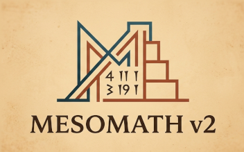

# The Scribe's Manual {{ release }} 

> 𒎀 **Display Note**: Throughout this manual, you will see examples of cuneiform writing. If empty rectangles (▯) appear on your screen, consult the [Cuneiform Support](#install-font) section to install the necessary fonts.

## **I. Foundations: The Sexagesimal Engine**

(babcalc-intro)=

### 1\. **Introduction & Quickstart**

#### **`babcalc` Environment**

`babcalc` is the heart of the **MesoMath** ecosystem. It is a specialized [REPL (Read–Eval–Print Loop)](https://en.wikipedia.org/wiki/Read%E2%80%93eval%E2%80%93print_loop) environment built upon Python 3, specifically architected to function as a seamless interactive calculator for Assyriological and mathematical research.

The `babcalc` interface serves two primary purposes:

  * **Interactive Computation**: It provides a pre-configured shell where all metrological and sexagesimal classes are pre-loaded and aliased for high-speed calculation.
  * **Workflow Automation**: It streamlines the execution of [scripts](https://www.google.com/search?q=%23scripting) by automatically resolving environment dependencies and paths, ensuring a consistent execution context regardless of your local [installation](#installation) method (e.g., `pipx` or virtual environments).

#### **Extending the Environment: `ibabcalc` & Jupyter**

While `babcalc` is the standard tool for quick calculations and automation, **MesoMath** offers advanced interfaces for researchers requiring more robust environments:

* **`ibabcalc` (Interactive Poweruser Console)**: Built on **IPython 9**, this console provides an enhanced experience with syntax highlighting, advanced command history, and object introspection. It is the recommended choice for complex, multi-step session work where a clean, dedicated scribal workspace is desired.
* **Jupyter Integration**: For those performing data analysis or creating reproducible research (like the study of *Plimpton 322*), **MesoMath** includes specialized utilities for **Jupyter Notebooks**. This allows for rich-text documentation, embedded tables, and high-fidelity rendering of cuneiform glyphs using the `mesomath.nb_utils` module.

> **Note for this Tutorial**: To ensure consistency and focus on core concepts, all examples and exercises in this manual will be demonstrated using the standard **`babcalc`** environment. Once you master the basics here, the same logic applies seamlessly to `ibabcalc` and Jupyter.


#### **Core Concepts: Classes and Objects**

For users less familiar with Object-Oriented Programming (OOP), it is helpful to understand that **Classes** act as blueprints. They define specific types of **Objects** (such as a weight or a length), their **Properties** (their value in different systems), and the **Methods** (operations like addition, reciprocal calculation, or transliteration) that can be performed upon them.

MesoMath organizes the metrology of the Old Babylonian Period (OBP) into the following optimized classes:

| Class | Domain | Shortcut |
| :--- | :--- | :--- |
| `BabN` | Sexagesimal Place Value Numbers | `bn` |
| `Blen` | Length (Linear measures) | `bl` |
| `Bsur` | Surface (Area) | `bs` |
| `Bvol` | Volume (Solid/Earth/Bricks) | `bv` |
| `Bcap` | Capacity (Liquid/Grain) | `bc` |
| `Bwei` | Weight (Mass) | `bw` |
| `Bbri` | Brick Metrology (Counts) | `bb` |
| `BsyG` | Enumeration (System **G**) | `bG` |
| `BsyS` | Enumeration (System **S**) | `bS` |
| `BsyC` | Enumeration (System **C**) | `bC` |
| `BsyK` | Enumeration (System **K**) | `bK` |

-----

**Invoking the Calculator**

If you have [installed](https://www.google.com/search?q=installation) MesoMath via `pip`, `pipx`, or `hatch`, the `babcalc` command is automatically added to your system's PATH. Simply execute it to initialize the environment:

```bash
$ babcalc
```

The terminal will display the initialization banner, confirming that the historical metrological models are ready for use:

```text

--- MesoMath Standard Console 2.0.0 ---

    Engine: Python 3.12.8
    Metrological classes: bl, bs, bv, bc, bw, bb, bG, bS, bC and bK loaded.
    Metrological presets: clist, wlist, slist, llist loaded.
    Use exit() or Ctrl-D (i.e. EOF) to close.

--> 
```

> **Note**: The `-->` symbol represents the primary `babcalc` prompt, indicating the system is ready for sexagesimal or metrological input.
> The Python version shown may vary reflecting your installation.

Alternatively, you can launch `ibabcalc` if you prefer an environment based on **IPython**:

```text
$ ibabcalc

--- MesoMath Scribal Research Lab 2.0.0 ---

Powered by: IPython 9.7.0 | Python 3.12.8
Interactive environment loaded: Jupyter/IPython integration enabled.
Metrological presets (clist, wlist, etc.) ready for analysis
--------------------------------------------------------------------
        

In [1]: 
```


#### **Manual Execution**

In the event that the command-line shortcut is not directly accessible, you may invoke the module via the Python interpreter:

```bash
$ python3 -m mesomath.babcalc
```

---

#### **Cloud Access**: The Zero-Install Experience

For an immediate start without local configuration, you can launch a live, interactive **MesoMath** environment directly in your browser via [MyBinder](https://jupyter.org/binder).

By clicking the badge below, you will gain access to a pre-configured cloud instance containing:

  * **Interactive Notebooks**: A collection of tutorials and curated examples (including the *Plimpton 322* analysis) ready to run in [Jupyter](https://jupyter.org/).
  * **Cloud Shell**: A fully functional terminal to execute `babcalc` or `ibabcalc` sessions in real-time.

[](https://mybinder.org/v2/gh/jccsvq/mesomath-nb/main?urlpath=%2Fdoc%2Ftree%2Fnotebooks%2Findex.ipynb)


[](https://mybinder.org/v2/gh/jccsvq/mesomath-nb/main?urlpath=%2Fdoc%2Ftree%2Fnotebooks%2Findex.ipynb)

---


### 2. **The `BabN` Class: Creating Babylonian Numbers**

In MesoMath, a **Babylonian Number** is defined as a non-negative integer represented through **sexagesimal place-value notation**. The `BabN` class (aliased as `bn` in `babcalc`) is the fundamental engine for these numerical entities.

#### **Core Properties and Exploration**
Let us initialize a Babylonian number and examine its internal structure:

```pycon
--> a = bn(405)
```

By querying the object's attributes, we can observe how MesoMath maintains the duality between decimal and sexagesimal systems:

* `a.dec`: The decimal integer value (405).
* `a.list`: The sexagesimal digits represented as a Python list: `[6, 45]` ($6 \times 60 + 45$).
* `a.factors`: A tuple representing the prime factorization in the form $(2^i, 3^j, 5^k, l)$. For 405, this is `(0, 4, 1, 1)`, meaning $2^0 \cdot 3^4 \cdot 5^1 \cdot 1$.
* `a.isreg`: A Boolean indicating if the number is **regular**. A number is regular if its prime factors are limited to 2, 3, and 5, meaning it possesses a finite sexagesimal reciprocal.
* `print(a)`: Returns the standard string representation: `6:45`.
* `a.rec()` : Returns the reciprocal of regular numbers.

```pycon
--> a = bn(405)
--> a.dec
405
--> a.list
[6, 45]
--> a.factors
(0, 4, 1, 1)
--> a.isreg
True
--> print(a)
6:45
--> a
6:45
--> a.rec()
8:53:20
--> bn(7).rec()
Not regular, (igi nu)!
```

#### **The `.explain()` Method**
For a comprehensive analysis, the `.explain()` method provides a detailed breakdown of the number's mathematical properties:

```pycon
--> a.explain()
|  Sexagesimal number: [6, 45] is the decimal number: 405.
|    It may be written as (2^0 * 3^4 * 5^1 * 1),
|    so, it is a regular number with reciprocal: 8:53:20
```

If the number is **irregular** (contains prime factors other than 2, 3, or 5), the method provides useful heuristics:

```pycon
--> b = bn(7)
--> b.explain()
|  Sexagesimal number: [7] is the decimal number:   7.
|    It may be written as (2^0 * 3^0 * 5^0 * 7),
|    so, it is NOT a regular number and has NO reciprocal.
|    but an approximate inverse is: 8:34:17:9
|    and a close regular is: 6:59:54:14:24
|    whose reciprocal is: 8:34:24:11:51:6:40
```


---

#### **Input Flexibility**
MesoMath supports four distinct methods for instantiating Babylonian numbers, allowing you to work with decimal data, digit lists, literal strings, or prime factors:

1.  **Decimal**: `bn(405)`
2.  **Digit List**: `bn([6, 45])`
3.  **Literal String**: `bn('6:45')` or `bn("6.45")`
4.  **Factors (Tuple)**: `bn((0, 4, 1, 1))`

All these methods yield identical objects:
```pycon
--> bn(405) == bn([6, 45]) == bn('6:45') == bn((0, 4, 1, 1))
True
```

> **Implementation Note**: The `BabN` class handles **non-negative integers** only. If a negative value is passed (e.g., `bn(-405)`), the class will automatically use the absolute value.

---

#### **Formatting and Separators**
By default, MesoMath uses the colon (`:`) as the digit separator. However, this is globally configurable via the `bn.sep` attribute to match different publication styles:

```pycon
--> n1 = bn(314159265)
--> n1
24:14:26:27:45
--> bn.sep = '.'
--> n1
24.14.26.27.45
```

When parsing strings, the `bn` constructor is highly resilient and can interpret multiple separators (`:`,  `;`, `.`, `,`,`-`) and blank space (` `) simultaneously:
```pycon
--> bn('1:2;3,4.5 6-7')
1:2:3:4:5:6:7
```

#### **Digit Count**
To determine the precision or "length" of a number (the number of sexagesimal places it occupies), you can use either the class method `.len()` or the standard Python `len()` function:

```pycon
--> m = bn('3:14:16')
--> len(m)
3
```


### 3. **The Arithmetic of Clay**: Operations, Roots, Reciprocals and logic.


MesoMath assumes a foundational understanding of Mesopotamian mathematics, particularly the distinction between **absolute** and **floating** sexagesimal notation, as well as the properties of **regular** and **reciprocal** numbers.

#### **3.1 Basic Arithmetic**

##### **Addition and Subtraction**
In MesoMath, addition and subtraction are **absolute** operations. Unlike modern algebra, Mesopotamian mathematics did not utilize negative numbers. To prevent errors and align with historical logic, subtraction in `BabN` returns the absolute difference. Consequently, **subtraction is commutative** by design:

```pycon
--> bn(45689) - bn(325874)
1:17:49:45
--> bn(325874) - bn(45689)
1:17:49:45
```

Addition supports multiple addends and direct interaction with standard Python integers:

```pycon
--> a = bn('16:24:35')
--> a + 34 + bn('1:33:54:22')
1:50:19:31
```

If a **floating** result is required (normalizing the number by removing trailing zeros), use the `.float()` method or its shortcut `.f()`:

```pycon
--> c = bn('40:16:37:0:0')
--> c.f()
40:16:37
```

##### **Multiplication and Powers**
Multiplication is absolute by default, but its behavior can be globally toggled via the `bn.floatmult` attribute. Powers are handled via the standard `**` operator:

```pycon
--> bn(3)*bn(140)
7:0
--> bn.floatmult = True
--> bn(3)*bn(140)
7
--> bn.floatmult = False
--> bn(3)*bn(140)
7:0
--> a = bn('34:59:31:12')
--> a**2
20:24:26:24:13:49:26:24
--> a**3
11:54:5:36:24:11:24:33:52:7:40:48
```

##### **Division: Modern vs. Babylonian**
MesoMath distinguishes between two conceptual approaches to division:

1.  **Modern Division (`a / b`)**: An approximate floating-point division. It converts sexagesimal values to a decimal-like quotient for the convenience of the modern researcher. The precision is controlled by `bn.rdigits`.

```pycon
--> bn(34)/7
4:51:25:42:51:25:43
--> bn(34)/bn(7)
4:51:25:42:51:25:43
--> 34/bn(7)
4:51:25:42:51:25:43
```

2.  **Babylonian Division (`a // b`)**: Historically accurate division via the **product of the reciprocal**. This operation requires the divisor `b` to be a **regular number**.

```pycon
--> a = bn('14:15:16')
--> b = bn(405) # Regular: 6:45
--> a // b
2:6:42:22:13:20
--> a//bn(7)
Divisor is not a regular number (igi nu)!
```

---

#### **3.2 Root Extraction**

MesoMath provides methods for calculating floating-point square (`.sqrt()`) and cube (`.cbrt()`) roots. These tools are essential for verifying tablet calculations, such as the famous diagonal of the square in **YBC 7289**.

```pycon
--> bn(2).sqrt()
1:24:51:10:7:46
```

By multiplying this result by 30 (the side of the square), we can replicate the exact value inscribed by the apprentice scribe over 3,700 years ago:

```pycon
--> (30 * bn(2).sqrt()).f()
42:25:35
```

The class attribute `rdigitis` controls the number of digits in some results. For example,

```pycon
--> bn(2).sqrt()
1:24:51:10:7:46
--> bn.rdigits = 10
--> bn(2).sqrt()
1:24:51:10:7:46:6:4:44:52
```


---

#### **3.3 Logical Operations and Complex Expressions**

Because MesoMath is built upon Python, `BabN` objects integrate seamlessly with standard logic and data structures (lists, comprehensions, etc.).

**Filtering for Regularity:**
A common research task is identifying regular numbers within a range. This can be achieved with a single line of Python code:

```pycon
--> [bn(i) for i in range(400, 410) if bn(i).isreg]
[6:40, 6:45]
```

**Logical Comparisons:**
```pycon
--> a = bn('16:22')
--> b = bn('44:16')
--> a < b and a.isreg
True
```

---

#### **3.4 Formatting: The `bn.fill` Attribute**

For researchers generating tables or requiring consistent digit widths, the `bn.fill` attribute toggles zero-padding for single-digit sexagesimal values (0-9).

```pycon
--> z = bn('1:2:0:14:5')
--> bn.fill = True
--> z
01:02:00:14:05
```

This global setting ensures that printed outputs align perfectly in columns, facilitating the creation of professional-grade metrological or mathematical lists.


### **4. Precision and Heuristic Tools**

The `BabN` class includes a suite of methods designed to handle approximations, reciprocals, and digit manipulation—essential for replicating the iterative processes of ancient calculators.

#### **4.1 Reciprocals and Inverses**

In the Babylonian system, division is conceptualized as multiplication by a reciprocal. MesoMath provides two ways to handle this:

* **`.rec()` (Reciprocal)**: Returns the exact reciprocal of a **regular** number. If the number is irregular (possessing prime factors other than 2, 3, or 5), it returns `None`.
* **`.inv(n)` (Inverse)**: A heuristic method for **irregular** numbers. Since irregular numbers have infinite sexagesimal expansions, `.inv(n)` calculates the first `n` digits of the approximation.

```pycon
--> a = bn(400) # 6:40
--> a.rec()
9
--> b = bn(406) # 6:46 (Irregular)
--> b.rec()
Not regular, (igi nu)!
--> b.inv(4)
08:52:01:11
```

#### **4.2 Digit Slicing and Rounding**

When working with long floating-point strings, researchers often need to truncate or round results to match the precision found on specific tablets.

* **`.round(n)`**: Returns the first `n` digits with standard rounding. This can also be invoked via the standard Python `round(obj, n)` function.
* **`.head(n)`**: Truncates the number, returning the first `n` digits without rounding.
* **`.tail(n)`**: Returns the final `n` digits, useful for analyzing remainders or lower-order values.

```pycon
--> c = bn('8:52:1:10:56:9:27')
--> c.round(4)
8:52:1:11
--> c.head(3)
8:52:1
--> c.tail(2)
9:27
```

#### **4.3 The Heuristic Search: `.searchreg()`**

A sophisticated feature of MesoMath is the ability to find the "closest regular" number to an irregular target. This mirrors the technique used by ancient scribes who substituted irregular values with nearby regular approximations to facilitate further calculations.

The `.searchreg(minn, maxn, limdigits=6, prt=False)` method queries an internal database to find the best candidate within a specified range:

```pycon
--> bn(7).searchreg('06:40', '07:40', 4, prt=True)
        72000 06:40
        54000 06:45
        37440 06:49:36
        35775 06:50:03:45
        19008 06:54:43:12
        12000 06:56:40
         6750 07:01:52:30
        24000 07:06:40
        43200 07:12
        50500 07:14:01:40
        60864 07:16:54:24
        62640 07:17:24
        82323 07:22:52:03
        88000 07:24:26:40
       108000 07:30
       126400 07:35:06:40
       128250 07:35:37:30
Minimal distance: 6750, closest regular is: 07:01:52:30
07:01:52:30
```

> **Note on Distance**: MesoMath uses a specialized "floating distance" (`.dist()`). Unlike decimal distance, this metric prioritizes the similarity of the **most significant digits** (the "head" of the number), correctly identifying that `7` is closer to `6:59:54:14:24` than to `7:10`.

---

#### **4.4 Accessing Documentation: `help()`**

MesoMath is fully documented internally. If you are unsure about the parameters of a method or its default values, you can use the built-in Python `help()` system directly from the `babcalc` prompt:

```pycon
--> help(bn.searchreg)
```
This will display the docstring for the method, including parameter types and return values. (Press `q` to return to the prompt).


### **5. Cuneiform Representation**

The `BabN` class can transform any sexagesimal number into its equivalent Unicode cuneiform signs. This is not a static mapping but a dynamic rendering that supports different scribal styles.

Using the `.cuneiform()` method, you can visualize the number directly:

```pycon
--> a = bn('1:12:0:52:37')
--> print(a.cuneiform())
  𒐕 𒌋𒐖  𒐐𒐖 𒌍𒑂  
```

MesoMath allows for nuanced control over the paleography through parameters:

  * **`alter=True`**: Uses alternative sign forms for certain values (e.g., variant forms of 40 or 50).
  * **`stroke=True`**: Adds structural or separation strokes where historically applicable to improve readability.


```pycon
--> # Using alternative signs and strokes for a more distinct rendering
--> print(a.cuneiform(alter=1, stroke=1))
 𒐕 𒌋𒐖 𒃵 𒑪𒐖 𒌍𒑂  
```

> **Tip:** Use `help(bn.cuneiform)` to see all available styles and stroke options. Note that the output relies on having a **Cuneiform Unicode font** installed on your system.

### **6. Multiplication Tables**

In the Babylonian *Edubba* (tablet house), learning the multiplication tables of "principal" numbers was a foundational requirement for any scribe. MesoMath replicates this experience through the `.multable()` method, allowing you to generate these tables instantly for any sexagesimal value.

#### **5.1 The Internal Method: `.multable()`**

Unlike standard calculators, MesoMath allows a `BabN` object to "reveal" its own multiplication table. By default, it follows the ancient scribal tradition of displaying products for the multipliers: **1–20, 30, 40, and 50**.

```pycon
--> n = bn(9)
--> n.multable()

|  i  | i * 9|
|-----|------|
|  1  |    9 |
|  2  |   18 |
|  3  |   27 |
|  4  |   36 |
|  5  |   45 |
|  6  |   54 |
|  7  |  1:3 |
|  8  | 1:12 |
|  9  | 1:21 |
| 10  | 1:30 |
| 11  | 1:39 |
| 12  | 1:48 |
| 13  | 1:57 |
| 14  |  2:6 |
| 15  | 2:15 |
| 16  | 2:24 |
| 17  | 2:33 |
| 18  | 2:42 |
| 19  | 2:51 |
| 20  |  3:0 |
| 30  | 4:30 |
| 40  |  6:0 |
| 50  | 7:30 |
```

#### **5.2 Advanced Options**

The `.multable()` method is highly customizable to suit different research needs:

* **Full Tables (`pral=False`)**: Generates a continuous table from 1 to 59.
* **Indices (`indices=[2,4,17]`)**: Generates a table only for the given numbers.
* **Floating Point (`floating=True`)**: Displays results in sexagesimal floating-point notation (useful for complex reciprocal calculations).
* **Cuneiform Output (`cuneiform=True`)**: Renders the entire table in original characters, including the multiplication operator label.


#### **5.3 Cuneiform Tables**

When using the `cuneiform=True` flag, MesoMath uses the `TIMES_LABEL` glyph and properly aligns the columns to provide a high-fidelity digital reconstruction of a clay tablet.

```pycon
--> n = bn(25)
--> n.multable(cuneiform=True, stroke=True)

|   𒎙𒐙  𒀀 𒁺  𒐕  |    𒎙𒐙 |
|---------------|-------|
|       𒀀 𒁺   𒐖 |    𒑪  |
|       𒀀 𒁺   𒐗 |  𒐕 𒌋𒐙 |
|       𒀀 𒁺   𒐘 |  𒐕 𒑩  |
|       𒀀 𒁺   𒐙 |  𒐖  𒐙 |
|       𒀀 𒁺   𒐚 |  𒐖 𒌍  |
|       𒀀 𒁺   𒑂 |  𒐖 𒑪𒐙 |
|       𒀀 𒁺   𒑄 |  𒐗 𒎙  |
|       𒀀 𒁺   𒑆 |  𒐗 𒑩𒐙 |
|       𒀀 𒁺  𒌋  |  𒐘 𒌋  |
|       𒀀 𒁺  𒌋𒐕 |  𒐘 𒌍𒐙 |
|       𒀀 𒁺  𒌋𒐖 |   𒐙 𒃵 |
|       𒀀 𒁺  𒌋𒐗 |  𒐙 𒎙𒐙 |
|       𒀀 𒁺  𒌋𒐘 |  𒐙 𒑪  |
|       𒀀 𒁺  𒌋𒐙 |  𒐚 𒌋𒐙 |
|       𒀀 𒁺  𒌋𒐚 |  𒐚 𒑩  |
|       𒀀 𒁺  𒌋𒑂 |  𒑂  𒐙 |
|       𒀀 𒁺  𒌋𒑄 |  𒑂 𒌍  |
|       𒀀 𒁺  𒌋𒑆 |  𒑂 𒑪𒐙 |
|       𒀀 𒁺  𒎙  |  𒑄 𒎙  |
|       𒀀 𒁺  𒌍  | 𒌋𒐖 𒌍  |
|       𒀀 𒁺  𒑩  | 𒌋𒐚 𒑩  |
|       𒀀 𒁺  𒑪  | 𒎙  𒑪  |
```

The previous cuneiform output should appear correctly aligned on almost any modern terminal; but, due to the variable width of the cuneiform glyphs, it is next to impossible to get it to appear aligned in an HTML document like this using a monospaced font, so henceforth the outputs will be presented in table format.


|   𒎙𒐙  𒀀 𒁺  𒐕  |    𒎙𒐙 |
|---------------|-------|
|       𒀀 𒁺   𒐖 |    𒑪  |
|       𒀀 𒁺   𒐗 |  𒐕 𒌋𒐙 |
|       𒀀 𒁺   𒐘 |  𒐕 𒑩  |
|       𒀀 𒁺   𒐙 |  𒐖  𒐙 |
|       𒀀 𒁺   𒐚 |  𒐖 𒌍  |
|       𒀀 𒁺   𒑂 |  𒐖 𒑪𒐙 |
|       𒀀 𒁺   𒑄 |  𒐗 𒎙  |
|       𒀀 𒁺   𒑆 |  𒐗 𒑩𒐙 |
|       𒀀 𒁺  𒌋  |  𒐘 𒌋  |
|       𒀀 𒁺  𒌋𒐕 |  𒐘 𒌍𒐙 |
|       𒀀 𒁺  𒌋𒐖 |   𒐙 𒃵 |
|       𒀀 𒁺  𒌋𒐗 |  𒐙 𒎙𒐙 |
|       𒀀 𒁺  𒌋𒐘 |  𒐙 𒑪  |
|       𒀀 𒁺  𒌋𒐙 |  𒐚 𒌋𒐙 |
|       𒀀 𒁺  𒌋𒐚 |  𒐚 𒑩  |
|       𒀀 𒁺  𒌋𒑂 |  𒑂  𒐙 |
|       𒀀 𒁺  𒌋𒑄 |  𒑂 𒌍  |
|       𒀀 𒁺  𒌋𒑆 |  𒑂 𒑪𒐙 |
|       𒀀 𒁺  𒎙  |  𒑄 𒎙  |
|       𒀀 𒁺  𒌍  | 𒌋𒐖 𒌍  |
|       𒀀 𒁺  𒑩  | 𒌋𒐚 𒑩  |
|       𒀀 𒁺  𒑪  | 𒎙  𒑪  |

>**Note**: As you can see, the previous output is in **Markdown table format**, so if you use Markdown for your documents, you're in luck, you just have to copy and paste the result from the terminal into your document and that's it. But you can also paste it into an intermediate `.csv` file that can be read by any spreadsheet (indicating the pipe `|` character as the column separator) and from there you can copy and paste it into your word processor or presentations.

<div class="tablet mini" style="text-align: right;">


|   𒎙𒐙  𒀀 𒁺  𒐕  |    𒎙𒐙 |
|---------------|------:|
|       𒀀 𒁺   𒐖 |    𒑪  |
|       𒀀 𒁺   𒐗 |  𒐕 𒌋𒐙 |
|       𒀀 𒁺   𒐘 |  𒐕 𒑩  |
|       𒀀 𒁺   𒐙 |  𒐖  𒐙 |
|       𒀀 𒁺   𒐚 |  𒐖 𒌍  |
|       𒀀 𒁺   𒑂 |  𒐖 𒑪𒐙 |
|       𒀀 𒁺   𒑄 |  𒐗 𒎙  |
|       𒀀 𒁺   𒑆 |  𒐗 𒑩𒐙 |
|       𒀀 𒁺  𒌋  |  𒐘 𒌋  |
|       𒀀 𒁺  𒌋𒐕 |  𒐘 𒌍𒐙 |
|       𒀀 𒁺  𒌋𒐖 |   𒐙 𒃵 |
|       𒀀 𒁺  𒌋𒐗 |  𒐙 𒎙𒐙 |
|       𒀀 𒁺  𒌋𒐘 |  𒐙 𒑪  |
|       𒀀 𒁺  𒌋𒐙 |  𒐚 𒌋𒐙 |
|       𒀀 𒁺  𒌋𒐚 |  𒐚 𒑩  |
|       𒀀 𒁺  𒌋𒑂 |  𒑂  𒐙 |
|       𒀀 𒁺  𒌋𒑄 |  𒑂 𒌍  |
|       𒀀 𒁺  𒌋𒑆 |  𒑂 𒑪𒐙 |
|       𒀀 𒁺  𒎙  |  𒑄 𒎙  |
|       𒀀 𒁺  𒌍  | 𒌋𒐖 𒌍  |
|       𒀀 𒁺  𒑩  | 𒌋𒐚 𒑩  |
|       𒀀 𒁺  𒑪  | 𒎙  𒑪  |

</div>


> **Warning**: If you are using the legacy `bmultable.py` script, we strongly recommend migrating your workflow to the `.multable()` method. The standalone script is considered **obsolete** and will be removed in the final stable 2.0.0 release.

---

#### **Summary of Parameters**

| Parameter | Type | Default | Description |
| :--- | :--- | :--- | :--- |
| `pral` | `bool` | `True` | If `True`, only prints the traditional "principal" multipliers. |
| `cuneiform`| `bool` | `False` | Switches output to Unicode Cuneiform characters. |
| `floating` | `bool` | `False` | Displays results as sexagesimal floating point numbers. |
| `sep` | `str` | `":"` | Custom separator for sexagesimal digits in ASCII mode. |
| `stroke` | `bool` | `False` | In cuneiform mode, uses a specific stroke for empty positional values (zeroes). |

---

### **7. Sexagesimal Fractions (`BabF`)**

The `BabF` class provides a robust implementation for the sexagesimal representation of non-negative rational fractions and their basic arithmetic operations. To preserve absolute mathematical precision throughout cuneiform data analysis, `BabF` performs exact fraction arithmetic internally, avoiding the floating-point rounding errors inherent to the IEEE 754 standard.

#### **7.1. Instantiation and Representation Methods**

A `BabF` object can be instantiated using three distinct semantic patterns depending on the nature of the historical source material.

##### **Pattern 1: Explicit Numerator and Denominator**

The most basic constructor accepts two arguments: `BabF(p, q)`. Both the numerator (`p`) and the denominator (`q`) can be loose integers, decimal strings, positional sexagesimal strings, or native `BabN` objects.

Inside the standard interactive console (`babcalc`), the class is pre-loaded via the short alias `bf`:

```pycon
--> f = bf(74, 28)
--> g = bf(5, 8)
--> f
1:14/28
--> g
5/8

```

Alternatively, structured strings containing a forward slash (`/`) are parsed automatically into their respective components:

```pycon
--> p = bn('32:54')
--> q = bn('43:18')
--> f2 = bf(p, q)
--> f3 = bf('32:54 / 43:18')
--> f2 == f3
True

```

##### **Pattern 2: Positional Sexagesimal Expansion**

Fractions can be defined via a single positional string using the character `@` as the "sexagesimal radix point" (defined by the class constant `BabF.SEP`). In this mode, the denominator is dynamically computed as an exact power of sixty ($60^n$), where $n$ represents the number of fractional sexagesimal places.

This pattern is highly effective for importing historical astronomical parameters, such as the mean synodic months compiled by ancient and medieval scholars:

```pycon
--> synodic = {
...     "Banu_Musa": bf('29@31:50:5:43:23'),
...     "Brahmagupta": bf('29@31:50:5:43:24'),    
...     "al_Hashimi": bf('29@31:50:5:43:33'),        
...     "Ibn_al_Muthanna": bf('29@31:50:5:44:33'),        
...     "Alfonsine_Tables": bf('29@31:50:7:37:27:8:25'),   
...     "Bonjorn": bf('29@31:50:7:53:39:49'),     
...     "Levi_ben_Gerson": bf('29@31:50:7:54:25:3:32'),   
...     "al_Hajjaj": bf('29@31:50:8:9:20'),
...     "al_Biruni": bf('29@31:50:8:9:20:13'),      
...     "Ibn_Yunus": bf('29@31:50:8:9:24'),         
...     "Ptolemy": bf('29@31:50:8:48'),      
...     "Geminus": bf('29@31:50:18'),         
... }

```
(Values taken from {ref}`Goldstein's: *Ancient and Medieval Values for the Mean Synodic Month* <ref-Goldstein>`)

Iterating through these objects highlights how `BabF` maintains the exact fractional structure while offering decimal evaluation capabilities:

```pycon
--> for author, period in synodic.items():
...     print(f"{author:>16} -> {period.__str__():37} ({period.as_float})")
... 
       Banu_Musa -> 29:31:50:5:43:23/1:0:0:0:0:0          (29.530582051183128)
     Brahmagupta -> 29:31:50:5:43:24/1:0:0:0:0:0          (29.530582052469136)
      al_Hashimi -> 29:31:50:5:43:33/1:0:0:0:0:0          (29.53058206404321)
 Ibn_al_Muthanna -> 29:31:50:5:44:33/1:0:0:0:0:0          (29.530582141203702)
Alfonsine_Tables -> 29:31:50:7:37:27:8:25/1:0:0:0:0:0:0:0 (29.530590852803854)
         Bonjorn -> 29:31:50:7:53:39:49/1:0:0:0:0:0:0     (29.530592103673698)
 Levi_ben_Gerson -> 29:31:50:7:54:25:3:32/1:0:0:0:0:0:0:0 (29.530592161855566)
       al_Hajjaj -> 29:31:50:8:9:20/1:0:0:0:0:0           (29.5305933127572)
       al_Biruni -> 29:31:50:8:9:20:13/1:0:0:0:0:0:0      (29.530593313035837)
       Ibn_Yunus -> 29:31:50:8:9:24/1:0:0:0:0:0           (29.530593317901236)
         Ptolemy -> 29:31:50:8:48/1:0:0:0:0               (29.530596296296295)
         Geminus -> 29:31:50:18/1:0:0:0                   (29.530638888888888)

```

##### **Pattern 3: Repeating Sexagesimal Digits**

The class method `BabF.repeated()` allows the instantiation of purely repeating fractional digits. This corresponds to the mathematical expression $\frac{p}{60^n - 1}$, mapping periodic sexagesimal expansions into exact rational fractions:

```pycon
--> h = bf.repeated('8:34:17')
--> h
8:34:17/59:59:59
--> h.expand(9)
'0@8:34:17:8:34:17:8:34:17'
--> h.simplified 
1/7

```

*Note: In the example above, the repeating sequence `8:34:17` resolves exactly to $\frac{1}{7}$, providing an elegant tool to handle non-regular sexagesimal denominators.*

More complex, mixed repeating fractions can be built by combining standard instances with scaled periodic parts:

```pycon
--> h2 = bf('2@37') + bf.repeated('8:34:17') / 60
--> h2.expand(10)
'2@37:8:34:17:8:34:17:8:34:17'
--> h2
2:37:8:31:40:0/59:59:59:0:0
--> h2.simplified 
55/21

```

---

#### **7.2. Introspection and Internal Properties**

Each `BabF` instance exposes specialized properties to query its internal state, convert to decimal formats, or obtain numerical variations:

```pycon
--> f = bf(74, 28)
--> f.p, f.q               # Returns the numerator and denominator as BabN objects
(1:14, 28)
--> f.as_dec_fraction      # Returns a string formatted as standard decimal integers
'74/28'
--> f.as_float             # Computes the lossy floating-point representation
2.642857142857143
--> f.simplified           # Returns a new BabF object reduced to lowest terms
37/14
--> f.rec                  # Returns the exact reciprocal fraction (inverse)
28/1:14

```

To visualize the precise fractional representation back into a manageable cuneiform string, the `.expand(max_digits)` method divides the internal parameters up to the specified limit of sexagesimal digits:

```pycon
--> f.expand(8)            # Forces expansion to 8 fractional places
'2@38:34:17:8:34:17:8:34'

```

---

#### **7.3. Arithmetic and Relational Operations**

`BabF` implements total ordering and full operator overloading. Operations are evaluated using cross-multiplication formulas to ensure absolute mathematical fidelity. Mixed operations between `BabF`, `int`, and `BabN` are fully supported out of the box.

```pycon
--> g = bf(5, 8)
--> g < f                  # Total ordering relational comparison
True
--> f - g                  # Fraction subtraction
7:32/3:44
--> f**2                   # Integer power exponentiation
1:31:16/13:4
--> f / g                  # Fraction division
9:52/2:20
--> (f / g).simplified     # Reduction of the division quotient
2:28/35

```

> **Safety Guardrails:** To protect the integrity of historical metrological and astronomical calculations, `MesoMath` strictly forbids direct operations between `BabF` and Python `float` types. Attempting mixed floating-point arithmetic will trigger a explicit `TypeError`. Users must explicitly declare a conversion using the `BabF` constructor patterns or fallback to the `.as_float` property.

#### **7.4. Cuneiform Convergence (Interoperability with `BabN`)**

Since historical cuneiform notation lacked an explicit radix point or separator to isolate the fractional part, advanced tablet reproduction can be achieved by feeding the result of a `BabF.expand()` directly back into a `BabN` positional instance after replacing the `@` sign with `:`. This is automatically done by the `to_cunei()` method.

This layout replicates the precise, seamless visual reading flow of ancient Mesopotamian mathematical texts:

```pycon
--> h2 = bf('2@37') + bf.repeated('8:34:17')/60
--> print(h2.to_cunei())
 𒐖 𒌍𒑂  𒑄 𒌍𒐘 𒌋𒑂  𒑄 𒌍𒐘  

```

## **II. Metrology: The Weight of Tradition**

The metrological engine of MesoMath is designed to handle the complex, non-linear systems of the Old Babylonian Period (OBP). Unlike the metric system, where conversion is a simple shift of the decimal point, Babylonian metrology relies on specific coefficients and discrete systems for different domains.

### 1\. **The Four Pillars and the Specificity of Classes**

MesoMath defines several specialized classes to represent different physical domains. While a modern mathematician might treat surfaces, volumes, and brick counts as "just numbers," the Babylonian scribe—and consequently this library—treats them as distinct ontological categories because **they support different mathematical operations and socio-economic rules.**

| Class | Domain | Base Unit |
| :--- | :--- | :--- |
| `Blen` | **Length** | `ninda` (approx. 6m) |
| `Bsur` | **Surface** | `sar` (approx. 36m²) |
| `Bvol` | **Volume** | `sar` (standard thickness of 1 `kuš3`) |
| `Bcap` | **Capacity** | `gur` (approx. 300 litres) |
| `Bwei` | **Weight** | `gu2` (talent, approx. 30kg) |
| `Bbri` | **Bricks** | `sar` (standardized brick volumes) |

#### **The Volume-Surface Equivalence (The 1-cubit Rule)**

In Babylonian mathematics, **Volumes** (`Bvol`) and **Brick counts** (`Bbri`) are expressed using the same units as **Surfaces** (`Bsur`). This is not a coincidence:

  * A volume is conceptually a "surface with a standardized thickness" of **1 `kuš3`** (cubit).
  * Therefore, a volume of `1 sar` represents a block with a base of `1 sar` (1x1 `ninda`) and a height of `1 kuš3`.

#### **Why separate classes?**

Although they share units (like the `sar`), MesoMath uses separate classes because:

1.  **Validation**: It prevents the accidental addition of a weight (`Bwei`) to a capacity (`Bcap`).
2.  **Specialized Methods**: `Bbri` (Bricks) includes methods for counting physical units that `Bsur` does not need.
3.  **Epigraphy**: Transliteration rules can vary slightly depending on whether you are describing a field or a pile of grain.

-----

### 2\. **The "Vertical Problem": Defining Height**

A common question for new users is: **"Where is the class for vertical lengths (height/depth)?"**

In the OBP system, vertical measures (heights of walls, depths of canals) are technically lengths. However, while horizontal lengths are measured in `ninda`, vertical measures are almost exclusively recorded in **`kuš3`**.

MesoMath does **not** include a separate `Bheight` class by default because:

  * Mathematically, it is redundant; any vertical measure is a `Blen` object.
  * The system is designed to favor the `ninda` as the primary sexagesimal unit for `Blen`, which is the standard for mathematical tablets.

> **User Extension**: If your specific research involves heavy interaction between vertical and horizontal measures and you prefer the semantic clarity of a dedicated class, you can easily [extend the metrology](#vertical-problem) to create one. However, for 99% of applications, using `Blen` with the appropriate unit (e.g., `bl('2 kuš3')`) is the historically accurate and functionally sufficient approach.

-----


### **3. Basics of Metrological Classes**

MesoMath handles historical metrology through specialized classes. While these classes are pre-imported in `babcalc` (as `bl`, `bc`, `bw`, etc.), their full academic names and internal structures are essential for advanced scripting and research.

#### **3.1 The Metrological Systems (OBP)**
Each class represents a specific physical domain with its own hierarchy of units and conversion factors:

**Measurements**

* **`bl` (Length)**: `danna` <-30- `UŠ` <-60- `ninda` <-12- `kuš3` <-30- `šu-si`
* **`bs`/`bv`/`bb` (Surface/Volume/Bricks)**: `GAN2` <-100- `sar` <-60- `gin2` <-180- `še`
* **`bc` (Capacity)**: `gur` <-5- `bariga` <-6- `ban2` <-10- `sila3` <-60- `gin2` <-180- `še`
* **`bw` (Weight)**: `gu2` <-60- `ma-na` <-60- `gin2` <-180- `še`

**Sexagesimal NPVS; Specialized counting systems**

* **`bG`**: `šar2-gal` <-6- `šar'u` <-10- `šar2` <-6- `bur'u` <-10- `bur3` <-3- `eše3` <-6- `iku`
* **`bS`**: `šar2-gal` <-6- `šar'u` <-10- `šar2` <-6- `geš'u` <-10- `geš` <-6- `u` <-10- `aš`
* **`bK`**: `šar2-gal` <-6- `šar'u` <-10- `šar2` <-6- `geš'u` <-10- `geš` <-6- `u` <-10- `diš`


#### **3.2 Unit Names and Schemas**
For ease of use in the REPL, unit names have been simplified (e.g., `susi` for *šu-si*, `kus` for *kuš3*). You can query any class to see its internal schema and academic nomenclature:

```pycon
--> bc.uname   # Simplified names for input
['se', 'gin', 'sila', 'ban', 'bariga', 'gur']

--> bc.aname   # Academic names with diacritics
['še', 'gin2', 'sila3', 'ban2', 'bariga', 'gur']

--> bc.cname()
['𒊺', '𒂆', '𒋡', '𒑏', '𒉿', '𒄥']

--> print(*bc.scheme(bc, 0)) # Visual representation of the hierarchy
gur <-5- bariga <-6- ban2 <-10- sila3 <-60- gin2 <-180- še

--> print(*bc.scheme(bc, 1)) # Cuneiform representation of the hierarchy
𒄥   ╼5╾  𒉿   ╼6╾  𒑏   ╼10╾  𒋡   ╼60╾  𒂆   ╼180╾  𒊺
```

---

#### **3.3 Defining Measurements**
You can instantiate metrological objects using two primary methods:
1.  **Smallest Unit (Integer)**: Passing a raw integer represents the total count of the smallest unit in that system.
2.  **String Literal**: A descriptive string using unit names.

```pycon
--> a = bl(11111)              # 11,111 susi
--> b = bl('5 ninda 25 susi')  # Textual definition
--> a
30 ninda 10 kus 11 susi
--> b
5 ninda 25 susi
--> a.dec
11111                          # total count of the smallest unit
--> b.dec
1825

```

#### **3.4 The `.sex()` and `.explain()` Methods**
To bridge the gap between concrete metrology and sexagesimal abstraction, the `.sex(unit_index)` method calculates the **sexagesimal floating value** relative to a specific unit in the hierarchy.

* `a.sex(2)`: Calculates the value relative to the 3rd unit (index 2), which for lengths is the `ninda`.

```pycon
--> bl.uname
['susi', 'kus', 'ninda', 'us', 'danna']
--> bl.uname[2]
'ninda'
```

This is the engine used to recreate historical **metrological lists**:

```pycon
--> bl('1 kus').sex(2)  # 1 kus as a fraction of a ninda (1/12)
5
--> bl('1 kus').sex(1)  # 1 kus as a fraction of a kus (1)
1
--> bl('1 kus').sex()  # 1 kus as a multiple of a susi (30) (Default = 0)
30
```

For a complete overview, including the approximate International System (SI) equivalent, use `.explain()`:

```pycon
--> bl('1 kus').explain()
This is a Babylonian length measurement: 1 kus
    Metrology:  danna <-30- us <-60- ninda <-12- kus <-30- susi
    Factor with unit 'susi':  1 30 360 21600 648000
Measurement in terms of the smallest unit: 30 (susi)
Sexagesimal floating value of the above: 30
Approximate SI value: 0.5 meters
```

---

### **4. Metrological Operations**

MesoMath objects are aware of their dimensional nature. They allow for both intra-class arithmetic and inter-class geometric operations.

#### **4.1 Intra-class Arithmetic**
Objects of the same class support addition, subtraction (absolute difference), and scaling by a number.

```pycon
--> a = bl('1 ninda')
--> b = bl('2 kus')
--> a + b
1 ninda 2 kus

--> a - b == b - a   # Subtraction is commutative (absolute difference)
True

--> a * 2.5          # Scaling by a factor
2 ninda 6 kus
--> c=bl(11111)
--> c
30 ninda 10 kus 11 susi
--> c*2
1 us 1 ninda 8 kus 22 susi
--> c/2
15 ninda 5 kus 6 susi  # Rounding!!
--> 2*(c/2)
30 ninda 10 kus 12 susi
```


#### **4.2 Geometric Interaction (Dimensionality)**

MesoMath enforces logical geometric rules through **Dimensional Awareness**. You can multiply lengths to generate surfaces, and surfaces by lengths to generate volumes. Conversely, you can divide these higher-order magnitudes to find missing linear or planar dimensions. 

However, “illegal” operations (like multiplying two volumes or dividing a length by a surface) are prohibited to maintain historical and physical consistency.

##### **Building Up: Multiplication**
Assembling a 3D structure follows the logical progression from $L \to S \to V$.

```pycon
--> length = bl('10 ninda')
--> width  = bl('5 ninda')
--> height = bl('2 kus')

--> surface = length * width      # returns a Bsur object (50 sar)
--> volume  = surface * height    # returns a Bvol object (1 2/3 sar)
--> volume2 = length * width * height
--> volume == volume2
True
```

##### **Breaking Down: Division**
MesoMath overloads the division operator to perform **Dimensional Descent**. This allows you to solve for a missing side or height directly.

* **Surface / Length = Length** ($S / L \to L$)
* **Volume / Length = Surface** ($V / L \to S$)
* **Volume / Surface = Length** ($V / S \to L$)

```pycon
--> # Finding the missing side of a 1 sar rectangle
--> area = bs('1 sar')
--> side_a = bl('3 ninda')
--> side_b = area / side_a
--> side_b.prtf()
'1/3 ninda'

--> # Finding the height of a canal from its volume and base area
--> total_vol = bv('10 sar')
--> base_area = bs('20 sar')
--> canal_depth = total_vol / base_area
--> canal_depth.prtf()
'1/2 kus'

--> # Finding the surface area from volume and a known linear dimension
--> width = bl('1/2 ninda')
--> canal_surface = total_vol / width
--> canal_surface
2(u) gan2
```


##### **Scaling and Distribution**
You can also divide any magnitude by a scalar (integer or float) for equal distribution or scaling without changing the dimension of the object.

```pycon
--> # Dividing a field of 1 gan2 among 3 brothers
--> field = bs('1 gan2')
--> share = field / 3
--> share
33 1/3 sar
```

> **Engineering Note**: In these operations, MesoMath automatically handles the internal conversion factors (e.g., the implicit thickness of $1 \text{ kuš}_3$ in volumes) and rounds the result to the nearest integer of the system's smallest unit.


### **4.3 SI Conversion & Modern Interoperability**

MesoMath provides a robust bridge between ancient units and the International System of Units (SI). This allows researchers to translate archaeological field data directly into Babylonian metrological objects.

#### **From Ancient to Modern: `.si()` and `.SI()`**
To obtain the approximate modern equivalent of a Babylonian measure, use `.si()` for a raw float or `.SI()` for a formatted string including the unit name.

```pycon
--> w = bw('1 mana 3 gin')
--> w.si()
0.525
--> w.SI()
'0.525 kilograms'
```

#### **From Modern to Ancient: `.from_si()`**
Reciprocally, the `@classmethod` `.from_si()` allows you to instantiate a metrological object starting from a modern value (meters, kilograms, square meters, cubic meters, or brick counts).

```pycon
--> # Converting 0.572 kg to Babylonian weight
--> a = bw.from_si(0.572)
--> a
1 mana 8 gin 115 se

--> # Checking the precision loss after conversion
--> a.SI()
'0.5719907407407407 kilograms'

--> # Converting a modern brick count to Babylonian Brick Metrology (Bbri)
--> bricks_total = bb.from_si(1700)
--> bricks_total
2 sar 21 gin 120 se
--> bricks_total.SI()
'1700.0 bricks'
```

> **Precision Note**: Since Babylonian metrology is based on discrete "units of account" (integers of the smallest unit), `.from_si()` uses a `round()` function. The small discrepancy seen in the example (`0.57199...` vs `0.572`) reflects the historical granularity of the system.


### **5. Advanced Metrological Input and Representation**

Mesopotamian scribes did not always record quantities as simple counts. Depending on the system (capacity, surface, etc.), they used specific sexagesimal notations known as **Systems S, G, C, and K**. MesoMath allows you to toggle between modern simplified output and these historical "sexagesimalized" representations.

#### **5.1 Historical Sexagesimal Modes (Systems C, S and G)**
By default, metrological objects display their values using simplified unit names and absolute decimal counts. However, you can switch to a mode that mimics the way measurements were actually inscribed on clay by grouping coefficients into higher-order sexagesimal signs (`bur3`, `iku`, `geš2`, etc.), see [Appendix A](#systems-SGC) for details on the use of systems C, S and G.

To activate this for a specific class (e.g., Volumes):
```pycon
--> bv.prtsex = True  # Enable historical sexagesimal grouping
--> a = bv('128 gan')
--> a
(7 bur 2 iku) gan
--> b=bw(11223344)
--> b
17 gu 19 mana 11 gin 164 se
--> bw.prtsex = True  # also: bw.prtsex = 1
--> b
(1 u 7 as) gu (1 u 9 dis) mana (1 u 1 dis) gin (2 ges 4 u 4 as) se
```

To apply this behavior globally to all metrological classes, use the master controller:
```python
from mesomath.npvs import MesoM
MesoM.prtsex = True
```

#### **5.2 The Third Input Method: Parenthetical Strings**
As a direct consequence of the historical mode, MesoMath supports a **third input method**. This method is highly resilient and allows you to copy-paste complex strings (even those with parentheses) directly into the constructor. For instance, continuing from above:

```pycon
--> c = bw('(1 u 7 as) gu (1 u 9 dis) mana (1 u 1 dis) gin (2 ges 4 u 4 as) se')
--> b == c
True
--> c.dec
11223344
```

The system can even interpret **sexagesimal coefficients** directly:
```pycon
--> d = bv('2:8:0:0 gan 44 sar 20 gin')
--> d
(7 sargal 6 sar 4 buru) gan (4 u 4 dis) sar (2 u) gin
```

---

#### **5.3 Fractional Support**
The Babylonian system relied heavily on a specific set of **principal fractions**: $1/6, 1/3, 1/2, 2/3,$ and $5/6$. MesoMath supports these fractions for both input and output.

**Inputting Fractions:**
Fractions can be entered using various natural syntaxes within the string literal:
```pycon
--> bl('1/3 ninda')        # Simple fraction
4 kus
--> bl('2 1/3 ninda')      # Integer + fraction
2 ninda 4 kus
--> bl('2 + 1/3 ninda')    # Explicit addition
2 ninda 4 kus
```

**Outputting Fractions (`.prtf()`):**
To generate a human-readable string that utilizes these fractions, use the `.prtf()` method.
* `prtf()`: Uses standard fractions ($1/3, 1/2, 2/3, 5/6$).
* `prtf(1)`: Includes the less frequent $1/6$ fraction.

```pycon
--> a = bl(11223344)
--> bl.prtsex = 0
--> a.prtf()
'17 danna 9 1/2 us 5 5/6 ninda 1 1/3 kus 4 susi'
```

If `prtsex` is active, the fractions are seamlessly integrated into the historical notation:
```pycon
--> bl.prtsex = True
--> a.prtf()
'(1 u 7 dis) danna (9 dis) 1/2 us (5 dis) 5/6 ninda (1 dis) 1/3 kus (4 dis) susi'
```

and this result can also be used as input:

```pycon
--> b = bl('(1 u 7 dis) danna (9 dis) 1/2 us (5 dis) 5/6 ninda (1 dis) 1/3 kus (4 dis) susi')
--> a == b
True
```

---

#### **5.4 Academic Nomenclature**
For final publications or formal research notes, you may require the exact **academic names** of units (including diacritics and Sumerian/Akkadian terminology like `kuš3` or `šu-si`). 

The `.prtf()` method accepts a second parameter (`academic=True`) to toggle this nomenclature:

```pycon
--> a = bl(11223344)
--> # Using both fraction extension and academic names:
--> a.prtf(1, 1)  # bl.prtsex = True !!
'(1 u 7 diš) 1/6 danna (4 diš) 1/2 UŠ (5 diš) 5/6 ninda (1 diš) 1/3 kuš3 (4 diš) šu-si'
```

**Crucially**, MesoMath's parser is symmetrical: any string generated by `.prtf()`—including those with parentheses, fractions, and academic diacritics—is valid input for creating new objects.

```pycon
--> b = bl(a.prtf(1, 1))
--> b.dec
11223344
```

You can also use `.acad` to view academic names without fractions:

```pycon
--> b
(1 u 7 dis) danna (9 dis) us (3 u 5 dis) ninda (1 u 1 dis) kus (1 u 4 dis) susi
--> b.acad
'(1 u 7 diš) danna (9 diš) UŠ (3 u 5 diš) ninda (1 u 1 diš) kuš3 (1 u 4 diš) šu-si'
```

---


### **6. Volume, Capacity, and Brick Metrology**

In Mesopotamia, the concept of "volume" diverged based on the physical nature of the substance being measured. MesoMath respects this historical distinction through specialized classes that allow for fluid conversion between administrative domains.

#### **6.1 Volume vs. Capacity**
There were two distinct systems for measuring three-dimensional space:
* **Capacity (`Bcap` / `bc`)**: Used for "hollow" measures such as grain, beer, and other commodities. Its primary unit is the **`sila`** (approx. 1 liter).
* **Volume Proper (`Bvol` / `bv`)**: Used for "solid" measures such as earth, canals, and architectural structures. Its primary unit is the **`sar`** (approx. 18 m³).

Since both systems measure the same physical magnitude, MesoMath provides direct conversion methods: `.cap()` and `.vol()`.

```pycon
--> a = bv('1 gin')
--> b = a.cap()  # Convert volume to capacity
--> b
1 gur
--> b.vol()  # Convert back to volume
1 gin

```
* **Note**: In the Babylonian system, 1 `gin2` of volume is exactly equivalent to 1 `gur` of capacity.


---

(brick-metrology)=
#### **6.2 Brick Metrology (`Bbri`)**
The calculation of bricks is one of the most sophisticated applications of Babylonian mathematics. Rather than counting individual bricks, scribes used the **`sar-b`** (a unit representing a "stack" or volume of 720 bricks) and the concept of the **`Nalbanum`**.

> **The Nalbanum**: This is a conversion coefficient. While the physical volume of a wall remains constant, the number of bricks required depends on their specific dimensions. The *Nalbanum* acts as the multiplier to translate "theoretical volume" into an "actual brick count."

##### **Using the `.bricks()` Method**
By default, MesoMath assumes a *Nalbanum* of 1.0 (Standard Type-12 brick). For other historical types, pass the coefficient as an argument:

```pycon
--> wall_volume = bv('1 sar')
--> # Calculating for Type-2 bricks (Nalbanum 7.20)
--> brick_count = wall_volume.bricks(7.2)
--> brick_count.SI()
'5184.0 bricks'
```

##### **The Brick Unit: 15 `še`**
Internally, MesoMath defines a single standard brick as equivalent to **15 `še`**. This allows you to instantiate `Bbri` objects directly from a known count:

```pycon
--> # Creating an object for a shipment of 10,000 bricks
--> shipment = bb(15 * 10000)
--> shipment.SI()
'10000.0 bricks'
--> # Convert back to physical volume for a specific brick type
--> shipment.vol(7.2).SI()
'34.721666666666664 cube meters'
```

but you can also use the `.from_si()` method:

```pycon
--> shipment = bb.from_si(10000)
--> shipment.SI()
'10000.0 bricks'
--> shipment.vol(7.2).SI()
'34.721666666666664 cube meters'
```

---

#### **6.3 Reference: Nalbanum Table**
The following table details the coefficients for common brick types based on archaeological and mathematical evidence (notably the work of Robson and Maza):

| Brick Type | Nalbanum (Dec.) | Nalbanum (Sex.) | Description |
| :--- | :--- | :--- | :--- |
| **Type 1** | 9.00 | 9 | Standard square brick (*sig-al-ur-ra*) |
| **Type 1a** | 8.33 | 8:20 | Variant square form |
| **Type 2** | 7.20 | 7:12 | 2/3 `kuš3` brick |
| **Type 4** | 5.00 | 5 | Standard rectangular brick |
| **Type 12** | 1.00 | 1 | Unit reference for transport logistics |


---

### **⚠️ Crucial Metrological Note**
As established in the foundations of this manual, in Babylonian metrology, **Volumes and Bricks are treated identically to Surfaces**.

* Objects of class `Bvol` and `Bbri` utilize the same unit hierarchy as `Bsur` (`sar`, `gin2`, `še`).
* This reflects the ancient conception of volume as a **surface area with a default thickness of 1 `kuš3` (cubit)**.
* **Structural Integrity**: To maintain physical consistency, MesoMath allows multiplying `Surface * Length` to yield a `Volume`, but strictly prohibits multiplying `Volume * Length`. This prevents the inadvertent creation of four-dimensional "hyper-volumes," which remained outside the scope of scribal praxis.


---

### **What's Next?**
Now that we have covered the diverse metrological domains, we will explore the **`.metrolist()` method** in the next section. This tool allows the researcher to automatically generate reference tables and simulate the school-text lists used by ancient apprentices.


### **7. Generating Reference Tables: The `.metrolist()` Method**

MesoMath does not just calculate; it generates structured data. The `.metrolist()` family of methods allows you to create segments of metrological lists and tables in various formats, from simple terminal output to academic $\LaTeX$.

#### **7.1 Method Overview**
Depending on your final destination, MesoMath provides different "siblings" for the same generation engine:

| Format | Method | Best For |
| :--- | :--- | :--- |
| **Markdown / Terminal** | `.metrolist()` | Quick reference and documentation. |
| **HTML** | `.metrohtml()` | Web publishing and Sphinx documentation. |
| **Academic ($\LaTeX$)** | `.metrolatex()` | Direct inclusion in papers and books. |
| **Data Science (CSV)** | `.metrocsv()` | Analysis in spreadsheets or R/Pandas. |

>**Note**: Everything above depends internally on the `.metro_generator()` class method. Use, for example, `--> help(bl.metro_generator)` to see a complete list of options.

#### **7.2 Basic Usage**
The `.metrolist()` method requires three core parameters: **Initial Value**, **Final Value**, and **Increment**. These can be provided as unit strings or as raw integers (representing the smallest unit).

```pycon
--> # Creating a list of weights from 10 gin to 1 mana in 10-gin steps
--> bw.metrolist('10 gin', '1 mana', '10 gin')

Babylonian weight measurement
gu <-60- mana <-60- gin <-180- se
|Measurement         |
|--------------------|
|10 gin              |
|20 gin              |
|30 gin              |
|40 gin              |
|50 gin              |
|1 mana              |
```

#### **7.3 Advanced Table Features**
By using **optional parameters**, you can transform a simple list into a complex comparative table:

* **`verbose=True`**: Adds columns for the **Sexagesimal value** and the **Reciprocal** (crucial for division problems).
* **`fractions=1` (or `2`)**: Automatically converts measurements to their fractional representations ($1/3$, $1/2$, $2/3$, $5/6$, and $1/6$).
* **`actual=True`**: Uses the academic unit names (e.g., `ma-na` instead of `mana`).
* **`echo=False`**: Instead of printing, it returns the table as a Python list of strings for script processing.

```pycon
--> # A comprehensive table with fractions and sexagesimal grouping enabled
--> bw.prtsex = True
--> bw.metrolist('10 gin', '1 mana', '10 gin', verbose=True, fractions=1)

Babylonian weight measurement
gu <-60- mana <-60- gin <-180- se
|Measurement         | Sexag. (gin)    | Reciprocal  |
|--------------------|-----------------|-------------|
|(1 u) gin           | 10              | 6           |
|1/3 mana            | 20              | 3           |
|1/2 mana            | 30              | 2           |
|2/3 mana            | 40              | 1:30        |
|5/6 mana            | 50              | 1:12        |
|(1 dis) mana        | 1               | 1           |
```

---

#### **7.4 Segmented Lists (Historical Reconstruction)**
Historical tables often changed their increments as the values increased (e.g., counting by $1$ unit up to $10$, then by $10$ up to $60$). MesoMath replicates this by allowing **lists** for the `mmax` and `step` parameters.

```pycon
--> # Counting from 10 susi to 2 kus (step: 5 susi), then up to 12 kus (step: 1 kus)...
--> bl.metrolist("10 susi", ["2 kus", "12 kus"], ["5 susi", "1 kus"], verbose=True, fractions=1)

Babylonian length measurement
danna <-30- us <-60- ninda <-12- kus <-30- susi
|Measurement         | Sexag. (ninda)  | Reciprocal  |
|--------------------|-----------------|-------------|
|1/3 kus             | 1:40            | 36          |
|1/2 kus             | 2:30            | 24          |
|2/3 kus             | 3:20            | 18          |
|5/6 kus             | 4:10            | 14:24       |
|1 kus               | 5               | 12          |
|1 kus 5 susi        | 5:50            | --igi nu--  |
|1 1/3 kus           | 6:40            | 9           |
|1 1/2 kus           | 7:30            | 8           |
|1 2/3 kus           | 8:20            | 7:12        |
|1 5/6 kus           | 9:10            | --igi nu--  |
|2 kus               | 10              | 6           |
|3 kus               | 15              | 4           |
|1/3 ninda           | 20              | 3           |
|1/3 ninda 1 kus     | 25              | 2:24        |
|1/2 ninda           | 30              | 2           |
|1/2 ninda 1 kus     | 35              | --igi nu--  |
|2/3 ninda           | 40              | 1:30        |
|2/3 ninda 1 kus     | 45              | 1:20        |
|5/6 ninda           | 50              | 1:12        |
|5/6 ninda 1 kus     | 55              | --igi nu--  |
|1 ninda             | 1               | 1           |
```

The table above is obviously a metrological table for horizontal lengths. If you wish to construct the same table for vertical lengths, use the parameter `ubase=1` (kus):

```pycon
--> bl.metrolist("10 susi", ["2 kus", "12 kus"], ["5 susi", "1 kus"], ubase=1,verbose=True, fractions=1)

Babylonian length measurement
danna <-30- us <-60- ninda <-12- kus <-30- susi
|Measurement         | Sexag. (kus)    | Reciprocal  |
|--------------------|-----------------|-------------|
|1/3 kus             | 20              | 3           |
|1/2 kus             | 30              | 2           |
|2/3 kus             | 40              | 1:30        |
|5/6 kus             | 50              | 1:12        |
|1 kus               | 1               | 1           |
|1 kus 5 susi        | 1:10            | --igi nu--  |
|1 1/3 kus           | 1:20            | 45          |
|1 1/2 kus           | 1:30            | 40          |
|1 2/3 kus           | 1:40            | 36          |
|1 5/6 kus           | 1:50            | --igi nu--  |
|2 kus               | 2               | 30          |
|3 kus               | 3               | 20          |
|1/3 ninda           | 4               | 15          |
|1/3 ninda 1 kus     | 5               | 12          |
|1/2 ninda           | 6               | 10          |
|1/2 ninda 1 kus     | 7               | --igi nu--  |
|2/3 ninda           | 8               | 7:30        |
|2/3 ninda 1 kus     | 9               | 6:40        |
|5/6 ninda           | 10              | 6           |
|5/6 ninda 1 kus     | 11              | --igi nu--  |
|1 ninda             | 12              | 5           |
```

This is the most authentic way to recreate segments of the **Standard Metrological Tables** used in the Old Babylonian period.

---

#### **7.5 Exporting for Publication**
The siblings `.metrohtml()` and `.metrolatex()` generate files or raw code ready for use in external editors.

**Example: Generating an HTML table**
```pycon
--> bw.metrohtml('10 gin', '1 mana', '10 gin', verbose=True, file='weight_table')
--> Exported 6 rows to 'weight_table.html'
```

**Example: Generating a $\LaTeX$ table**
The $\LaTeX$ output uses the `booktabs` package style for a professional, academic look:

```latex
\begin{table}[h]
  \centering
  \begin{tabular}{lll}
    \toprule
    Measurement & Sexag. (gin) & Reciprocal \\
    \midrule
    (1 u) gin & 10 & 6 \\
    1/3 mana & 20 & 3 \\
    \bottomrule
  \end{tabular}
\end{table}
```

> **Note on Compatibility**: Some options are interdependent. For instance, `actual=True` (academic names) or `fractions` only trigger specific formatting when the system can resolve those units. Always use `help(bw.metro_generator)` to check the latest parameter overrides.

(proust-series)=
### **8. Historical Presets: The Proust Series**

Manually determining the start, end, and increment values to replicate an archaeological tablet can be tedious. To solve this, MesoMath includes `metrology_presets` based on the work of **Christine Proust** (e.g., *Tablettes mathématiques de Nippur*). 

These are pre-configured in `babcalc` under the following aliases:
* `clist`: Capacity Series (Proust 8.1)
* `wlist`: Weight Series (Proust 8.2)
* `slist`: Surface Series (Proust 8.3)
* `llist`: Length Series (Proust 8.4)

but for your scripts you need to import them:

```python
from mesomath.metrology_presets import CAPACITY_PROUST_81 as clist
from mesomath.metrology_presets import WEIGHT_PROUST_82 as wlist
from mesomath.metrology_presets import SURFACE_PROUST_83 as slist
from mesomath.metrology_presets import LENGTH_PROUST_84 as llist
```

#### **8.1 Exploring a Preset**
You can inspect the structure of a series by simply typing its name. This reveals the "curriculum steps" used in ancient scribal training:

```pycon
--> clist
MetrologySeries: Proust 8.1 Capacities (se)
-----------------------------------------------------------------
Step   | Start Value     | End Value       | Increment      
-----------------------------------------------------------------
0      | 1 gin           | 3 gin           | 30 se          
1      | 3 gin           | 20 gin          | 1 gin          
2      | 20 gin          | 2 sila          | 10 gin         
3      | 2 sila          | 2 ban           | 1 sila         
4      | 2 ban           | 1 bariga        | 5 sila         
5      | 1 bariga        | 1 gur           | 1 ban          
6      | 1 gur           | 2 gur           | 1 bariga       
7      | 2 gur           | 20 gur          | 1 gur          
8      | 20 gur          | 120 gur         | 10 gur         
9      | 120 gur         | 1200 gur        | 60 gur         
10     | 1200 gur        | 7200 gur        | 600 gur        
11     | 7200 gur        | 72000 gur       | 3600 gur       
12     | 72000 gur       | 216000 gur      | 36000 gur      
-----------------------------------------------------------------
--> clist.nframes 
13
```

#### **8.2 Using `.select()` to Generate Tables**
The real power of these presets lies in the `.select()` method. This allows you to pick specific ranges from the historical series and feed them directly into `.metrolist()` (or its siblings `.metrohtml()` / `.metrolatex()`).

If you want to reconstruct the segment of a capacity list from **Step 2 to Step 4** (covering measurements from `20 gin` up to `1 bariga` with their historically accurate shifting increments):

```pycon
--> # Extract start, end, and increment list for steps 2 through 4
--> a, b, c = clist.select(2, 4)
--> # Generate the segmented metrological list
--> bc.metrolist(a, b, c)

Babylonian capacity measurement
gur <-5- bariga <-6- ban <-10- sila <-60- gin <-180- se
|Measurement         |
|--------------------|
|20 gin              |
|30 gin              |
|40 gin              |
|50 gin              |
|1 sila              |
|1 sila 10 gin       |
|1 sila 20 gin       |
|1 sila 30 gin       |
|1 sila 40 gin       |
|1 sila 50 gin       |
|2 sila              |
|3 sila              |
|4 sila              |
|5 sila              |
|6 sila              |
|7 sila              |
|8 sila              |
|9 sila              |
|1 ban               |
|1 ban 1 sila        |
|1 ban 2 sila        |
|1 ban 3 sila        |
|1 ban 4 sila        |
|1 ban 5 sila        |
|1 ban 6 sila        |
|1 ban 7 sila        |
|1 ban 8 sila        |
|1 ban 9 sila        |
|2 ban               |
|2 ban 5 sila        |
|3 ban               |
|3 ban 5 sila        |
|4 ban               |
|4 ban 5 sila        |
|5 ban               |
|5 ban 5 sila        |
|1 bariga            |
```

#### **8.3 Why use Presets?**
1.  **Academic Accuracy**: You don't have to guess the increments used in ancient Nippur; they are already encoded.
2.  **Efficiency**: It allows for the rapid creation of comparative tables for papers or classroom presentations.
3.  **Cross-Validation**: Use these lists to verify if a broken fragment of a tablet follows the standard curriculum steps.

> **Pro Tip**: You can combine these presets with the advanced formatting seen earlier. For example, `bc.metrolatex(*clist.select(0, 2), verbose=True)` will generate a high-quality LaTeX table of the earliest capacity measures, including their sexagesimal reciprocals.


#### **8.4 Custom Metrology Series**

While the Proust presets cover standard academic needs, you can create your own `MetrologySeries`. This is particularly useful when working with non-standard archives or specific commodities.

By passing integers instead of strings, you can define the series based on the absolute count of the smallest unit (e.g., `se` for weights or volumes).

```pycon
--> from mesomath.metrology_presets import MetrologySeries

--> # Define a series using raw integer values
--> my_series = MetrologySeries(
...     name='Silver Logistics',
...     ini=1000, 
...     endlist=[1500, 2500], 
...     inclist=[100, 200], 
...     unit_class='Weight'
... )

--> # Display the custom steps
--> my_series
MetrologySeries: Silver Logistics (Weight)
-----------------------------------------------------------------
Step   | Start Value     | End Value       | Increment       
-----------------------------------------------------------------
0      | 1000            | 1500            | 100             
1      | 1500            | 2500            | 200             
-----------------------------------------------------------------
```

Now, because we used integers, we can apply it to any class; for instance:

```pycon
--> a, b, c = my_series.select(0,1)
--> bc.metrolist(a,b,c)

Babylonian capacity measurement
gur <-5- bariga <-6- ban <-10- sila <-60- gin <-180- se
|Measurement         |
|--------------------|
|5 gin 100 se        |
|6 gin 20 se         |
|6 gin 120 se        |
|7 gin 40 se         |
|7 gin 140 se        |
|8 gin 60 se         |
|8 gin 160 se        |
|10 gin              |
|11 gin 20 se        |
|12 gin 40 se        |
|13 gin 60 se        |
|13 gin 160 se       |
```

> MesoMath's ability to interpret this type of integer-based preset definition is probably useless beyond the developer's scope. Measurements such as '1 sila', '1/3 ninda', etc., will normally be used.

#### **8.5 Specialized Formatting: `subst`, `incipit` and `colophon`**
When generating the final table, you can add contextual information to the output to better reflect the nature of the transaction or the document:

* **`subst`**: Appends a specific string (like the commodity name) to the measurements.
* **`incipit`**: If set to `True` (or `1`), it only places the `subst` label at the very first and very last rows of each segment, mimicking the "header/footer" style often seen in administrative records.
* **`width`**: Manually sets the character width of the table columns.

```pycon
--> # Using the custom series for Weight (bw)
--> a, b, c = my_series.select(0, 1)
--> bw.metrolist(a, b, c, width=37, subst='ku-babbar', incipit=1, verbose=1)

Babylonian weight measurement
gu <-60- mana <-60- gin <-180- se
|Measurement                          | Sexag. (gin)    | Reciprocal  |
|-------------------------------------|-----------------|-------------|
|(5 dis) gin (1 ges 4 u) se ku-babbar | 5:33:20         | 10:48       |
|(6 dis) gin (2 u) se                 | 6:6:40          | --igi nu--  |
|(6 dis) gin (2 ges) se               | 6:40            | 9           |
|(7 dis) gin (4 u) se                 | 7:13:20         | --igi nu--  |
|(7 dis) gin (2 ges 2 u) se           | 7:46:40         | --igi nu--  |
|(8 dis) gin (1 ges) se               | 8:20            | 7:12        |
|(8 dis) gin (2 ges 4 u) se ku-babbar | 8:53:20         | 6:45        |
|(1 u) gin                            | 10              | 6           |
|(1 u 1 dis) gin (2 u) se             | 11:6:40         | 5:24        |
|(1 u 2 dis) gin (4 u) se             | 12:13:20        | --igi nu--  |
|(1 u 3 dis) gin (1 ges) se           | 13:20           | 4:30        |
|(1 u 3 dis) gin (2 ges 4 u) se       | 13:53:20        | 4:19:12     |

```

In this example, `ku-babbar` (silver) is used as the substance. Notice how `incipit=1` ensures the label is not repeated on every single line, making the table cleaner and historically more authentic.

Finally, we can add a *colophon*:

```pycon
--> bw.metrolist(a, b, c, width=37, subst='ku-babbar', incipit=1, verbose=1, colophon=1)

Babylonian weight measurement
gu <-60- mana <-60- gin <-180- se
|Measurement                          | Sexag. (gin)    | Reciprocal  |
|-------------------------------------|-----------------|-------------|
|(5 dis) gin (1 ges 4 u) se ku-babbar | 5:33:20         | 10:48       |
|(6 dis) gin (2 u) se                 | 6:6:40          | --igi nu--  |
|(6 dis) gin (2 ges) se               | 6:40            | 9           |
|(7 dis) gin (4 u) se                 | 7:13:20         | --igi nu--  |
|(7 dis) gin (2 ges 2 u) se           | 7:46:40         | --igi nu--  |
|(8 dis) gin (1 ges) se               | 8:20            | 7:12        |
|(8 dis) gin (2 ges 4 u) se ku-babbar | 8:53:20         | 6:45        |
|(1 u) gin                            | 10              | 6           |
|(1 u 1 dis) gin (2 u) se             | 11:6:40         | 5:24        |
|(1 u 2 dis) gin (4 u) se             | 12:13:20        | --igi nu--  |
|(1 u 3 dis) gin (1 ges) se           | 13:20           | 4:30        |
|(1 u 3 dis) gin (2 ges 4 u) se       | 13:53:20        | 4:19:12     |
--------------------------------------------------
| Grand Total: (1 dis) 5/6 mana (1 dis) gin (2 u) se ku-babbar
| Number of lines: 12 | Scribe: MesoMath 2.0.0 |
| April 2026 |
--------------------------------------------------
```

The **`colophon=True`** argument adds a summary block at the end of the table, including the total sum of the measurements, the line count, and the "scribe" (software version), mimicking the metadata found at the end of many ancient tablets.


### **9. Reverse Metrological Search: `.lookup()`**

One of the greatest challenges in Mesopotamian mathematics is the absence of an absolute "decimal point." A number like `20` could represent $20$, $20 \times 60$, or even $20/60$ depending on the context. 

The `@classmethod` `.lookup()` allows you to perform a **reverse search**. Given an abstract sexagesimal value, MesoMath scans across multiple orders of magnitude to find every possible physical measurement that matches that value.

#### **9.1 Basic Usage**
By default, `.lookup()` searches for matches relative to the system's base unit.

```pycon
--> bl.lookup('20')

Looking for Babylonian length measurement with Abstract = 20
Base reference unit: ninda
-------------------------------------------------------------
2400 danna           <- 20
40 danna             <- 20
20 us                <- 20
20 ninda             <- 20
4 kus                <- 20
2 susi               <- 20
```

#### **9.2 Filters and Formatting**
You can refine your search or change the output format to match your publication requirements:

* **Strict Matching (`strict=True`)**: Only returns results where the sexagesimal string matches your input exactly (useful for filtering out fractional approximations).
* **Epigraphic Output**: Use `translit=True` or `cuneiform=True` to see the results as they would appear on a tablet.
* **Detailed View (`verbose=True`)**: Includes the modern SI equivalent (meters, kg, etc.) for every potential match.

```pycon
--> # Looking for a capacity value in cuneiform with detailed SI info
--> from mesomath.npvs import Bcap
--> Bcap.lookup('1:10', cuneiform=True, verbose=True)

Looking for Babylonian capacity measurement with Abstract = 1:10
Base reference unit: gin
-----------------------------------------------------------------
Measure:   𒐞 𒐘 𒄥
Equiv.:    252000.0 litres
Abstract:   𒐕 𒌋  

Measure:   𒌋 𒐂 𒄥
Equiv.:    4200.0 litres
Abstract:   𒐕 𒌋  

Measure:   𒁹 𒑏 𒊺
Equiv.:    70.0 litres
Abstract:   𒐕 𒌋  

Measure:   𒁹 𒋡 𒌋 𒂆
Equiv.:    1.1666666666666665 litres
Abstract:   𒐕 𒌋  

Measure:   𒁹 𒂆 𒊺 𒅆 𒐋 𒅅 𒂆
Equiv.:    0.019444444444444445 litres
Abstract:   𒐕 𒌋  

Measure:   𒐈 𒊺
Equiv.:    0.0002777777777777778 litres
Abstract:   𒐕 

```


#### **9.3 Parameter Reference**

| Parameter | Type | Description |
| :--- | :--- | :--- |
| `value` | `str\|int` | The abstract sexagesimal value (e.g., `'1:20'` or `80`). |
| `ubase` | `int` | The unit index to use as the "positional zero". Defaults to the class standard. |
| `strict` | `bool` | If `True`, only matches identical sexagesimal strings. |
| `translit` | `bool` | Displays measurements in Nippur-style transliteration. |
| `cuneiform`| `bool` | Displays measurements and abstract values in Unicode Cuneiform. |
| `verbose` | `bool` | Adds modern SI equivalents and detailed breakdown to each result. |

> **Scribe's Tip**: Use `.lookup()` when you find an isolated number in a field of a table. It will help you narrow down the most plausible metrological category based on the physical dimensions of the object you are studying.


## **III. Epigraphy: From Math to Tablet**

<div style="text-align:center;">
<div class="tablet" >

| NAM-DUB-SAR |
|:---:|
|<big>𒉆𒁾𒊬</big>|

</div>
</div>

MesoMath is first and foremost a high-precision calculator. However, its primary objective extends beyond mathematical correctness. A significant effort has been made to include two representations that reflect how quantities were actually recorded on clay: **transliteration** and **original cuneiform characters**.

### **1. Transliteration: The `.translit` Property**

MesoMath incorporates the composite metrological tables of the Old Babylonian Period (Nippur) published by **Proust (2009)** as the foundation for its transliteration engine. To achieve a representation faithful to ancient scribal practices, the library employs a two-step process:

1.  **Greedy Decomposition**: The internal decimal value (`self.dec`) is decomposed into the largest possible values corresponding to specific graphemes present in Proust’s composite lists.
2.  **Post-processing**: The resulting tokens are concatenated and re-analyzed to regroup identical units and recalculate coefficients (e.g., aggregating multiple `še` or `gin2` tokens), ensuring historical accuracy in the final string.

```pycon
--> a = bc(11223344)
--> a.translit
'3(aš) gur 2(barig) 1(ban2) še 9(diš) sila3 1(u) 1(diš) 5/6 gin2 1(u) 4(diš) še'
```

#### **Reliability Limits**

The `.translit` property is optimized for the standard ranges found in archaeological contexts. Beyond these limits, historical systems often diverged or used non-standard notations.

| Domain | Limit (Traditional) | Limit (Metric/SI) |
| :--- | :--- | :--- |
| **Capacity** | `(2 sargal) gur` (432,000 gur) | 129,600,000 litres |
| **Weight** | `(2 sargal) gu2` (432,000 gu2) | 12,960,000 kg |
| **Surface** | `(2 sargal) gan2` (129,600 gan2) | 466,560,000 m² |
| **Length** | `(2 ges2) danna` (120 danna) | 1,296,000 m |

> ⚠️ **Warning**: For values exceeding these limits, the transliteration engine enters experimental territory where results may become unpredictable.

> ⚠️ **Note on Attested Models**: MesoMath adheres strictly to the metrological structures attested in the Nippur corpus (Proust 2009). When a value lacks an attested model within these lists, the engine purposefully returns `(?)` rather than attempting a synthetic extrapolation. This design choice prioritizes philological integrity, ensuring the user is explicitly notified when a calculation enters non-attested territory.

#### **Note on Volume and Brick Metrology**

In Babylonian practice, **Volumes** and **Brick counts** do not have a dedicated unit system; they are expressed using the **Surface system** (`Bsur`).

  * **Volumes** are conceived as a surface area with a default thickness of 1 `kuš3` (cubit).
  * **Bricks** are standardized into volumes, allowing scribes to calculate counts via "surface-volume" logic.

MesoMath's `.translit` property correctly reflects this by using surface units (`sar`, `gan2`, etc.) when calling volume or brick objects.

-----

### **2. Transliteration in Tables**

You can generate metrological lists and tables using professional transliteration by passing the `translit=True` flag. This is the preferred method for generating data for academic publications.

```pycon
--> # Generating a length list with transliteration and a colophon
--> bl.metrolist("1 kus", ["5 kus", "1 ninda"], ["10 susi", "1 kus"], 
...             verbose=True, translit=True, width=25, colophon=True)

Babylonian length measurement
danna <-30- us <-60- ninda <-12- kus <-30- susi
|Measurement              | Sexag. (ninda)  | Reciprocal  |
|-------------------------|-----------------|-------------|
|1(diš) kuš3              | 5               | 12          |
|1(diš) 1/3 kuš3          | 6:40            | 9           |
|1(diš) 2/3 kuš3          | 8:20            | 7:12        |
|2(diš) kuš3              | 10              | 6           |
|2(diš) 1/3 kuš3          | 11:40           | --igi nu--  |
|2(diš) 2/3 kuš3          | 13:20           | 4:30        |
|3(diš) kuš3              | 15              | 4           |
|3(diš) 1/3 kuš3          | 16:40           | 3:36        |
|3(diš) 2/3 kuš3          | 18:20           | --igi nu--  |
|4(diš) kuš3              | 20              | 3           |
|4(diš) 1/3 kuš3          | 21:40           | --igi nu--  |
|4(diš) 2/3 kuš3          | 23:20           | --igi nu--  |
|5(diš) kuš3              | 25              | 2:24        |
|1/2 ninda                | 30              | 2           |
|1/2 ninda 1(diš) kuš3    | 35              | --igi nu--  |
|1/2 ninda 2(diš) kuš3    | 40              | 1:30        |
|1/2 ninda 3(diš) kuš3    | 45              | 1:20        |
|1/2 ninda 4(diš) kuš3    | 50              | 1:12        |
|1/2 ninda 5(diš) kuš3    | 55              | --igi nu--  |
|1(diš) ninda             | 1               | 1           |
--------------------------------------------------
| Grand Total: 8(diš) 1/2 ninda 
| Number of lines: 20 | Scribe: MesoMath 2.0.0 |
| April 2026 |
--------------------------------------------------
```


-----

### **3. Cuneiform: The `.cuneiform` Property**

The cuneiform representation is derived directly from the `.translit` output. The engine maps each transliterated token to its corresponding Unicode glyph.

```pycon
--> a = bc(11223344)
--> print(a.cuneiform)
𒐁 𒄥 𒑖 𒑏 𒊺 𒐎 𒋡 𒌋 𒁹 𒑜 𒂆 𒌋 𒐉 𒊺
```

```pycon
--> print(*bc.scheme(actual=1))
gur <-5- bariga <-6- ban2 <-10- sila3 <-60- gin2 <-180- še
--> print(*bc.scheme(cuneiform=1))
𒄥   ╼5╾  𒉿   ╼6╾  𒑏   ╼10╾  𒋡   ╼60╾  𒂆   ╼180╾  𒊺

--> print(*bw.scheme(actual=1))
gu2 <-60- ma-na <-60- gin2 <-180- še
--> print(*bw.scheme(cuneiform=1))
𒄘   ╼60╾  𒈠 𒈾   ╼60╾  𒂆   ╼180╾  𒊺

--> print(*bs.scheme(actual=1))
GAN2 <-100- sar <-60- gin2 <-180- še
--> print(*bs.scheme(cuneiform=1))
𒃷   ╼100╾  𒊬   ╼60╾  𒂆   ╼180╾  𒊺

--> print(*bl.scheme(actual=1))
danna <-30- UŠ <-60- ninda <-12- kuš3 <-30- šu-si
--> print(*bl.scheme(cuneiform=1))
𒆜 𒁍   ╼30╾  𒍑   ╼60╾  𒃻   ╼12╾  𒌑   ╼30╾  𒋗 𒋛
```

#### **Visualizing the Script**

Cuneiform characters reside in the **Supplementary Multilingual Plane** of Unicode. To see them correctly, you must have a specialized font installed.

> ▯ **Rendering Check**: If you see empty boxes or "tofu" instead of wedges, please refer to the [Cuneiform Support](#install-font) section for font recommendations and installation guides.

### **4. Cuneiform in Tables**

```pycon
--> # Generating a length list with cuneiform and a colophon
--> bl.metrolist("1 kus", ["5 kus", "1 ninda"], ["10 susi", "1 kus"], 
...             verbose=True, cuneiform=True, width=25, colophon=True)

Babylonian length measurement
𒆜 𒁍   ╼30╾  𒍑   ╼60╾  𒃻   ╼12╾  𒌑   ╼30╾  𒋗 𒋛
|Measurement              | Sexag. (𒃻 )     | Reciprocal  |
|-------------------------|-----------------|-------------|
|𒁹 𒌑                      |  𒐙              | 𒌋𒐖          |
|𒁹 𒑚 𒌑                    |  𒐚 𒑩            |  𒑆          |
|𒁹 𒑛 𒌑                    |  𒑄 𒎙            |  𒑂 𒌋𒐖       |
|𒐖 𒌑                      | 𒌋               |  𒐚          |
|𒐖 𒑚 𒌑                    | 𒌋𒐕 𒑩            | 𒅆 𒉡         |
|𒐖 𒑛 𒌑                    | 𒌋𒐗 𒎙            |  𒐘 𒌍        |
|𒐈 𒌑                      | 𒌋𒐙              |  𒐘          |
|𒐈 𒑚 𒌑                    | 𒌋𒐚 𒑩            |  𒐗 𒌍𒐚       |
|𒐈 𒑛 𒌑                    | 𒌋𒑄 𒎙            | 𒅆 𒉡         |
|𒐉 𒌑                      | 𒎙               |  𒐗          |
|𒐉 𒑚 𒌑                    | 𒎙𒐕 𒑩            | 𒅆 𒉡         |
|𒐉 𒑛 𒌑                    | 𒎙𒐗 𒎙            | 𒅆 𒉡         |
|𒐊 𒌑                      | 𒎙𒐙              |  𒐖 𒎙𒐘       |
|𒈦 𒃻                      | 𒌍               |  𒐖          |
|𒈦 𒃻 𒁹 𒌑                  | 𒌍𒐙              | 𒅆 𒉡         |
|𒈦 𒃻 𒐖 𒌑                  | 𒑩               |  𒐕 𒌍        |
|𒈦 𒃻 𒐈 𒌑                  | 𒑩𒐙              |  𒐕 𒎙        |
|𒈦 𒃻 𒐉 𒌑                  | 𒑪               |  𒐕 𒌋𒐖       |
|𒈦 𒃻 𒐊 𒌑                  | 𒑪𒐙              | 𒅆 𒉡         |
|𒁹 𒃻                      |  𒐕              |  𒐕          |
--------------------------------------------------
| 𒋗 𒆸 𒃲: 𒐆 𒈦 𒃻 
| 𒈬 𒋃 𒁉: 𒐀 | 𒁾 𒊬: MesoMath 2.0.0 |
| 𒌗 𒐂 𒐈 𒐈 𒐉 𒐋 𒈬 |
--------------------------------------------------
```

<div class="tablet">

|Babylonian length measurement|
|----------------------------|
|𒆜 𒁍   ╼30╾  𒍑   ╼60╾  𒃻   ╼12╾  𒌑   ╼30╾  𒋗 𒋛|

|Measurement              | Sexag. (𒃻 )     | Reciprocal  |
|-------------------------|-----------------|-------------|
|𒁹 𒌑                      |  𒐙              | 𒌋𒐖          |
|𒁹 𒑚 𒌑                    |  𒐚 𒑩            |  𒑆          |
|𒁹 𒑛 𒌑                    |  𒑄 𒎙            |  𒑂 𒌋𒐖       |
|𒐖 𒌑                      | 𒌋               |  𒐚          |
|𒐖 𒑚 𒌑                    | 𒌋𒐕 𒑩            | 𒅆 𒉡         |
|𒐖 𒑛 𒌑                    | 𒌋𒐗 𒎙            |  𒐘 𒌍        |
|𒐈 𒌑                      | 𒌋𒐙              |  𒐘          |
|𒐈 𒑚 𒌑                    | 𒌋𒐚 𒑩            |  𒐗 𒌍𒐚       |
|𒐈 𒑛 𒌑                    | 𒌋𒑄 𒎙            | 𒅆 𒉡         |
|𒐉 𒌑                      | 𒎙               |  𒐗          |
|𒐉 𒑚 𒌑                    | 𒎙𒐕 𒑩            | 𒅆 𒉡         |
|𒐉 𒑛 𒌑                    | 𒎙𒐗 𒎙            | 𒅆 𒉡         |
|𒐊 𒌑                      | 𒎙𒐙              |  𒐖 𒎙𒐘       |
|𒈦 𒃻                      | 𒌍               |  𒐖          |
|𒈦 𒃻 𒁹 𒌑                  | 𒌍𒐙              | 𒅆 𒉡         |
|𒈦 𒃻 𒐖 𒌑                  | 𒑩               |  𒐕 𒌍        |
|𒈦 𒃻 𒐈 𒌑                  | 𒑩𒐙              |  𒐕 𒎙        |
|𒈦 𒃻 𒐉 𒌑                  | 𒑪               |  𒐕 𒌋𒐖       |
|𒈦 𒃻 𒐊 𒌑                  | 𒑪𒐙              | 𒅆 𒉡         |
|𒁹 𒃻                      |  𒐕              |  𒐕          |

| 𒋗 𒆸 𒃲: 𒐆 𒈦 𒃻 |
|-----------------------------|
| 𒈬 𒋃 𒁉: 𒐀   𒁾 𒊬: MesoMath 2.0.0 |
| 𒌗 𒐂 𒐈 𒐈 𒐉 𒐋 𒈬 |

</div>


## **IV. Socio-Economic Applications**

In the ancient Near East, mathematics was the language of management. MesoMath provides specialized methods to solve the three pillars of the Babylonian economy: **labor management**, **food distribution**, and **silver-based accounting**.

### **1. Labor and Rations**

The following methods allow you to calculate the human and caloric cost of a project without manually navigating reciprocal tables.

#### **Labor Cost: `.labor_cost()`**
This method calculates the total "man-days" required for a project. You provide the total volume of work (e.g., a canal to be excavated) and the **work quota** (the amount one man is expected to finish in one day).

```pycon
--> # Excavating a small canal of 10 sar volume
--> canal = bv('10 sar')
--> quota = '20 gin'  # Standard quota: 1/3 sar per man-day
--> wages = canal.labor_cost(quota)
--> print(f"{wages} man-days required.")
30.0 man-days required.
```

#### **Food Management: `.rations()`**
Once the labor force is calculated, the next step for an administrator is feeding them. This method calculates the total grain, beer, or oil required based on the daily ration per worker.


```pycon
--> daily_grain_ration = '2 sila'
--> # Calculate total barley needed for the canal project
--> total_grain = canal.rations(work_man='20 gin', wage=daily_grain_ration)
--> total_grain
1 bariga
```

---

### **2. The Silver Standard: `.silver_payments()`**

While rations were the primary means of subsistence, silver served as the unit of account for higher-level transactions and professional wages. The `.silver_payments()` method translates physical work into its equivalent weight in silver.

```pycon
--> # A construction project involving 2 sar-b of bricks
--> bricks = bb('2 sar')
--> silver_wage = '8 se' # Daily wage in silver
--> # Calculate cost based on a quota of 1 sar-b per day
--> total_silver = bricks.silver_payments(work_man='1 sar', wage=silver_wage)
--> total_silver
16 se
```


---

### **3. Construction Engineering (`Bbri`)**

As discussed in [Section II-6](#brick-metrology), the `Bbri` class is not just for counting; it is a tool for architectural planning. By combining the `Nalbanum` coefficients with labor methods, you can estimate the entire lifecycle of a building project:

1.  **Volume**: Calculate the physical space of the walls (`Bvol`).
2.  **Count**: Convert volume to bricks using `.bricks(nalbanum)` (`Bbri`).
3.  **Logistics**: Use `.labor_cost()` to see how many workers are needed to mold or carry those bricks.

> **Historical Context**: The standard work quotas used in these examples (like 1/3 *sar* of earth per day) are derived directly from the **Mathematical Susa Texts** and the **Old Babylonian "coefficient lists"** (*pikkurtum*).


## **V. Automation and Extension**

### **1. Scripting with `babcalc`**

While the interactive REPL is ideal for exploration, research often requires batch processing of large datasets or the reproduction of complex calculations. `babcalc` acts as a command-line interface (CLI) that can execute Python scripts directly.

#### **CLI Usage**
```bash
$ babcalc -h
Usage:
  babcalc                Launch interactive REPL
  babcalc <script.py>    Execute a script and exit
  babcalc -i <script.py> Execute a script and stay in interactive mode
```

* **The `-i` flag**: This is essential for debugging. It runs your script and then leaves the session open, allowing you to inspect the final state of your variables.
* **Compatibility**: By design, `babcalc -i` does not auto-import its internal classes into the script's namespace. This ensures that your `.py` scripts are **standard Python code** that can be shared and run by anyone with the `mesomath` library installed.

MesoMath is designed to handle multi-step mathematical procedures. A prime example is the reconstruction of ancient reciprocal algorithms. The following script implements two methods described by Duncan J. Melville (2005) to find the reciprocal of a multi-digit sexagesimal number.

**Case Study: The Reciprocal of 2:5**: Taken from [Duncan J. Melville: Reciprocals and Reciprocal algorithms in Mesopotamian Mathematics (2005)](https://www.researchgate.net/publication/237309438_RECIPROCALS_AND_RECIPROCAL_ALGORITHMS_IN_MESOPOTAMIAN_MATHEMATICS).  In this example, we apply the "Simple Reciprocal Algorithm" and "The Technique" to find the inverse of $2;5$. Save the following code as `Melville.py`:


```python
# Example of use of `BabN` class

from mesomath.babn import BabN

# Example 1: Searching the reciprocal of 2:5  according to D. J. Melville (2005)
# from Table 2. Simple Reciprocal algorithm

d1 = BabN("2:5")
r1 = d1.tail()
r2 = r1.rec()
r3 = d1 * r2
r4 = r3.rec()
r5 = r4 * r2

print(f"{d1 = }")
print(f"{r1 = }")
print(f"{r2 = }")
print(f"{r3 = }")
print(f"{r4 = }")
print(f"{r5 = }\n")

print(f"Result: {r5 = }\n")

print(f"\nTesting: {d1 * r5 = }")

# Example 2: from Table 3. using *The Technique*

r1 = d1.tail()
r2 = r1.rec()
r3 = d1.head() * r2
r4 = r3 + BabN(1)
r5 = r4.rec()
r6 = r5 * r2

print(f"{d1 = }")
print(f"{r1 = }")
print(f"{r2 = }")
print(f"{r3 = }")
print(f"{r4 = }")
print(f"{r5 = }")
print(f"{r6 = }")

print(f"\nResult: {r6 = }")

print(f"\nTesting: {d1 * r6 = }")
```

**Execution**: Running this script via `babcalc` provides a step-by-step trace of the Babylonian logic:

```bash
$ babcalc Melville.py
d1 = 2:5
r1 = 5
r2 = 12
r3 = 25:0
r4 = 2:24
r5 = 28:48

Result: r5 = 28:48


Testing: d1 * r5 = 1:0:0:0
d1 = 2:5
r1 = 5
r2 = 12
r3 = 24
r4 = 25
r5 = 2:24
r6 = 28:48

Result: r6 = 28:48

Testing: d1 * r6 = 1:0:0:0
```
> **Expert Insight**: The result `1:0:0:0` represents the sexagesimal unit. Since Babylonian math used a **floating-place system**, this confirms that $2;5 \times 0;28,48 = 1$.
---

Another example of a script: Write a markdown table of the area of ​​squares based on their edge. Copy and paste the following code into a file named `squares.py`:


```python
"""Write a markdown table of the area of ​​squares as a function of their edge.
"""
# Required imports
from mesomath import Blen as bl
from mesomath.utils import gen_multi_range as gmr
from mesomath.metrology_presets import LENGTH_PROUST_84 as llist


# Selecting range from Proust's presets
a,b,c = llist.select(4,6)

# Table header
output = "| Side | Surface |\n|:---|---:|\n"
# Table body
for _ in gmr(bl,a,b,c):
    ll = bl(_[0])
    ll2 = ll * ll
    
    output += f"| {ll.cuneiform:<20} | {ll2.cuneiform:<37} |\n"

# Printing
print(output)
```

**Execution**:

```bash
$ babcalc squares.py
| Side | Surface |
|:---|---:|
| 𒌋 𒃻                  | 𒀸 𒃷                                   |
| 𒎙 𒃻                  | 𒐂 𒃷                                   |
| 𒌍 𒃻                  | 𒑘 𒐁 𒃷                                 |
| 𒐏 𒃻                  | 𒑙 𒐂 𒃷                                 |
| 𒐏 𒐊 𒃻                | 𒌋 𒐀 𒃷 𒎙 𒐊 𒊬                           |
| 𒐐 𒃻                  | 𒌋 𒑘 𒀸 𒃷                               |
| 𒐐 𒐊 𒃻                | 𒌋 𒑙 𒃷 𒎙 𒐊 𒊬                           |
| 𒁹 𒍑                  | 𒎙 𒃷                                   |
| 𒁹 𒍑 𒌋 𒃻              | 𒎙 𒑙 𒀸 𒃷                               |
| 𒁹 𒍑 𒎙 𒃻              | 𒌍 𒑘 𒐂 𒃷                               |
| 𒁹 𒍑 𒌍 𒃻              | 𒐏 𒑘 𒐁 𒃷                               |
| 𒁹 𒍑 𒐏 𒃻              | 𒐐 𒑘 𒐂 𒃷                               |
| 𒁹 𒍑 𒐐 𒃻              | 𒐑 𒑙 𒀸 𒃷                               |
| 𒐖 𒍑                  | 𒐓 𒃷                                   |
```

or:

| Side | Surface |
|:---|---:|
| 𒌋 𒃻                  | 𒀸 𒃷                                   |
| 𒎙 𒃻                  | 𒐂 𒃷                                   |
| 𒌍 𒃻                  | 𒑘 𒐁 𒃷                                 |
| 𒐏 𒃻                  | 𒑙 𒐂 𒃷                                 |
| 𒐏 𒐊 𒃻                | 𒌋 𒐀 𒃷 𒎙 𒐊 𒊬                           |
| 𒐐 𒃻                  | 𒌋 𒑘 𒀸 𒃷                               |
| 𒐐 𒐊 𒃻                | 𒌋 𒑙 𒃷 𒎙 𒐊 𒊬                           |
| 𒁹 𒍑                  | 𒎙 𒃷                                   |
| 𒁹 𒍑 𒌋 𒃻              | 𒎙 𒑙 𒀸 𒃷                               |
| 𒁹 𒍑 𒎙 𒃻              | 𒌍 𒑘 𒐂 𒃷                               |
| 𒁹 𒍑 𒌍 𒃻              | 𒐏 𒑘 𒐁 𒃷                               |
| 𒁹 𒍑 𒐏 𒃻              | 𒐐 𒑘 𒐂 𒃷                               |
| 𒁹 𒍑 𒐐 𒃻              | 𒐑 𒑙 𒀸 𒃷                               |
| 𒐖 𒍑                  | 𒐓 𒃷                                   |

---

**Remastering Plimpton 322**

```python
from mesomath import BabN as bn

PLIMPTON_322 = [
    ["1:59:00:15", "1:59", "2:49", "1"],
    ["1:56:56:58:14:50:06:15", "56:07", "1:20:25", "2"],
    ["1:55:07:41:15:33:45", "1:16:41", "1:50:49", "3"],
    ["1:53:10:29:32:52:16", "3:31:49", "5:09:01", "4"],
    ["1:48:54:01:40", "1:05", "1:37", "5"],
    ["1:47:06:41:40", "5:19", "8:01", "6"],
    ["1:43:11:56:28:26:40", "38:11", "59:01", "7"],
    ["1:41:33:45:14:03:45", "13:19", "20:49", "8"],
    ["1:38:33:36:36", "8:01", "12:49", "9"],
    ["1:35:10:02:28:27:24:26:40", "1:22:41", "2:16:01", "10"],
    ["1:33:45", "45", "1:15", "11"],
    ["1:29:21:54:02:15", "27:59", "48:49", "12"],
    ["1:27:00:03:45", "2:41", "4:49", "13"],
    ["1:25:48:51:35:06:40", "29:31", "53:49", "14"],
    ["1:23:13:46:40", "56", "53", "15"],
    ]

KI_GLYPH = "\N{CUNEIFORM SIGN KI}"

# Pad with zeros if necesary
bn.fill = True

# Extrapolated "1" switch
use_ones = False
# Use e1 = 0 to use extrapolated "1", e1 = 2 to do not use it
e1 = 0 if use_ones else 2

output = "|Plimpton 322 Content|||||\n|:---|:---|:---|:---|:---|\n"
for line in PLIMPTON_322:
    clin = [bn(_).cuneiform(stroke=1, alter=1) for _ in line]
    output += f"| {clin[0][e1:]} | {clin[1]} | {clin[2]} | {KI_GLYPH} |{clin[3]} |\n"


print(output)
```

[Plimpton 322](../../notebooks/Plimpton322.py)

<div class="tablet mini">


|Plimpton 322 Content|||||
|:---|:---|:---|:---|:---|
|  𒑪𒑆 𒃵 𒌋𒐙  |  𒐕 𒑪𒑆  |  𒐖 𒑩𒑆  | 𒆠 | 𒐕  |
|  𒑪𒐚 𒑪𒐚 𒑪𒑄 𒌋𒐘 𒑪   𒐚 𒌋𒐙  | 𒑪𒐚  𒑂  |  𒐕 𒎙  𒎙𒐙  | 𒆠 | 𒐖  |
|  𒑪𒐙  𒑂 𒑩𒐕 𒌋𒐙 𒌍𒐗 𒑩𒐙  |  𒐕 𒌋𒐚 𒑩𒐕  |  𒐕 𒑪  𒑩𒑆  | 𒆠 | 𒐗  |
|  𒑪𒐗 𒌋  𒎙𒑆 𒌍𒐖 𒑪𒐖 𒌋𒐚  |  𒐗 𒌍𒐕 𒑩𒑆  |  𒐙  𒑆  𒐕  | 𒆠 | 𒐘  |
|  𒑩𒑄 𒑪𒐘  𒐕 𒑩   |  𒐕  𒐙  |  𒐕 𒌍𒑂  | 𒆠 | 𒐙  |
|  𒑩𒑂  𒐚 𒑩𒐕 𒑩   |  𒐙 𒌋𒑆  |  𒑄  𒐕  | 𒆠 | 𒐚  |
|  𒑩𒐗 𒌋𒐕 𒑪𒐚 𒎙𒑄 𒎙𒐚 𒑩   | 𒌍𒑄 𒌋𒐕  | 𒑪𒑆  𒐕  | 𒆠 | 𒑂  |
|  𒑩𒐕 𒌍𒐗 𒑩𒐙 𒌋𒐘  𒐗 𒑩𒐙  | 𒌋𒐗 𒌋𒑆  | 𒎙  𒑩𒑆  | 𒆠 | 𒑄  |
|  𒌍𒑄 𒌍𒐗 𒌍𒐚 𒌍𒐚  |  𒑄  𒐕  | 𒌋𒐖 𒑩𒑆  | 𒆠 | 𒑆  |
|  𒌍𒐙 𒌋   𒐖 𒎙𒑄 𒎙𒑂 𒎙𒐘 𒎙𒐚 𒑩   |  𒐕 𒎙𒐖 𒑩𒐕  |  𒐖 𒌋𒐚  𒐕  | 𒆠 |𒌋   |
|  𒌍𒐗 𒑩𒐙  | 𒑩𒐙  |  𒐕 𒌋𒐙  | 𒆠 |𒌋𒐕  |
|  𒎙𒑆 𒎙𒐕 𒑪𒐘  𒐖 𒌋𒐙  | 𒎙𒑂 𒑪𒑆  | 𒑩𒑄 𒑩𒑆  | 𒆠 |𒌋𒐖  |
|  𒎙𒑂 𒃵  𒐗 𒑩𒐙  |  𒐖 𒑩𒐕  |  𒐘 𒑩𒑆  | 𒆠 |𒌋𒐗  |
|  𒎙𒐙 𒑩𒑄 𒑪𒐕 𒌍𒐙  𒐚 𒑩   | 𒎙𒑆 𒌍𒐕  | 𒑪𒐗 𒑩𒑆  | 𒆠 |𒌋𒐘  |
|  𒎙𒐗 𒌋𒐗 𒑩𒐚 𒑩   | 𒑪𒐚  | 𒑪𒐗  | 𒆠 |𒌋𒐙  |


</div>

---


### **2. Advanced Topic: Extending Metrology**

MesoMath's greatest strength is its **polymorphic architecture**. You are not restricted to the built-in units. By inheriting from base classes like `Blen` (Length) or `Bcap` (Capacity), you can define custom systems for specific cities, periods, or professional niches.

(vertical-problem)=
#### **The "Vertical Problem": Custom Height Class**
In many tablets, vertical measurements (depth of a canal, height of a wall) use length unit names but fixed ratios for calculation. We can create a dedicated `bh` (Babylonian Height) class in just a few lines:

```python
from mesomath.npvs import Blen, Bsur, Bvol

class bh(Blen):
    title: str = "Babylonian Height Measurement"
    ubase: int = 1  # Standardizes calculations around the 'kus' (cubit)
```

Because `bh` inherits from `Blen`, it is fully compatible with the rest of the library. You can multiply a standard surface (`Bsur`) by your custom height (`bh`) to get a volume (`Bvol`) without any errors.

---

### **3. Case Study: Late Babylonian Period (LBP)**

The metrology of the Late Babylonian period shifted significantly (e.g., the introduction of the *GAR*). We can implement this entire system by creating a new module (e.g., `lateb.py`):

```python
from mesomath.npvs import Bcap, Bvol


class LBcap(Bcap):  # Capacity
    """This class implement Non-Place-Value System arithmetic
    for Late Babylonian Period capacity units:

        **gur <-5- bariga <-6- ban2 <-10- sila3 <-10- GAR**

    """

    title: str = "Late Babylonian capacity measurement"
    uname: list[str] = "gar sila ban bariga gur".split()
    aname: list[str] = "GAR sila3 ban2 bariga gur".split()
    ufact: list[int] = [10, 10, 6, 5]
    cfact: list[int] = [1, 10, 100, 600, 3000]
    siv: float = 0.1
    siu: str = "litres"
    ubase: int = 3  # bariga

    def vol(self) -> object:
        """Convert capacity to volume measurement

        :return: volume measurement
        :rtype: "Bvol"
        """
        return LBvol(int(round(self.dec/(100/6))))

class LBvol(Bvol):  # Volume
    """This class implement Non-Place-Value System arithmetic
    for Late Babylonian Period volume units:

        **GAN2 <-100- sar <-60- gin2 <-180- še**

    """
    title: str = "Late Babylonian volume measurement"
    
    def cap(self) -> object:
        """Convert volume to capacity measurement"""
        return LBcap(int(round(self.dec*(100/6))))
```


#### **Running the Extension**
Once defined, load your custom metrology into the calculator:

```bash
$ babcalc -i lateb.py 
```

and use it:

```pycon
--> a = LBcap('1000 sila')
--> b = a.vol()
--> b
3 gin 60 se
--> b.explain() 
This is a Late Babylonian volume measurement: 3 gin 60 se
    Metrology:  gan <-100- sar <-60- gin <-180- se
    Factor with unit 'se':  1 180 10800 1080000
Measurement in terms of the smallest unit: 600 (se)
Sexagesimal floating value of the above: 10
Approximate SI value: 0.9999999999999999 cube meters
--> c=b.cap() 
--> c
3 gur 1 bariga 4 ban
--> c.SI() 
'1000.0 litres'
--> c.explain() 
This is a Late Babylonian capacity measurement: 3 gur 1 bariga 4 ban
    Metrology:  gur <-5- bariga <-6- ban <-10- sila <-10- gar
    Factor with unit 'gar':  1 10 100 600 3000
Measurement in terms of the smallest unit: 10000 (gar)
Sexagesimal floating value of the above: 2:46:40
Approximate SI value: 1000.0 litres
-->
--> LBcap.metrolist('1 bariga','3 bariga', '1 ban',verbose=1)

Late Babylonian capacity measurement
gur <-5- bariga <-6- ban <-10- sila <-10- gar
|Measurement         | Sexag. (bariga) | Reciprocal  |
|--------------------|-----------------|-------------|
|1 bariga            | 1               | 1           |
|1 bariga 1 ban      | 1:10            | --igi nu--  |
|1 bariga 2 ban      | 1:20            | 45          |
|1 bariga 3 ban      | 1:30            | 40          |
|1 bariga 4 ban      | 1:40            | 36          |
|1 bariga 5 ban      | 1:50            | --igi nu--  |
|2 bariga            | 2               | 30          |
|2 bariga 1 ban      | 2:10            | --igi nu--  |
|2 bariga 2 ban      | 2:20            | --igi nu--  |
|2 bariga 3 ban      | 2:30            | 24          |
|2 bariga 4 ban      | 2:40            | 22:30       |
|2 bariga 5 ban      | 2:50            | --igi nu--  |
|3 bariga            | 3               | 20          |
```

etc. but we should also redefine the rest of the classes to ensure consistency in the operations with the new units.


---

### **Why Extend MesoMath?**
1.  **Chronological Flexibility**: Adapt the tool for Neo-Sumerian, Old Assyrian, or Seleucid data.
2.  **Regional Variations**: Account for the different *sila* sizes used in Mari vs. Nippur.
3.  **Automatic Tools**: Your custom classes automatically inherit `.metrolist()`, and `.lookup()` capabilities.


### **Extending Metrology: Limitations & Compatibility**

While the arithmetic engine of MesoMath is highly flexible, the epigraphic layer is deeply rooted in specific historical corpora.

> [\!CAUTION]
> **Epigraphic Compatibility Notice**
> The epigraphic properties (`.translit`, `.cuneiform`) and the [historical presets](https://www.google.com/search?q=%23proust-series) are strictly based on the metrology and habits of scribes from the **Old Babylonian period** (specifically the Nippur tradition).
>
> Using these properties with custom metrologies defined by the user will predictably lead to inconsistent results, as the sign-mapping logic expects the standard Old Babylonian ratios and unit names.

#### **Why this limitation?**

The conversion from a decimal value to a cuneiform string is not a simple character replacement. It involves a complex mapping of:

1.  **Grapheme choice**: Different signs for the same value depending on whether it is a capacity, weight, or length.
2.  **Standard Ratios**: The automatic breakdown of units (e.g., *gur* to *bariga*) assumes the $5:6:10:10$ ratio.

If you define a custom class for a different historical period, we recommend relying on the `.prtf()` (pretty print) or `.sex()` (sexagesimal) methods for output, as these are purely mathematical and remain consistent across any user-defined system.

---
<center>

<strong><big> 𒍻 jccsvq 𒁾𒊬  𒐞𒐞𒐞 𒐗 𒐏 𒐋 </big></strong>

</center>


## **VI. MesoTimes: Chronology and Astronomy Reference**

### **1. Introduction**

Starting from version `2.1.0`, the `MesoMath` ecosystem incorporates **`MesoTimes`**, a specialized package dedicated to the computation of historical Mesopotamian astronomy and chronology.

`MesoTimes` possesses a level of algorithmic complexity and mathematical depth equivalent to the core metrological modules of `MesoMath`. However, in its current architectural state, it operates as an **independent package**.

To provide a clean and unified user experience, the package encapsulates its internal astronomical engines (solar, lunar, and planetary core solvers) and exposes a single, comprehensive facade class as the primary user interface: **`ChronDate`** (aliased simply as **`Date`** within the standard `babcalc` and `ibabcalc` interactive consoles).

```{warning}
**Alpha Software Status**
The `MesoTimes` package and the `ChronDate` class are currently in an **alpha development stage**. The internal API, database schemas, and method signatures are experimental and subject to change in future releases. Production scripts relying on this package should lock the dependency explicitly to version `2.1.0`.

```

---

### **2. Chronological Paradigms: Astronomical vs. Babylonian Days**

When dealing with ancient Near Eastern dates, computing timeline intersections requires precise management of day-boundary definitions. `MesoTimes` reconciles two distinct chronological paradigms:

1. **The Astronomical / Civil Day (UT):** Follows the modern international standard. It is defined as a continuous period of 24 hours that begins strictly at **00:00 UT (Midnight)**.
2. **The Babylonian Day:** Follows historical Mesopotamian practice, where the calendar day is tied directly to local visual horizons. A Babylonian day begins officially at **Sunset** and lasts until the following Sunset.

#### **The Alignment Rule**

To maintain mathematical harmony between both systems, `MesoTimes` establishes a strict alignment convention: **A Babylonian day is defined as the evening-to-evening period that contains the 00:00 UT (midnight) marker of the corresponding Astronomical day.**

Therefore, while the core architecture of `ChronDate` is anchor-centered around the absolute precision of Astronomical Julian Days (UT), the interface provides native property pipelines to shift perspectives, isolate local horizons, and perform seamless validation of true Babylonian civil dates.

---

### **3. Instantiation API (The Four Pathways)**

A `ChronDate` instance can be constructed using four distinct chronological pathways, depending on the format of your source data:

#### **Path 1: Julian Day Number (Absolute UT)**

Instantiates a date directly from a standard floating-point Julian Day (JD) number. This is the core native format of the engine.

```python
# Instantiation via raw Julian Day
from mesomath import ChronDate

date = ChronDate(1748872.5)

```

#### **Path 2: Julian Calendar Date**

Constructs an instance from a historical Julian year, month, and day. It automatically handles proleptic or standard configurations depending on the period.

```python
# Instantiation from Julian Calendar (-378-05-17)
date = ChronDate.from_julian(-378, 5, 17)

```

#### **Path 3: Gregorian Calendar Date**

Constructs an instance using the modern Gregorian calendar rules, fully supporting proleptic extensions for deep historical retro-calculations.

```python
date = ChronDate.from_gregorian(2026, 5, 28)

```

#### **Path 4: Babylonian King Date (Historical Chronology)**

The most advanced entry point. It resolves a canonical Babylonian date into an absolute astronomical point by querying the internal {ref}`Parker-Dubberstein database <ref-PD71>`. It requires the king code, the regnal year, the historical lunar month, and the tablet day.


```pycon
# Query king codes
>>> from mesomath import ChronDate
>>> date = ChronDate.kings()

Code       | King Name                 | Start Date (J)
------------------------------------------------------------
k001       | Nabopolassar              | -625/04/05
k002       | Nebuchadnezzar            | -603/04/02
k003       | Amel_Marduk               | -560/04/06
k004       | Nergal-Shar-Usur          | -558/04/14
k005       | Nabunaid                  | -554/03/31
k006       | Cyrus                     | -537/03/24
k007       | Cambyses                  | -528/04/12
k008       | Darius I                  | -520/04/14
k009       | Xerxes                    | -484/04/06
k010       | Artaxerxes I              | -463/04/13
k011       | Darius II                 | -422/04/11
k012       | Artaxerxes II             | -403/04/10
k013       | Artaxerxes III            | -357/04/12
k014       | Arses                     | -336/04/19
k015       | Darius III                | -334/03/29
k016       | Alexander III             | -329/04/03
k017       | Philip Arrahidaeus        | -321/04/04
k018       | Alexander IV              | -314/04/16
k019       | Seleucid Era              | -310/04/03

```
> `Start Date (J)` above correspond to King's regnal year 1, month 1, day 1.


```python
# Year 26 of Artaxerxes II, Month 2 (Aiaru), Day 14
date = ChronDate.from_babylonian(king_code="k012", year=26, month=2, day=14)

```

### **4. Core Operations & Timeline Arithmetic**


Once instantiated, a `ChronDate` object operates as an immutable point on the timeline. Internally, all operations are calculated using absolute precision floating-point Julian Days (UT). However, the class exposes a fluid API to extract representations across modern and ancient calendars, query dynastic contexts, and perform timeline arithmetic.

In the standard interactive terminal (`babcalc`), the class is available under the clean alias `Date`. Let us instantiate two anchors to explore these operations: an ancient tablet date from the Seleucid Era and a modern contemporary date.

```pycon
--> date = Date.from_babylonian("k019", 45, 5, 19)
--> today = Date.from_gregorian(2026, 5, 29)
--> date
ChronDate(jd=1624122.5)

```

#### **4.1. Calendar Conversions & Introspection**

`ChronDate` objects decouple the internal astronomical time placement from its civil expressions. Five core properties allow the inspection of any timeline node:

* **`__call__()`:** Invoking the instance directly (`date()`) returns its raw, continuous Julian Day number as a standard Python `float`.
* **`.julian`:** Returns a 7-element tuple representing `(year, month, day, hour, minute, second, microsecond)` in the Julian Calendar. It operates as a proleptic calendar for dates preceding its historical implementation.
* **`.gregorian`:** Returns a 7-element tuple in the standard modern Gregorian Calendar (proleptic for deep historical retro-calculations).
* **`.babylonian`:** Resolves the exact local Mesopotamian calendar parameters (Regnal Year, Lunar Month, and Tablet Day).
* **`.context`:** Queries the internal historical database to extract political, dynastic, or co-regency details matching the active date.

```pycon
--> date()
1624122.5

--> date.julian
(-266, 8, 10, 0, 0, 0, 0)

--> date.gregorian        # Proleptic Gregorian representation
(-266, 8, 6, 0, 0, 0, 0)
 
--> date.babylonian
'Year 45 of Seleucid Era, month: 5 (Abu), day: 19'

--> date.context
(Dynasty): Year 46 of Seleucid Era (Continuous count starting 312/311 BC))
(Regnal): Year 15 of Antiochus I Soter (Co-regent from -291))

```

#### **4.2. The Proleptic Babylonian Calendar**

When calculating dates outside the strict limits of surviving historical records (such as modern dates), `MesoTimes` projects a **Proleptic Babylonian Calendar**.

```pycon
--> today.julian          # Proleptic Julian representation
(2026, 5, 16, 0, 0, 0, 0)

--> today.gregorian 
(2026, 5, 29, 0, 0, 0, 0)

--> today.babylonian    # Proleptic Babylonian computation
'Year 2026 of Proleptic Babylonian Calendar, month: Simanu, day: 13'

--> today.context 
No historical context available for proleptic dates.

```

```{note}
**Mathematical Grounding of the Proleptic Engine**
The proleptic Babylonian calendar is structurally mapped using the year-and-month distribution schema of the **Metonic Cycle** (the 19-year intercalation cycle stabilized during the late Babylonian/Seleucid era). 

However, a strict mathematical Metonic mapping introduces a systematic drift of approximately **two hours per cycle**. To prevent this chronological desynchronization, `MesoTimes` does not rely on a rigid cycle; instead, it delegates the start and duration of every proleptic month to the **true astronomical neomenia calculated at Babylon's local visual horizon**. This hybrid approach guarantees that the projected calendar remains perfectly in phase with actual lunar physics over thousands of years.

```

#### **4.3. Timeline Arithmetic and Ordering**

`ChronDate` instances support standard arithmetic operators and total ordering comparisons. Because instances are immutable, shifting a date returns a completely new `ChronDate` node.

* **Interval Derivation (`date1 - date2`):** Subtracting one instance from another yields a `float` representing the absolute distance between both nodes in elapsed days.
* **Timeline Shifting (`date + int` / `date - int`):** Adding or subtracting loose integers steps the timeline forward or backward by that exact number of days.
* **Relational Operators:** Relational checks (`>`, `<`, `>=`, `<=`, `==`, `!=`) evaluate chronological positioning by comparing the absolute underlying Julian Day values.

```pycon
--> today - date
837067.0

--> (date + 17).babylonian
'Year 45 of Seleucid Era, month: 6 (Ululu), day: 7'

--> today > date
True

```

#### **4.4. Hashing and Collection Persistence**

`ChronDate` implements secure hashing (`__hash__`). This enables instances to be safely stored within standard Python hashed collections, such as sets or as keys in dictionaries, preventing mutable side effects when managing large sets of archaeological text dates.

```pycon
--> day_set = {date, (date + 17), today}
--> for historical_date in day_set:
...     print(historical_date.babylonian)
... 
Year 45 of Seleucid Era, month: 5 (Abu), day: 19
Year 45 of Seleucid Era, month: 6 (Ululu), day: 7
Year 2026 of Proleptic Babylonian Calendar, month: Simanu, day: 13

```


#### **4.5. Macro-Calendrical Matrix Dispatchers (`bab_year_calendar`)**

To visualize the overarching lunisolar grid of any given historical or theoretical boundary, `ChronDate` exposes the `bab_year_calendar()` method. This engine acts as a dynamic dispatcher that decides, based on localized archaeological and algorithmic dataset availability, whether to render a strict empirical record or a cyclical astronomical projection.

The structural grid outputs a terminal report tracking the localized nomenclature of months (*Nisānu* through *Addaru*), their calculated mathematical duration (29 to 31 days based on lunar horizon visibility), and their alignment with historical Julian dates.

##### **Case A: The Regnal Era Matrix (Historical Empirical)**

When initialized inside well-documented historical intervals, the header dynamically updates to display the formal regnal years of the localized rulers or global overarching eras:

```pycon
--> date = Date.from_julian(74, 10, 15)
--> date.bab_year_calendar()

--- HISTORIC BABYLONIAN CALENDAR: SELEUCID ERA YEAR 385 ---
#  Month Name     Start Date (Y/M/D)    JDE Start      Length
------------------------------------------------------------------------
1  Nisanu         74/04/17              1748192.5      30 days
2  Aiaru          74/05/17              1748222.5      29 days
3  Simanu         74/06/15              1748251.5      30 days
4  Duzu           74/07/15              1748281.5      30 days
5  Abu            74/08/14              1748311.5      29 days
6  Ululu          74/09/12              1748340.5      29 days
7  Tashritu       74/10/11              1748369.5      30 days
8  Arahsamnu      74/11/10              1748399.5      29 days
9  Kislimu        74/12/09              1748428.5      29 days
10 Tebetu         75/01/07              1748457.5      30 days
11 Shabatu        75/02/06              1748487.5      29 days
12 Addaru         75/03/07              1748516.5      30 days
------------------------------------------------------------------------
Year ends on: 75/04/06 (JDE 1748546.5)
Total year duration: 354 days (Regular year)

```

##### **Case B: The Imperial Era Matrix (Historical Seleucid)**

As the historical timeline advances, the underlying engine automatically switches its anchoring references to trace long-form continuous reporting frameworks such as the Seleucid accounting loops:

```pycon
--> date = Date.from_julian(75, 10, 15)
--> date.bab_year_calendar()

--- HISTORIC BABYLONIAN CALENDAR: SELEUCID ERA YEAR 386 ---
#  Month Name     Start Date (Y/M/D)    JDE Start      Length
------------------------------------------------------------------------
1  Nisanu         75/04/06              1748546.5      29 days
2  Aiaru          75/05/05              1748575.5      30 days
3  Simanu         75/06/04              1748605.5      30 days
4  Duzu           75/07/04              1748635.5      30 days
5  Abu            75/08/03              1748665.5      30 days
6  Ululu          75/09/02              1748695.5      29 days
7  Tashritu       75/10/01              1748724.5      30 days
8  Arahsamnu      75/10/31              1748754.5      29 days
9  Kislimu        75/11/29              1748783.5      29 days
10 Tebetu         75/12/28              1748812.5      29 days
11 Shabatu        76/01/26              1748841.5      30 days
------------------------------------------------------------------------
Year ends on: 76/02/25 (JDE 1748871.5)
Total year duration: 325 days (Regular year)

```

```{warning}
   **Chronological Boundary Artifact**
   The year 386 of the Seleucid Era (75/76 CE) marks the absolute terminal boundary of the empirical data compiled in {ref}`Parker-Dubberstein (1971) <ref-PD71>`. Because the underlying database lacks any subsequent historical records beyond JDE 1748871.5, the engine cannot fetch the start date of the following year's *Nisānu*. 

   Consequently, the 12th month (*Addaru*) is omitted from the tabular grid, and both the reported **Year ends on** boundary and the **Total year duration** (325 days) are historically incomplete and mathematically truncated.
```


##### **Case C: The Proleptic Fallback Grid**

If a target date falls into a structural chronological gap where the empirical cuneiform database (`kingdates`) does not contain verified data points, the method down-grades gracefully. It switches to a proleptic calculation model to simulate astronomical ideal cycles based on the neomenia as contemplated from `city`/`ziggurat` (if such parameters are included in the invocation, or from Babylon/0.0 by default), [See :Observatories bellow](observatories):

```pycon
--> date = Date.from_julian(76, 10, 15)
--> date.bab_year_calendar(city="Babylon", ziggurat=0.0)

--- PROLEPTIC BABYLONIAN CALENDAR: YEAR 76 ---
#   Month Name   Start Date (Y/M/D)   JDE Start       Length
---------------------------------------------------------------------
1   Nisanu       76/03/24             1748899.5       30     days
2   Aiaru        76/04/23             1748929.5       29     days
3   Simanu       76/05/22             1748958.5       30     days
4   Duzu         76/06/21             1748988.5       31     days
5   Abu          76/07/22             1749019.5       30     days
6   Ululu        76/08/21             1749049.5       29     days
7   Tashritu     76/09/19             1749078.5       29     days
8   Arahsamnu    76/10/18             1749107.5       29     days
9   Kislimu      76/11/16             1749136.5       30     days
10  Tebetu       76/12/16             1749166.5       29     days
11  Shabatu      77/01/14             1749195.5       29     days
12  Addaru       77/02/12             1749224.5       30     days
13  Addaru II    77/03/14             1749254.5       29     days
---------------------------------------------------------------------
Year ends on: 77/04/12 (JDE 1749283.5)
Total year duration: 384 days (Leap year)

```

```{important}
**Intercalary Recognition (`Addaru II` / `Ululu II`)**
The historical grid reports empirical leap intercalations manually declared by the administration of the *Esagila* temple or royal decrees, while the proleptic framework applies mathematical cycle distributions. Intercalary months are explicitly tracked and logged in the terminal with an explicit suffix (e.g., `Addaru II`).

```


### **5. Solar & Lunar Horizon Dynamics**

(observatories)=
#### **5.1 Geo-Astronomical Observatories (`ChronDate.sites`)**

Every atmospheric and horizontal calculation in `MesoTimes` (such as twilight phases, moonrise, or heliacal events) depends strictly on local geographic parameters: **Latitude, Longitude, and Elevation**.

To facilitate fluid context switching during computational sessions, `MesoTimes` embeds a static registry of ancient core observation sites and historical sanctuaries within `mesotimes.astronomy.core.mesopotamian_cities`.

|City         | Latitude  | Longitude | Elevation | Modern Location / Description|
|-------------|-----------|-----------|-----------|------------------------------|
|Babylon      | 32.5430°N | 44.4244°E |   26 m    | Al Hillah, Iraq|
|             |           |           |           | Main center of the astronomical diaries (Esagila).|
|Uruk         | 31.3222°N | 45.6361°E |   21 m    | Warka, Iraq|
|             |           |           |           | Important center of observation and late mathematical/astronomical texts.|
|Nineveh      | 36.3583°N | 43.1517°E |  223 m    | Mosul, Iraq|
|             |           |           |           | Seat of the library of Ashurbanipal, rich in texts of celestial omens (Enuma Anu Enlil).|
|Ur           | 30.9625°N | 46.1031°E |    5 m    | Tell el-Muqayyar, Iraq|
|             |           |           |           | Key Sumerian city with an astronomically aligned ziggurat.|
|Nippur       | 32.1264°N | 45.2319°E |   25 m    | Afak, Iraq|
|             |           |           |           | Religious center and lunar calendar calibration center.|
|Sippar       | 33.0594°N | 44.2525°E |   32 m    | Tell Abu Habbah, Iraq|
|             |           |           |           | City of the sun god (Utu/Shamash), relevant for solstice calculations.|
|Assur        | 35.4567°N | 43.2625°E |  165 m    | Qal'at Sherqat, Iraq|
|             |           |           |           | Assyrian religious capital with early observations.|
|Kish         | 32.5453°N | 44.6033°E |   29 m    | Tell al-Uhaymir, Iraq|
|             |           |           |           | A site of great antiquity, mentioned in royal lists and eclipse records.|
|Borsippa     | 32.3917°N | 44.3417°E |   30 m    | Birs Nimrud, Iraq|
|             |           |           |           | Sister city of Babylon with an important ziggurat (associated with Nabu).|
|Susa         | 32.1892°N | 48.2436°E |   78 m    | Shush, Iran|
|             |           |           |           | Capital of Elam; seat of administrative and astronomical archives shared with Mesopotamia.|
|Harran       | 36.8625°N | 39.0250°E |  377 m    | Harran, Turkey|
|             |           |           |           | Main center of worship of the god Sin (the Moon). Fundamental for lunar observations in the north.|
|Eridu        | 30.8158°N | 45.9961°E |    6 m    | Tell Abu Shahrein, Iraq|
|             |           |           |           | Considered the oldest city; relevant to the cosmogony associated with the sea horizon.|
|Larsa        | 31.2858°N | 45.8533°E |   20 m    | Tell as-Senkereh, Iraq|
|             |           |           |           | Ancient solar center relevant for astronomical observations.|
|Sevilla      | 37.4000°N | -6.0000°E |   20 m    | Seville, Spain|
|             |           |           |           | Non-Mesopotamian test node (internal verification).|

This metadata can be printed directly in the interactive REPL by invoking the static helper method `ChronDate.sites()` (aliased as `Date.sites()` or accessible from any instance):

```pycon
--> Date.sites()
```

```{warning}
**Observatory Scope Hardcoding**
At present, the astronomical engine pipelines are hardcoded to match the historical coordinates present in this native registry. Passing a string identifier not compiled within the internal `mesopotamian_cities` catalog will result in a validation error. Custom user coordinates cannot be dynamically injected without fully refactoring the underlying spatial calculation wrappers.

```


### **6. Master Almanacs & Structural Reporting**

For macro-historical analysis, `ChronDate` exposes reporting engines that compile complex mathematical calculations into comprehensive, production-grade CLI dashboards.

```{note}
**Historical Delta T ($\Delta T$) and Mathematical Uncertainty**
To maintain absolute alignment with established canon research, `MesoTimes` utilizes the identical polynomial expressions and uncertainty tables compiled by **Fred Espenak and Jean Meeus** for the *Five Millennium Canon of Eclipses*. At present, these parameters are hardcoded into the internal ephemeris clock loops; users cannot inject custom terrestrial rotation values or alternate $\Delta T$ tables.

```

#### **6.1. The Daily Ephemeris View (`day_ephemeris`)**

The `day_ephemeris()` method prints an instant diagnostic profile of the chosen date, combining civil timelines, localized solar positions, lunar table intervals, and planetary visibilities evaluated against their critical Arc of Vision (`Av`).

```pycon
--> date.day_ephemeris(city='Susa', ziggurat=50.0)

=================================================================
                MESOPOTAMIAN DAILY EPHEMERIS: SUSA                
=================================================================
  Julian Day:  1583129.58611   | Civil Calendar: Julian (-378/5/17)
  Chronology:  Year 26 of Artaxerxes II, month: 2 (Aiaru), day: 14
-----------------------------------------------------------------
  SOLAR CONTEXT:
    Sunrise : 01:45 UT | Sunset : 15:32 UT
    Transit : 08:39 UT | Season : Day: 52 of spring
-----------------------------------------------------------------
  LUNAR INTERVALS (Phenomena in current lunation):
    [Neomenia] NA Interval: -67.43 min (Time from Sunset to Moonset)
    [Mid-Month] MI-MUSH:    20.68 min (Simultaneous visibility)
    [End-Month] KUR:        -894.29 min (Dawn crescent disappearance)
-----------------------------------------------------------------
  PLANETARY VISIBILITY ( Twilight vs. Arc of Vision ):
    * Mercury    -> Invisible / Glare                   (Required Av: 12.0°)
    * Venus      -> VISIBLE (Morning Star)     (Required Av: 6.0°)
    * Mars       -> VISIBLE (Morning Star)     (Required Av: 14.0°)
    * Jupiter    -> VISIBLE (Evening Star)     (Required Av: 9.0°)
    * Saturn     -> VISIBLE (Evening Star)     (Required Av: 11.0°)
=================================================================

```

#### **6.2. The Annual Historical Almanac (`year_almanac`)**

To study long-term chronological drifts, `year_almanac()` tracks the physical rotation variables of the Earth ($\Delta T$, geographic longitude shifts, and sigma error margins), maps solar equinoxes/solstices, finds planetary oppositions (*Sarsu*), and references verified historical eclipse records.

```pycon
--> date.year_almanac(city="Babylon", ziggurat=15.5)

=================================================================
              BABYLONIAN YEAR ALMANAC FOR YEAR -378              
=================================================================
  CHRONOLOGICAL ROOT & EARTH ROTATION CONTEXT:
    Delta T (ΔT) approx. : 15116.00 seconds (4:11:56)
    Longitude Shift      : 62° 59' 0"
    Uncertainty (σ)      : 386.00 seconds (0:06:26)
    Uncertainty in Arc   : 1° 36' 30"
-----------------------------------------------------------------
  CARDINAL SOLAR POINTS:
    Vernal Equinox   : -378-03-26.10
    Summer Solstice  : -378-06-28.20
    Autumnal Equinox : -378-09-28.35
    Winter Solstice  : -378-12-25.91
-----------------------------------------------------------------
  CRITICAL PLANETARY PHENOMENA (Sarsu - UT Clock):
    * Mars   Opposition: -378-10-08.10 | Station 1: -378-08-31.88
    * Jupiter Opposition: -378-04-12.94 | Station 1: -378-02-11.06
    * Saturn  Opposition: -378-01-28.56 | Station 1: -379-11-22.56
    * Venus   Inf. Conj. : -378-05-08.93
    * Mercury Inf. Conj. : -378-04-26.43
-----------------------------------------------------------------
  ECLIPSES VISIBLE FROM KISH (Historical Database):
    * Date: -378-05-02 | Type: Solar Partial Eclipse | Observed Mag: 0.805
=================================================================

```

```{seealso}
**Local Eclipse Circumstances & External Tooling**
The eclipse data printed by `year_almanac()` is pulled from a historical global visibility database. `MesoTimes` **does not compute localized eclipse circumstances** (such as exact contact times $P_1/U_1$, internal path limits, or dynamic local magnitudes). For high-precision mapping of local eclipse tracks, users are highly encouraged to consult the following dedicated astronomical computing services:

* **NASA JavaScript Lunar Eclipse Explorer:** [https://eclipse.gsfc.nasa.gov/JLEX/JLEX-AS.html](https://eclipse.gsfc.nasa.gov/JLEX/JLEX-AS.html)
* **NASA JavaScript Solar Eclipse Explorer:** [https://eclipse.gsfc.nasa.gov/JSEX/JSEX-AS.html](https://eclipse.gsfc.nasa.gov/JSEX/JSEX-AS.html)
* **IMCCE Lunar Eclipses Forms:** [https://ssp.imcce.fr/forms/lunar-eclipses](https://ssp.imcce.fr/forms/lunar-eclipses)
* **IMCCE Solar Eclipses Forms:** [https://ssp.imcce.fr/forms/solar-eclipses](https://ssp.imcce.fr/forms/solar-eclipses)

```


#### **6.3. The Monthly Lunar Phase Almanac (`month_almanac`)**

When `full=True` is provided, `month_almanac()` tracks standard syzygies and triggers a full mathematical reconstruction of a Babylonian diary month, measuring intervals in exact cuneiform *UŠ* units.

```pycon
--> date.month_almanac(city="Babylon", AoV=12.0, uncertainty=0.833, full=True)

=======================================================
         LUNAR PHASES FOR JULIAN MONTH: 5/-378         
=======================================================
    * -378-05-02.34 -> New Moon
    * -378-05-09.79 -> First Quarter
    * -378-05-16.44 -> Full Moon
    * -378-05-23.82 -> Last Quarter
    * -378-05-31.88 -> New Moon
=======================================================

Launching tablet reconstruction for Babylonian month context...

--- ASTRONOMICAL DIARY: YEAR -378, MONTH 5 ---
City: Babylon  | Coordinates: (Lat: 32.543)
----------------------------------------------
[Day 01]  NA:  9.07 UŠ | Date: -378/4/3 (VISIBLE)
[Full ]  GE₆:  7.35 UŠ | Date: -378/4/16
[Full ]   ME:  0.93 UŠ | Date: -378/4/17
[Full ]   ME:  9.59 UŠ | Date: -378/4/18
[Day 28] KUR:  2.06 UŠ | Date: -378/5/2 (Last Vis.)
----------------------------------------------
Month Duration: 30 days (Full)

```


### **7. Planetary Engines & Heliacal Scanners**

'MesoTimes' analytically bifurcates the calculation of the "wandering gods" (*bibbū*) according to the geometric orbital mechanics of the Earth's position. The engine natively calculates anomalies of time and space (maximum elongation angles) and mechanical stationarities in planetary longitude (retrogradation).

#### **7.1. Inferior Planets Dispatchers (`mercury_almanac`, `venus_almanac`)**

For planets closer to the Sun than Earth, the API tracks inner geometric configurations: Inferior and Superior Conjunctions, Maximum Spatial Elongations (measured in absolute degrees), and the critical turning points where the planet stalls in longitude (Station 1 and Station 2) before changing direction.

```pycon
--> date = Date(1583129.58611)
--> date.mercury_almanac()

==========================================================
             ASTRONOMICAL EVENTS FOR MERCURY              
==========================================================
 Reference Date: 5/-378 (JD 1583129.58611)
----------------------------------------------------------
  [Time] Inferior Conjunction      -> -378/04/26  (10h UT)
  [Time] Superior Conjunction      -> -378/06/19  (23h UT)
  [Time] Western Elongation        -> -378/05/21  (16h UT)
  [Space] Western Elongation       -> 22.598°
  [Time] Eastern Elongation        -> -378/04/03  (05h UT)
  [Space] Eastern Elongation       -> 21.042°
  [Time] Station Longitude 1       -> -378/04/14  (21h UT)
  [Time] Station Longitude 2       -> -378/05/08  (18h UT)
==========================================================

--> date.venus_almanac()

==========================================================
              ASTRONOMICAL EVENTS FOR VENUS               
==========================================================
 Reference Date: 5/-378 (JD 1583129.58611)
----------------------------------------------------------
  [Time] Inferior Conjunction      -> -378/05/08  (22h UT)
  [Time] Superior Conjunction      -> -377/03/01  (12h UT)
  [Time] Western Elongation        -> -378/07/18  (12h UT)
  [Space] Western Elongation       -> 45.894°
  [Time] Eastern Elongation        -> -378/02/27  (10h UT)
  [Space] Eastern Elongation       -> 45.836°
  [Time] Station Longitude 1       -> -378/04/17  (11h UT)
  [Time] Station Longitude 2       -> -378/05/30  (15h UT)
==========================================================

```

#### **7.2. Superior Planets Dispatchers (`mars_almanac`, `jupiter_almanac`, `saturn_almanac`)**

For outer bodies, the geometric loops omit interior conjunctions and switch to tracking clean absolute Oppositions (*Sarsu* markers) and their surrounding stationary retrogradations.

```pycon
--> date.mars_almanac()

==========================================================
               ASTRONOMICAL EVENTS FOR MARS               
==========================================================
 Reference Date: 5/-378 (JD 1583129.58611)
----------------------------------------------------------
  [Time] Conjunction               -> -379/08/13  (18h UT)
  [Time] Opposition                -> -378/10/08  (02h UT)
  [Time] Station Longitude 1       -> -378/08/31  (21h UT)
  [Time] Station Longitude 2       -> -378/11/10  (19h UT)
==========================================================

--> date.jupiter_almanac()

==========================================================
             ASTRONOMICAL EVENTS FOR JUPITER              
==========================================================
 Reference Date: 5/-378 (JD 1583129.58611)
----------------------------------------------------------
  [Time] Conjunction               -> -378/10/31  (01h UT)
  [Time] Opposition                -> -378/04/12  (23h UT)
  [Time] Station Longitude 1       -> -378/02/11  (01h UT)
  [Time] Station Longitude 2       -> -378/06/14  (11h UT)
==========================================================

--> date.saturn_almanac()

==========================================================
              ASTRONOMICAL EVENTS FOR SATURN              
==========================================================
 Reference Date: 5/-378 (JD 1583129.58611)
----------------------------------------------------------
  [Time] Conjunction               -> -378/08/09  (15h UT)
  [Time] Opposition                -> -378/01/28  (13h UT)
  [Time] Station Longitude 1       -> -379/11/22  (13h UT)
  [Time] Station Longitude 2       -> -378/04/07  (16h UT)
==========================================================


```

#### **7.3. Heliacal Station Scan (`heliacal_phases`)**

The most critical astronomical tool for matching historical clay diaries is the `heliacal_phases(planet, city)` scanner. It evaluates local horizon glares, atmospheric dust extinction models, and specific arcs of vision to determine the exact civil calendar day when a planet breaks out of or vanishes into the solar glare.

It identifies the classical heliacal milestones:

* **$\Gamma$ (Gamma) / $\Xi$ (Xi):** First Morning Appearance (East).
* **$\Omega$ (Omega) / $\Sigma$ (Sigma):** Last Evening Appearance (West).
* **$\Delta$ (Delta):** Heliacal Setting (Morning/East).
* **$\mathrm{E}$ (Epsilon):** Heliacal Setting (Evening/West).

```pycon
--> date.heliacal_phases("Mercury", city="Babylon")

=======================================================
          HELIACAL STATIONS SCAN FOR MERCURY           
=======================================================
 Start Baseline: 5/-378 (JD 1583129.58611)
 Observatory   : Babylon at 0.0m over ground level
-------------------------------------------------------
  [*] First Appearance (Morning/East - Γ/Ξ)
      -> Calendar (Julian): -378/5/25 at 00:00 UT
      -> Chronology  : Year 26 of Artaxerxes II, month: 2 (Aiaru), day: 22
-------------------------------------------------------
  [*] Last Appearance (Evening/West - Ω/Σ)
      -> Calendar (Julian): -378/7/4 at 00:00 UT
      -> Chronology  : Year 26 of Artaxerxes II, month: 4 (Duzu), day: 4
-------------------------------------------------------
  [*] Heliacal Setting (Morning/East - Δ) 
      -> Calendar (Julian): -378/5/30 at 00:00 UT
      -> Chronology  : Year 26 of Artaxerxes II, month: 2 (Aiaru), day: 27
-------------------------------------------------------
  [x] Heliacal Setting (Evening/West - Ε) 
      -> Not found in window (60 days limit)
-------------------------------------------------------
=======================================================

```

```{note}
**Scan Windows Limits**
The internal search loops of `heliacal_phases()` use a standard bounded optimization bracket of **60 days** from the reference baseline date. If a specific heliacal phenomenon falls outside this window, the CLI report logs it as `Not found in window`.

```


### **8. Visual CLI Rendering (Terminal Charts)**

To provide a rapid, intuitive diagnostic of the night sky without forcing the user to interpret raw ephemeris tables, `ChronDate` includes an interactive ASCII-art visualization engine.

#### **8.1. Celestial Overview (`night_at_a_glance`)**

The `night_at_a_glance(city)` method aggregates the computed horizontal visibility curves of the Sun, Moon, and all five naked-eye planets into a continuous 24-hour horizontal bar chart plotted directly onto the terminal.

It maps standard universal time (UT) against computed localized solar time, rendering twilight densities and horizon transitions according to classical structural boundaries:

```pycon
--> date = Date(1583129.58611)
--> date.night_at_a_glance(city="Susa")

===================================================================
          NIGHT AT A GLANCE: SUSA (-378-05-17)
===================================================================
UT Hours:  09  11  13  15  17  19  21  23  01  03  05  07  09  
Local H.:  12  14  16  18  20  22  00  02  04  06  08  10  12  
-------------------------------------------------------------------
 Sky/Sun :  #############::.               .::###############
-------------------------------------------------------------------
 Moon    :              =====================                
-------------------------------------------------------------------
 Mercury :  ----------                      -----------------
 Venus   :  ------------                     ----------------
 Mars    :  -                          --------------------- 
 Jupiter :          -----------------------                  
 Saturn  :  ------------------------                    -----
===================================================================
Legend:  # Day  : Civ/Nav Twilight  . Ast Twilight    Night
         - Planet above horizon     = Moon above horizon


```

#### **Interpreting the Chart Patterns**

* **The Sky/Sun Strip:** Blocks of `#` mark full daylight hours. The transitions `::` and `.` trace the rapid progression of Civil, Navigational, and Astronomical Twilights, mapping the physical window of true observation darkness (empty spaces).
* **The Planetary/Lunar Tracks:** A continuous line of dashes (`-`) or equality markers (`=`) indicates that the specific celestial body is physically **above the local horizon**.
* **Historical Diagnostics:** In the example above, one can instantly notice that while Mercury and Venus are above the horizon during twilight boundaries, they are trapped inside the intense solar glare curve (as corroborated by the `day_ephemeris()` output), whereas Jupiter and Saturn act as prominent *Evening Stars* during the first watch of the night.


### **9. Babylonian Timekeeping & Elastic Day Metrics (`BabylonianDay`)**

A standard civil day begins abstractly at midnight. In contrast, a historical **Babylonian Day** is fundamentally *elastic*: it begins officially at visual **Sunset** and lasts until the following sunset, shifting its raw duration and boundaries daily based on localized solar physics.

The `ChronDate.bab_day_instance()` factory method unifies these two worlds, generating an isolated `BabylonianDay` instance. This class acts as a bi-directional metrological translator between continuous Julian Days (UT) and native Mesopotamian temporal frameworks.

```pycon
--> date = Date(1583129.58611)
--> b_day = date.bab_day_instance(city="Babylon", ziggurat=50.0)

```

#### **9.1. Day Anatomy and Horizon Boundaries (`.info`)**

The `.info` property prints a structural dashboard of the active elastic day. It calculates the raw lengths of total darkness vs. daylight hours and exposes the microsecond-precise boundary limits in both Universal Time clocks and Julian Day metrics.

```pycon
--> b_day.info

Babylonian day in Babylon
Year 26 of Artaxerxes II, month: 2 (Aiaru), day: 14
==============================================================
Babylonian day duration: 24:00:40
       Diurnal duration: 13:46:33
     Nocturnal duration: 10:14:06
   Start (previous day): 15:46:38 (UT) 1583129.157394896 (JD)
                Sunrise: 02:00:45 (UT) 1583129.5838633014 (JD)
                Transit: 08:54:02 (UT)
                    End: 15:47:19 (UT) 1583130.1578598886 (JD)

```

```pycon
--> b_day
<BabylonianDay at Babylon: Start(UT)=15.7775, End(UT)=15.7886, Duration=24.0112h>

```

#### **9.2. Night Vigils and Cuneiform Metrology (`get_time_units`, `get_vigil`)**

`BabylonianDay` automatically divides the spatial and temporal flow of a day into traditional cuneiform increments:

* **`UŠ` (Time Degrees):** The complete elastic day length is mapped uniformly to a $360^{\circ}$ rotational scale.
* **`bēru` (Double-Hours):** The ultimate unit of Mesopotamian day-measurement ($1 \text{ bēru} = 30 \text{ UŠ}$), dividing the active day length into 12 proportional blocks.
* **`maṣṣarātu` (Night Watches / Vigils):** The nocturnal phase is dynamically trisected into *barārītu* (First Vigil), *enmaššītu* (Middle Vigil), and *šadduru* (Morning Vigil).

```pycon
--> # At the exact moment of the initial Sunset (Day Start)
--> b_day.get_time_units(b_day.start_jd)
{'ush': 0.0, 'beru': 0.0, 'vigil': 'First Vigil (barārītu)'}

--> # Shifting deep into the night timeline
--> b_day.get_time_units(b_day.start_jd + 0.15)
{'ush': 53.97, 'beru': 1.8, 'vigil': 'Middle Vigil (enmaššītu)'}

--> # High up into the morning daylight phase
--> b_day.get_time_units(b_day.sunrise_jd + 0.2)
{'ush': 225.42, 'beru': 7.51, 'vigil': 'Daytime'}

```

#### **9.3. Automated Multi-Day Boundary Resolvers (`ut_to_ush`, `ush_to_ut`)**

Because a Babylonian day starts in the afternoon of a standard modern calendar day and finishes in the afternoon of the next, mapping a standard decimal UT hour can be contextually ambiguous.

Methods like `ut_to_ush()` internally build and test parallel matrix options (Option A: afternoon of yesterday vs Option B: morning of today) to match the correct historical cuneiform degree without manual user evaluation.

```pycon
--> # Mapping an evening hour (17:30 UT belonging to the start boundary)
--> ush_evening = b_day.ut_to_ush(17.5)
--> print(f"{ush_evening:.2f}° UŠ")
25.83° UŠ

--> # Inverting the computation back to decimal hours
--> b_day.ush_to_ut(ush_evening)
17.5

```

#### **9.4. Chronological Offsets and Title Tracking**

`BabylonianDay` instances override relational and arithmetic operators. Shifting days using addition or subtraction automatically scales the geographical and astronomical variables, while recursively parsing the underlying document `title` strings to update historical context counters.

```pycon
--> b_day.title = "Tablet Esagila Anchor"

--> # Stepping forward into future horizons
--> future_bday = b_day + 3
--> future_bday.title
'Tablet Esagila Anchor + 3 days'

--> # Calculating relative retro-steps (Consolidating the net offsets string)
--> past_bday = future_bday - 5
--> past_bday.title
'Tablet Esagila Anchor - 2 days'

```


---


## **VII. Reference & Appendices**

(systems-SGC)=
### **Appendix A**: Use of Systems C, S and G in MesoMath Metrology

According to {ref}`Proust's: Numerical and Metrological Graphemes: From Cuneiform to Transliteration.  Table 9 <ref-Proust3>`

|Measurement| System | Unit   | Class            |
|------------|--------|--------|------------------|
| capacities | C      | gin2   | Bcap             |
| capacities | C	  | sila3  | Bcap             |
| capacities | C*     | ban2   | Bcap             |
| capacities | C*     | bariga | Bcap             |
| capacities | S      | gur	   | Bcap             |
| weights    | C      | še     | Bwei             |
| weights    | C	  | gin2   | Bwei             |
| weights    | C	  | ma-na  | Bwei             |
| weights    | S	  | gu2    | Bwei             |
| surfaces   | C      | še     | Bsur, Bvol, Bbri |
| surfaces   | C      | gin2   | Bsur, Bvol, Bbri |
| surfaces   | C      | sar    | Bsur, Bvol, Bbri |
| surfaces   | G      | GAN2   | Bsur, Bvol, Bbri |
| lengths    | C      | šu-si  | Blen             |
| lengths    | C      | kuš3   | Blen             |
| lengths    | C      | ninda  | Blen             |
| lengths    | C      | UŠ     | Blen             |
| lengths    | C      | danna  | Blen             |

>**(*)**: Note These are not in the reference.


### **Appendix B: The Metrological Catalog**

This appendix provides a complete reference of the units and conversion coefficients used in **MesoMath v2.0.0**. The systems follow the standard Old Babylonian (Nippur) tradition.

#### **1. Overview of Metrological Chains**

The following diagrams illustrate the ratios between units. Each arrow `╼ n ╾` indicates how many of the smaller unit (right) are contained in the larger unit (left).

##### **Capacity (Bcap)**
> Used for liquids and dry grains. Base unit: **sila3**.
```text
  gur  ╼5╾  bariga  ╼6╾  ban2  ╼10╾  sila3  ╼60╾  gin2  ╼180╾  še
  𒄥   ╼5╾    𒉿    ╼6╾   𒑏    ╼10╾    𒋡    ╼60╾   𒂆    ╼180╾  𒊺
```

##### **Weight (Bwei)**
> Used for metals (silver, copper) and wool. Base unit: **ma-na**.
```text
   gu2   ╼60╾   ma-na   ╼60╾   gin2   ╼180╾   še
   𒄘    ╼60╾   𒈠 𒈾   ╼60╾   𒂆    ╼180╾   𒊺
```

##### **Surface (Bsur)**
> Used for land management. Base unit: **sar**.
```text
  GAN2   ╼100╾   sar   ╼60╾   gin2   ╼180╾   še
   𒃷    ╼100╾   𒊬   ╼60╾    𒂆    ╼180╾   𒊺
```

##### **Length (Blen)**
> Used for architecture and surveying. Base unit: **ninda**.
```text
 danna  ╼30╾  UŠ  ╼60╾  ninda  ╼12╾  kuš3  ╼30╾  šu-si
 𒆜 𒁍   ╼30╾  𒍑  ╼60╾    𒃻    ╼12╾   𒌑   ╼30╾  𒋗 𒋛
```


---

#### **2. Technical Coefficients and SI Equivalents**

For a quick reference, this table summarizes the internal conversion factors (`ufact`) and the approximate values in the International System (`siv`).

| Category | Base Unit | Smallest Unit | Internal Ratios (`ufact`) | SI Equivalent (`siv`) |
| :--- | :--- | :--- | :--- | :--- |
| **Capacity** | sila3 | še | `[180, 60, 10, 6, 5]` | 1 sila3 ≈ 1.0 Litre |
| **Weight** | ma-na | še | `[180, 60, 60]` | 1 ma-na ≈ 0.5 kg |
| **Surface** | sar | še | `[180, 60, 100]` | 1 sar ≈ 36.0 m² |
| **Length** | ninda | šu-si | `[30, 12, 60, 30]` | 1 ninda ≈ 6.0 m |

---


#### **3. Numerical and Specialized Systems (NPVS)**

Beyond standard measurements, MesoMath implements the discrete counting systems and the specialized land-area system (System G). These follow the Non-Positional Value System (NPVS) logic used for administrative and historical records.

##### **System S (BsyS): Sexagesimal Counting**
> Used for counting discrete objects (people, animals, objects). Base unit: **aš**.
```text
 šar2-gal  ╼6╾  šar'u  ╼10╾  šar2  ╼6╾  geš'u  ╼10╾  geš  ╼6╾  u  ╼10╾  aš
    𒊹      ╼6╾    𒐬    ╼10╾   𒊬    ╼6╾    𒐞    ╼10╾   𒐕   ╼6╾  𒌋  ╼10╾  𒀸
```

##### **System G (BsyG): Field Area (Sumerian Tradition)**
> Used for large scale field measurements. Base unit: **iku**.
```text
 šar2-gal  ╼6╾  šar'u  ╼10╾  šar2  ╼6╾  bur'u  ╼10╾  bur3  ╼3╾  eše3  ╼6╾  iku
    𒊹      ╼6╾    𒐬    ╼10╾   𒊬    ╼6╾    𒐴    ╼10╾   𒌋     ╼3╾   𒑘    ╼6╾  𒀸
```
> **Historical Note**: System G is the archaic precursor to the later surface metrology (`Bsur`). While `Bsur` is optimized for mathematical calculations, `BsyG` is the standard for administrative land management and surveyor reports.

##### **System SKL (BsyK): Sumerian King List**
> A specialized variant for astronomical time periods (years). Base unit: **diš**.
```text
 šar2-gal  ╼6╾  šar'u  ╼10╾  šar2  ╼6╾  geš'u  ╼10╾  geš  ╼6╾  u  ╼10╾  diš
    𒊹      ╼6╾    𒐬    ╼10╾   𒊬    ╼6╾    𒐞    ╼10╾   𒐕   ╼6╾  𒌋  ╼10╾  𒁹
```

---


#### **4. Implementation Details**

Each of these systems is implemented as a subclass of `Npvs`. When extending these classes, remember that:
* **Abstract Values**: All calculations are performed relative to the base unit (index defined by `ubase`).
* **Storage**: Values are stored as integers representing the smallest unit of the chain to avoid floating-point errors.


### **Appendix C** Commodity Lists & Conversion factors.


#### Substance Symbols and others

You can access these terms. Example:

```pycon
--> from mesomath.glyphs import subsdict
--> print(subsdict['ki_la2'])
𒆠 𒆷
```

##### **Metals & Value**

|Subst|Glyph|Meaning|
|-----|:---:|-------|
|ku_babbar|𒆬 𒌓| Silver (kù-babbar), also weight|
|urudu|𒍏| Copper (urudu)|
|ku3_sig17|𒆬 𒄀| Gold (kù-sig17)|

##### **Crops & Liquids**

|Subst|Glyph|Meaning|
|-----|:---:|-------|
|se|𒊺| Barley (še), also capacity|
|ziz2|𒀾| Emmer wheat (zíz)|
|i3_gis|𒉌 𒄑| Sesame oil (ì-giš)|
|kas|𒁉| Beer (kaš / bi) - Standard vessel sign|

##### **Land & Livestock**

|Subst|Glyph|Meaning|
|-----|:---:|-------|
|a_sa|𒀀 𒊮| Field (a-šà), also surface|
|kiri6|𒊬| Orchard/Garden (kiri6)|
|gu4|𒄞| Ox (gu4)|
|udu|𒇻| Sheep (udu)|

##### **Textiles & Fibers**

|Subst|Glyph|Meaning|
|-----|:---:|-------|
|siki|𒋠| Wool (siki)|
|gada|𒃰| Linen (gada)|
|siki_gi|𒋠 𒄀| Native/Standard wool (siki-gi)|

##### **Fruits & Provisions**

|Subst|Glyph|Meaning|
|-----|:---:|-------|
|zu2_lum|𒍪 𒈝| Dates (zú-lum)|
|ges_tin|𒃾| Wine (geštin)|
|ga_ar3|𒂵 𒄯| Cheese/Curd (ga-àr)|
|i3_nun|𒉌 𒉣| Ghee/Butter (ì-nun)|

##### **Building & Resources**

|Subst|Glyph|Meaning|
|-----|:---:|-------|
|esir|𒀀 𒂍| Bitumen (esir2 / A.E2) - The most standard form|
|ges|𒄑| Wood/Beam (geš)|
|sig4|𒋞| Brick (sig4)|
|na4|𒉌| Stone (na4)|

##### **Personnel (Contextual)**

|Subst|Glyph|Meaning|
|-----|:---:|-------|
|lu2|𒇽| Man/Worker (lú)|
|geme2|𒊩| Female worker (gemé)|
|er3|𒀴| Slave/Servant (er3)|

##### **Mathematical States** (for Metrotable)

|Subst|Glyph|Meaning|
|-----|:---:|-------|
|igi_nu|𒅆 𒉡| Reciprocal not found (igi-nu)|
|igi_nu_du8|𒅆 𒉡 𒂃| Reciprocal does not open (igi-nu-du8)|
|a_ra2|𒀀 𒁺|Times (a-rá)|


##### **Geometry**

**1. Main Dimensions**

|Subst|Glyph|Meaning|
|-----|:---:|-------|
|sag|𒊕|Front / Width (Literally |head|, used for the frontal dimension or the width of a rectangle, thickness of walls or bricks).|
|dagal|𒂼|Breadth / Width (Used for the extent of an object or surface).|
|sag_dagal|𒊕 𒂼|

**2. Other Geometric Dimensions**

|Subst|Glyph|Meaning|
|-----|:---:|-------|
|us|𒍑| Length / Long (It is the companion of SAG; in a rectangle, UŠ is the long side and SAG the short side).|
|sukud|𒊩𒆪| Height (Used for the height of a wall or a tower).|
|bur|𒌋| Depth (In cuneiform:  𒁓)?  (Common in texts about excavation of canals or wells).|
|gam|𒃵|Depth, curvature (GAM)|
|da|𒁕| Side / Flank (Refers to the edge or lateral line of a figure).|
|gid|𒁍|Length / Extension (Means |long| or |stretch|, sometimes used as a linear measure).|
|ki_la2|𒆠 𒆷|Excavation area| or |Volume.| It is the technical term for the hole left in the ground.|
|sahar|𒅖|Earth / Dust.| It is the determinant that almost always accompanies excavation volumes.


#### **Administrative Terms**

You can access these terms. Example:

```pycon
--> from mesomath.glyphs import MAP_ADMIN as admin
--> print(admin['mu-kux'])
𒈬 𒁺
```

|Subst|Glyph|Meaning|
|-----|:---:|-------|
|su_ningin_gal|𒋗 𒆸 𒃲| Total if sections|
|mu_sid_bi|𒈬 𒋃 𒁉| Your number of lines|
|dub|𒁾| Clay tablet|
|mu-kux|𒈬 𒁺| mu-kux(DU) Delivery. Indicates goods that enter the institution or warehouse.|
|zi-ga| 𒍣 𒂵| Expense. Indicates what has been withdrawn or spent from the inventory.|
|la-ia| 𒇲 𒉌| Deficit. (lá-ia3) It was used to indicate what was missing in an account or what an official still had to deliver.|
|nig-ka|𒃻 𒅗| Balance, the general term for the "account statement" or the process of auditing a ledger.|
|iti|𒌗| Date. Month / Time of creation.|
|dub-sar|𒁾 𒊬| Scribe|
|nu_til|𒉡 𒌀| Not finished. |
|ba_til|𒁀 𒌀| Finished.|
|mu|𒈬|Used for "year" in administrative dating contexts.|
|su_ti_a|𒋗 𒋾 𒀀| Received (šu-ti-a)|
|ib2_tag4|𒅁 𒋳| Remainder / Balance (ib2-tag4)|
|sa10|𒌓| Price / Equivalent (sa10 / sham)|

#### **Determinatives**

You can access these terms. Example:

```pycon
--> from mesomath.glyphs import DETERM
--> print(DETERM['ku3'])
𒆬
```

|Subst|Glyph|Meaning|
|-----|:---:|-------|
|gi|𒄀|Reed, Crucial for alternative length measurements (*gi* = 1/2 ninda).|
|ku3|𒆬|Precious/Pure. It precedes metals.|
|dug|𒂁|Vessel. It precedes liquids.|