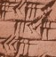

(tutorialmesomath)=
# `babcalc` {{ release }} Tutorial


(babcalc-intro)=
## Introduction

`babcalc` is the core engine of MesoMath; it is a custom or specialized [REPL/shell/interpreter](https://en.wikipedia.org/wiki/Read%E2%80%93eval%E2%80%93print_loop) for Python 3, designed to make using this package as an interactive calculator easier as well as to run [scripts](#scripting).

* In **interactive** use, it will show you an environment where arithmetic and metrological classes are preloaded (and abbreviated for smooth use) and you can start working directly. 
* In **scripting**, it will save you from having to locate the Python interpreter of your virtual environment, which, depending on your installation, may be in obscure places on your system (e.g., if you used `pipx`).

>If you're not very familiar with `Python`, you might be interested to know that ***classes*** are a central concept in Object-Oriented Programming (OOP). They are the way to inform the programming language that we will be working with ***objects*** of a certain type, characterized by a series of ***properties*** on which we wish perform specific operations or processes through certain ***methods***. The classes and objects defined in `MesoMath` are:

| Class  | Object              | abbrev.  |
|--------|---------------------|----------|
| `Babn` | Sexagesimal numbers | `bn`     |
| `Blen` | OBP(*) lengths      | `bl`     |
| `Bsur` | OBP surfaces        | `bs`     |
| `Bvol` | OBP volumes         | `bv`     |
| `Bcap` | OBP capacities      | `bc`     |
| `Bwei` | OBP weights         | `bw`     |
| `BsyG` | System **G** counts | `bG`     |
| `BsyS` | System **S** counts | `bS`     |
| `Bbri` | OBP volume in bricks| `bb`     |

>**(*) OBS:** Old Babylonian Period

>If you miss a class dedicated to Babylonian height measurements, know that it's by design; it is unnecessary. The only difference with horizontal length measurements lies in their metrological tables, and this is covered by the [`metrotable`](#metrotable-tutorial) utility. However, if you do want it, you can easily [create one yourself](#vertical-class).

## Running `babcalc` as an interactive calculator

If you [installed](installation)  `MesoMath` using `pip`, `pipx` or `hatch`, etc., you should have the `babcalc` command in your PATH, so you only need to invoke it to see the banner:

```bash
$ babcalc

Welcome to Babylonian Calculator 1.3.0
    ...the calculator that every scribe should have!

Use: bn(number) for sexagesimal calculations
Metrological classes: bl, bs, bv, bc, bw, bG, bS and bb loaded.
Use exit() or Ctrl-D (i.e. EOF) to exit

--> 
```
>The symbol `-->` is the primary prompt for `babcalc`.

and to enter an interactive `Python` interpreter with all relevant MesoMath classes pre-loaded as if you were imported them individually:

```bash
$ python3
Python 3.11.2 (main, Apr 28 2025, 14:11:48) [GCC 12.2.0] on linux
Type "help", "copyright", "credits" or "license" for more information.
>>> 
>>> from mesomath.babn import BabN as bn
>>> from mesomath.npvs import Blen as bl
>>> from mesomath.npvs import Bsur as bs
>>> from mesomath.npvs import Bvol as bv
>>> from mesomath.npvs import Bcap as bc
>>> from mesomath.npvs import Bwei as bw
>>> from mesomath.npvs import BsyG as bG
>>> from mesomath.npvs import BsyS as bS
>>> from mesomath.npvs import Bbri as bb
>>> ...
```


In the unlikely event that after installing the package you have the `mesomath` module accessible in your `PYTHONPATH` but not the `babcalc` command, you can run it from the console:

```bash
$ python -m mesomath.babcalc
```


>As of version 1.2.1, a [`Jupyter` notebook](https://jupyter.org/) version of this tutorial is in preparation. You can also try `babcalc` in the cloud, without installing anything on your computer, simply by clicking the badge below. Please be patient and wait for [`Binder`](https://mybinder.org/) to finish preparing the virtual machine for you.
>[](https://mybinder.org/v2/gh/jccsvq/mesomath-nb/main?urlpath=%2Fdoc%2Ftree%2Fnotebooks%2Findex.ipynb)
 

## Sexagesimal arithmetic

In what follows, the reader is assumed to be familiar with the key topics of [Mesopotamian mathematics](#References), in particular with the concepts of **decimal** and **sexagesimal** notations, **absolute** and **floating** numbers and with the concepts of **regular** and **reciprocal** numbers.


### Introducing or creating *Babylonian numbers*

We use **Babylonian Number** as a synonym for **non-negative integers** expressed in **sexagesimal notation**. Let us create our first Babylonian number 

```pycon
--> a = bn(405)
```

where `bn(405)` creates it and it is asigned to variable `a`. Let us explore some of its properties:

```pycon
--> a.dec
405
--> int(a)
405
--> a.list
[6, 45]
--> a.factors
(0, 4, 1, 1)
--> a
6:45
--> a.isreg
True
```

where:


* `a.dec` This is the decimal expansion of the number, we have used it for its creation above
* `a.list`This is the list of sexagesimal digits of the number
* `a.factors` This is the list of factors/divisors of the number (see bellow)
*  `a` or `print(a)` give us the printable representation of the sexagesimal number `6:45`
*  `a.isreg` This tells us that it is a **regular** number (i.e. it has a **reciprocal**)

We can obtain all this information together using the method `.explain()`:

```pycon
--> a.explain()
|  Sexagesimal number: [6, 45] is the decimal number: 405.
|    It may be written as (2^0 * 3^4 * 5^1 * 1),
|    so, it is a regular number with reciprocal: 8:53:20
```

The `.explain()` method provides different information for a non-regular number:

```pycon
--> b=bn(7)
--> b.isreg
False
--> b.explain()
|  Sexagesimal number: [7] is the decimal number:   7.
|    It may be written as (2^0 * 3^0 * 5^0 * 7),
|    so, it is NOT a regular number and has NO  reciprocal.
|    but an approximate inverse is: 8:34:17:9
|    and a close regular is: 6:59:54:14:24
|    whose reciprocal is: 8:34:24:11:51:6:40
```

>A method (like `.explain()`) is distinguished from a property (like `.isreg`) by the presence of parentheses. A method is a procedure that may require additional information to execute, in which case this information must be provided as arguments within the parentheses.

>Any natural number n can be writen as $n = 2^i \cdot 3^j \cdot 5^k \cdot l$ where  $i, j, k, l  ≥ 0$. The numbers $i, j, k$ are the powers of $2$, $3$ and $5$ respectively, and $l$ is a *"remainder"* that must not be divisible by $2$, $3$ or $5$. The tuple  `(i,j,k,l)` is what `a.factors` returned above.

We can introduce bab numbers in  four ways:

*  using the decimal equivalent: `a=bn(405)`
*  using the list of  sexagesimal digits: `a=bn([6,45])`
*  using its string or literal expression: `a=bn('6:45')` or `a=bn("6.45")`
*  using its factors as a tuple, as  $405 = 2^0 \cdot 3^4 \cdot 5^1 \cdot 1$,  `a=bn((0,4,1,1))`

so we have:

```pycon
--> b = bn([6,45])
--> c = bn('6:45')
--> d = bn((0,4,1,1))
--> a == b == c == d
True
```

>**_NOTE:_**  The `BabN` class is for **non-negative integers** only. By design, if you enter `a=bn(-405)`, you get the same result as with `a=bn(405)`.

The printable or string representation of numbers uses colon `:` as separator  by default.

```pycon
--> n1=bn(314159265)
--> n1
24:14:26:27:45
```


You can change this default to your liking:

```pycon
--> bn.sep = '.'
--> n1
24.14.26.27.45
--> bn.sep = '-'
--> n1
24-14-26-27-45
--> bn.sep = '<>'
--> n1
24<>14<>26<>27<>45
```

but you can only use  `:`,  `;`, `.`, `,`,`-` and blank space (` `) as input separators:

```pycon
--> m = bn('3:14:16')
--> m1 = bn('3.14.16')
--> print(m,m1)
3:14:16 3:14:16
--> bn('1:2;3,4.5 6-7')
1:2:3:4:5:6:7
```

You can obtain the number of sexagesimal digits using:

```pycon
--> m.len()
3
```

or using the standard `Python` function `len`

```pycon
--> len(m)
3
``` 

###  Basic arithmetic

#### Addition

We use the addition operator `+` to perform addition:

```pycon
--> a = bn('16.24.35')
--> b = bn('1.33.54.22')
--> a+b
1:50:18:57
```

addition is always absolute:

```pycon
--> a = bn('15.42.37.0.0')
--> b = bn('24.34.0.0.0')
--> c = a + b
--> c
40:16:37:0:0
```

At any time, if we want the floating version of a number, we will use the `float()` method or its synonym `f()`

```pycon
--> c.float()
40:16:37
--> c.f()
40:16:37
```

There is no need to use variables for operations:

```pycon
--> bn(45689) + bn(325874)
1:43:12:43
```

Finally, integers can be added directly:

```pycon
--> bn('33.14.22') + 34
33:14:56
--> 5523 + bn('33.14.22')
34:46:25
```


Of course, we are not limited to two addends:

```pycon
--> a + b + bn('33.14.22') + 34
40:17:10:14:56
```

#### Subtraction

Subtraction, like addition, always gives absolute (not floating) results. It also returns the absolute difference of numbers. This is by design, because Mesopotamian mathematics lacked negative numbers and to save us from mistakes. Thus, **subtraction in this application is a commutative operation**.

```pycon
--> bn(45689) - bn(325874)
1:17:49:45
--> bn(325874) - bn(45689)
1:17:49:45
```

#### Multiplication

Multiplication is absolute by default:

```pycon
--> a = bn('34:59:31:12')
--> b = bn('14:3:45')
--> a*b
8:12:4:30:0:0:0
```

if we want a floating result:

```pycon
--> (a*b).f()
8:12:4:30
```

or we can change the default

```pycon
--> bn.floatmult = True
--> a*b
8:12:4:30
```

and restore it again:

```pycon
--> bn.floatmult = False
--> a*b
8:12:4:30:0:0:0
```


#### Powers

Use the `**` operator:

```pycon
--> a
34:59:31:12
--> a**2
20:24:26:24:13:49:26:24
--> a**3
11:54:5:36:24:11:24:33:52:7:40:48
```

#### Division

Class `BabN` has two types of division defined, both are floating:

*  **`a/b` Modern Division:** Approximate floating division of two arbitrary numbers. This is the translation of our modern division into the world of Babylonian floating numbers for the convenience of the modern *scribe*.
*  **`a//b` Babylonian Division:** This is the **product of** `a` **by the reciprocal of** `b`, which implies that `b` has to be a regular number.

Let us try them:

```pycon
--> a = bn('14.15.16')
--> b = bn('12.2')
--> q = a/b
--> q
1:11:4:29:15:7:29
```


now, as a check:

```pycon
--> b*q
14:15:16:0:0:0:2:58
```


a value that, in the world of floating numbers, is very similar to `a`.

We can change the number of digits in the result (only approximately, sorry):

```pycon
--> bn.rdigits = 10
--> a/b
1:11:4:29:15:7:28:45:12:29:52
```
Now let us try:

```pycon
--> a//b
Divisor is not a regular number!
--> b = bn(405)
--> b
6:45
--> b.isreg
True              # b is regular
--> c = b.rec()   # c is the reciprocal of b
--> a//b
2:6:42:22:13:20
--> a * c
2:6:42:22:13:20
--> c
8:53:20           # reciprocal of 6:45 (dec. 405)
```

### Roots

#### Square root

Method `.sqrt()` returns the floating square root of the numbers.

```pycon
--> bn.rdigits = 6
--> bn(2).sqrt()
1:24:51:10:7:46
```

Let us check it:

```pycon
--> bn(2).sqrt() ** 2
1:59:59:59:59:59:42:48:20:19:16
```

let us round it to 6 digits:

```pycon
--> (bn(2).sqrt() ** 2).round(6)
2:0:0:0:0:0
```

and, finally, *floating* it:

```pycon
--> (bn(2).sqrt() ** 2).round(6).f()
2
```

We see that effectively 1:24:51:10:7:46 is an approximation of the square root of 2. To relate this sexagesimal floating value to the square root of two in the decimal system, let's calculate:

```pycon
--> (bn(2).sqrt()).dec/60.**5
1.4142135622427983
```


which is similar to:

```pycon
--> from math import sqrt
--> sqrt(2)
1.4142135623730951
```

Compare the following result:

```pycon
--> (30*bn(2).sqrt()).float()
42:25:35
```

to the one appearing in tablet [YBC 7289](https://en.wikipedia.org/wiki/YBC_7289) where the apprentice scribe calculated the diagonal of a square with a side of 30.

<a target = "_blank" title="Urcia, A., Yale Peabody Museum of Natural History,  http://peabody.yale.edu, http://hdl.handle.net/10079/8931zqj
derivative work, user:Theodor Langhorne Franklin, CC0, via Wikimedia Commons" href="https://commons.wikimedia.org/wiki/File:YBC-7289-OBV-labeled.jpg"></a>

#### Cube root

Method `.cbrt()` returns the floating cube root of the numbers.

```pycon
--> bn.rdigits = 4
--> bn(2).cbrt()
1:15:35:43
--> bn(2).cbrt() ** 3
2:0:0:0:15:12:26:47:50:7
--> (bn(2).cbrt() ** 3).round(4).f()
2
```

etc.

### Complex expressions

The Python engine is behind the scenes, which means we can combine elementary operations to build complex expressions:

```pycon
--> a = bn('16.22')
--> b = bn('44.16')
--> c = bn('6.45')
--> d = ((a+b)*(a-b))//c**2
--> d
37:7:42:48:53:20
``` 

use lists:

```pycon
--> ll=[a,b,c,d]
--> ll
[16:22, 44:16, 6:45, 37:7:42:48:53:20]
--> min(ll)
6:45
--> max(ll)
37:7:42:48:53:20
```
for instance, look for some non-regular numbers:

```pycon
--> ll=[_ for _ in range(25)]               # between 0 and 25
--> [bn(_) for _ in ll if not bn(_).isreg]
[0, 7, 11, 13, 14, 17, 19, 21, 22, 23]
--> ll=[_ for _ in range(400,410)]          # between 400 and 410
--> [bn(_) for _ in ll if not bn(_).isreg]
[6:41, 6:42, 6:43, 6:44, 6:46, 6:47, 6:48, 6:49]
```

etc.

### Logical operators

Logical operators are available and can be combined with integers. This can be useful in programming or scripting.

```pycon
--> a <= b and c.isreg
True
--> a < 300
False
```

### Another `BabN` class  attribute

`bn.fill` is set to `False` by default. You can change it to modify the aspect of the printed sexagesimal numbers by adding a left 0 to digits from 0 to 9 i.e. to convert them to 00, 01, ..., 09:

```pycon
--> z = bn('1.2.0.14.5.4.3')
--> z
1:2:0:14:5:4:3
--> bn.fill = True
--> z
01:02:00:14:05:04:03
--> bn.fill = False
--> z
1:2:0:14:5:4:3
```

This is useful if we want to build tables of values ​​with proper alignment.

### Other BabN class methods


#### `.rec()`

This method returns the reciprocal of regular numbers, `None` for non-regular numbers:

```pycon
--> a=bn(400)
--> a
6:40
--> a.rec()
9
--> a * a.rec()
1:0:0
--> b=bn(406)
--> b
6:46
--> b.rec()
Not regular!
--> x = b.rec()
Not regular!
--> x
--> type(x)
<class 'NoneType'>
```

#### `.inv(n)`

This is a replacement for .rec() for irregular numbers. Irregular numbers can be said to have infinite-digit reciprocals; this method calculates the first `n` of them.

```pycon
--> b=bn(406)
--> b
6:46
--> b.isreg
False
--> c=b.inv()
--> c
8:52:1:11
--> b * c
1:0:0:0:0:26
--> c=b.inv(10)
--> c
8:52:1:10:56:9:27:29:15:44
--> b * c
1:0:0:0:0:0:0:0:0:0:27:44
```


#### `.round(n)`

Returns the first n sexagesimal digits of the number with rounding:

```pycon
--> c
8:52:1:10:56:9:27:29:15:44
--> c.round(4)
8:52:1:11
```


Useful when working with approximate floating numbers. Alternatively, you can use the standard function `round`

```pycon
--> round(c,4)
8:52:1:11
```


#### `.head(n)`

Returns the first n sexagesimal digits of the number without rounding:

```pycon
--> c
8:52:1:10:56:9:27:29:15:44
--> c.head()  # Without argument, returns the first digit only.
8
--> c.head(3)
8:52:1
--> c.head(7)
8:52:1:10:56:9:27
```


#### `.tail(n)`

Returns the last n sexagesimal digits of the number:

```pycon
--> c
8:52:1:10:56:9:27:29:15:44
--> c.tail()   # Without argument, returns the last digit only.
44
--> c.tail(2)
15:44
--> c.tail(6)
56:9:27:29:15:44
```

#### `.dist(n)`

When dealing with floating-point numbers, we must use a pseudo-distance based on the similarity of the most significant sexagesimal digits, such that "7" is very close to "6:59:54:14:24" (but their decimal values ​​are 7 and 90699264 respectively, which are very dissimilar). This allows us to search for regular numbers close to a given number using the next method.

This method is not intended for interactive use.

#### `.searchreg()`

`.searchreg(minn, maxn, limdigits=6, prt=False)`

Searches the `BabN.database` database for the closest regular number to the object's.
`minn` and `maxn`: must be sexagesimal strings using ":" separator. `limdigits` max value is 20.

```pycon
--> c
8:52:1:10:56:9:27:29:15:44
--> c.searchreg('01', '59')
8:51:26:27:36
--> c.searchreg('01', '59', 7)
8:51:26:27:36
--> c.searchreg('01', '59', 9)
8:51:26:27:36
--> c.searchreg('01', '59', 19)
--> bn(7).searchreg('06:40', '07:40', 4, True)
...(Database: regular.db3 created!)...
        72000 06:40
        54000 06:45
        37440 06:49:36
        35775 06:50:03:45
        19008 06:54:43:12
        12000 06:56:40
         6750 07:01:52:30
        24000 07:06:40
        43200 07:12
        50500 07:14:01:40
        60864 07:16:54:24
        62640 07:17:24
        82323 07:22:52:03
        88000 07:24:26:40
       108000 07:30
       126400 07:35:06:40
       128250 07:35:37:30
Minimal distance: 6750, closest regular is: 07:01:52:30
07:01:52:30
```

**Tip:**

You can refer to the Python help system at any time to refresh your memory about the parameters you must pass to a method:

```pycon
--> help(bn(7).searchreg)
```

or simply

```pycon
--> help(bn.searchreg)
```

will present the relevant information on a screen (with scrolling):

```pycon
Help on method searchreg in module mesomath.babn:


searchreg(minn: str | int, maxn: str | int, limdigits: int = 6, prt: bool = False) -> 'BabN' method of mesomath.BabN instance
    Search database for regulars between sexagesimals minn y maxn.
    Returns BabN object with the closest regular found.

    :param minn: and maxn: must be sexagesimal strings using ":" separator
    :type minn: str | int
    :param maxn: and maxn: must be sexagesimal strings using ":" separator
    :type maxn: str | int
    :param limdigits:  max regular digits number, defaults to 6
    :type limdigits: int, optional
    :param prt: print list of found regulars, defaults to False
    :type prt: bool, optional
    :return: closest regular found as BabN object
    :rtype: BabN
```

(You will need to press `q` to exit this screen)


## Metrology

### Basics

As explained in the [Introduction](#babcalc-intro), `babcalc` already has the metrological classes `BabN, Blen, Bsur,`... pre-imported as `bn, bl, bs,` etc.

```python
from mesomath.babn import BabN as bn
from mesomath.npvs import Blen as bl
from mesomath.npvs import Bsur as bs
from mesomath.npvs import Bvol as bv
from mesomath.npvs import Bcap as bc
from mesomath.npvs import Bwei as bw
from mesomath.npvs import BsyG as bG
from mesomath.npvs import BsyS as bS
from mesomath.npvs import Bbri as bb
```

This is what the classes `bl`, `bs`, `bv`, `bc`, `bw`, `bG`, `bS` and `bb` represent:

    class  bl: Babylonian length system:
               danna <-30- UŠ <-60- ninda <-12- kuš3 <-30- šu-si

    class  bs: Babylonian surface system:
               GAN2 <-100- sar <-60- gin2 <-180- še

    class  bv: Babylonian volume system:
               GAN2 <-100- sar <-60- gin2 <-180- še

    class  bc: Babylonian capacity system:
               gur <-5- bariga <-6- ban2 <-10- sila3 <-60- gin2 <-180- še

    class  bw: Babylonian weight system:
               gu2 <-60- ma-na <-60- gin2 <-180- še

    class  bG: Babylonian counting System G:
               šar2-gal <-6- šar'u <-10- šar2 <-6- bur'u <-10- bur3 <-3- eše3 <-6- iku

    class  bS: Babylonian counting System S:
               šar2-gal <-6- šar'u <-10- šar2 <-6- geš'u <-10- geš <-6- u <-10- diš

    Class  bb: Babylonian brick counting system:
               GAN2 <-100- sar <-60- gin2 <-180- še

However, for ease of writing, the real or academic names of the units in these metrological systems have been simplified by removing capital letters, numbers, hyphens, and diacritics. Therefore, for introduction of measurements, we will use the following unit names:

Class|Metrology|Units
-----|---------|-----
bl| Babylonian length system|  susi, kus, ninda, us, danna
bs| Babylonian surface system|  se, gin, sar, gan
bv| Babylonian volume system|  se, gin, sar, gan
bc| Babylonian capacity system|  se, gin, sila, ban, bariga, gur
bw| Babylonian weight system|  se, gin, mana, gu
bG| Babylonian System G|  iku, ese, bur, buru, sar, saru, sargal
bS| Babylonian System S|  dis, u, ges, gesu, sar, saru, sargal
bb| Babylonian brick counting system|  se gin sar gan

>Note that scribes wrote volumes as an equivalent surface area multiplied by a standard height of 1 kus; thus, they used the same metrology for surfaces and volumes. Here, however, two different classes will be used, so that one can multiply a surface area by a length to obtain a volume, but one cannot multiply a volume by a length to obtain a four-dimensional volume, which was probably beyond the scribes' understanding.

At any time, you can review the names of the units in each system and their factors through the following, e.g., for capacities:

```pycon
--> bc.uname
['se', 'gin', 'sila', 'ban', 'bariga', 'gur']
--> bc.ufact
[180, 60, 10, 6, 5]
```

and the academic names:

```pycon
--> bc.aname
['še', 'gin2', 'sila3', 'ban2', 'bariga', 'gur']
```

or

```pycon
--> print(*bc.scheme(bc))
gur <-5- bariga <-6- ban <-10- sila <-60- gin <-180- se
--> print(*bc.scheme(bc,1))
gur <-5- bariga <-6- ban2 <-10- sila3 <-60- gin2 <-180- še
```

In a similar way to what we saw for sexagesimal numbers with the `bn` class. We can introduce measurements in two different ways:

```pycon
--> a = bl(11111)
--> a
30 ninda 10 kus 11 susi
--> b = bl('5 ninda 25 susi')
--> b
5 ninda 25 susi
```

In the first case, `a` is defined as a certain (integer) number of times the smallest unit ("susi" in the case of lengths). In the second case, we define the value for `b` textually. Note that we can only use integer values ​​in both cases. Both input methods are available for all classes.

>In fact, there is a [**third input method**](#third-input-method).

Once you have defined measurements, you can "explain" them:

```pycon
--> a.explain()
This is a Babylonian length meassurement: 30 ninda 10 kus 11 susi
    Metrology:  danna <-30- us <-60- ninda <-12- kus <-30- susi
    Factor with unit 'susi':  1 30 360 21600 648000
Meassurement in terms of the smallest unit: 11111 (susi)
Sexagesimal floating value of the above: 3:5:11
Approximate SI value: 185.18333333333334 meters
--> 
--> b.explain()
This is a Babylonian length meassurement: 5 ninda 25 susi
    Metrology:  danna <-30- us <-60- ninda <-12- kus <-30- susi
    Factor with unit 'susi':  1 30 360 21600 648000
Meassurement in terms of the smallest unit: 1825 (susi)
Sexagesimal floating value of the above: 30:25
Approximate SI value: 30.416666666666668 meters
```

That will give us information about the nature of the measurement and the properties of the measurement system being used.

Note that the value given as "Sexagesimal floating value of the above:" is generated by the `.sex()` method; however, this method accepts a numeric parameter to indicate the unit relative to which this sexagesimal floating value is calculated. This parameter defaults to zero, indicating the first unit in the list provided by `.explain()`: `Unit names: ['susi', 'kus', 'ninda', 'us', 'danna']`

```pycon
--> a.sex()   # susi as the base unit
3:5:11
--> a.sex(0)  # the same as .sex()
3:5:11
--> a.sex(1)  # kus as the base unit
6:10:22
--> a.sex(2)  # ninda as the base unit
30:51:50
--> a.sex(3)  # us as the base unit
30:51:50
--> a.sex(4)  # danna as the base unit
1:1:43:40
```

This will be useful if you want to recreate **metrological lists** yourself. For example, code:

```python
from mesomath.npvs import Blen as bl

ls =[]
for i in range(1,10):
    ls.append(str(i)+' susi')
for i in '10 15 20 25'.split():
    ls.append(i+' susi')
ls.append('1 kus')
for i in '10 15 20 25'.split():
    ls.append('1 kus '+i+' susi')
ls.append('2 kus')
for i in ls:
    x=bl(i)
    print(f'{str(x).ljust(15)} -> {str(x.sex(2)).rjust(6)}')
```


will print this excerpt of the metrological table for length using ninda (x.sex(2)) as base unit:

```pycon
1 susi          ->     10
2 susi          ->     20
3 susi          ->     30
4 susi          ->     40
5 susi          ->     50
6 susi          ->      1
7 susi          ->   1:10
8 susi          ->   1:20
9 susi          ->   1:30
10 susi         ->   1:40
15 susi         ->   2:30
20 susi         ->   3:20
25 susi         ->   4:10
1 kus           ->      5
1 kus 10 susi   ->   6:40
1 kus 15 susi   ->   7:30
1 kus 20 susi   ->   8:20
1 kus 25 susi   ->   9:10
2 kus           ->     10
```

(See page 8 of [Floating calculation in Mesopotamia](https://hal.science/hal-01515645v2/document) by Christine Proust).

But you will rarely need to resort to programming, since MesoMath has specialized resources for building metrological lists and tables:

*   The [`metrotable`](#metrotable-tutorial) tool, which specializes in printing segments of metrological list and tables.
*   The [`mtlookup`](#mtlookup-tutorial) tool that simulates direct and inverse searches in metrological tables.
*   The [`.metrolist()`] method that works with all metrological classes, including [those you define yourself](#advanced-topics).

For instance for horizontal distances (base unit ninda)
```pycon
--> bl.metrolist('1 kus', '5 kus', '1 kus', verbose=True)
1 kus                | 5              
2 kus                | 10             
3 kus                | 15             
4 kus                | 20             
5 kus                | 25   
```

For vertical distances (base unit kus)
```pycon
--> bl.metrolist('1 kus', '5 kus', '1 kus', verbose=True, ubase =1)
1 kus                | 1              
2 kus                | 2              
3 kus                | 3              
4 kus                | 4              
5 kus                | 5   
```

Since version v1.1.0 you can get the metrological value of an object directly using the `.metval()` method:

```pycon
--> bl('1 kus 15 susi').metval()
7:30
```


### Operations

For objects of the same class, the following operations are available:

* Addition
* Subtraction (returns the absolute value of the difference)
* Multiplication by a number
* Division by a number
* Logical operations

Let's look at some examples:

```pycon
--> a >= b
True
--> a+b
35 ninda 11 kus 6 susi
--> a-b
25 ninda 9 kus 16 susi
--> b-a                   # a-b == b-a !!!
--> a-b == b-a
True
25 ninda 9 kus 16 susi
--> 2*a
1 us 1 ninda 8 kus 22 susi
--> b*2
10 ninda 1 kus 20 susi
--> b*2.5
12 ninda 8 kus 2 susi
--> a/2
15 ninda 5 kus 6 susi
--> (a+2*b)/5
8 ninda 2 kus 12 susi
--> (a+2*b)/5.3
7 ninda 8 kus 25 susi
```

Additionally, for length measurements we can multiply them together to obtain surfaces and volumes, and for surfaces we can multiply them by lengths to obtain volumes:

```pycon
--> c = bl('2 kus')
--> c
2 kus
--> s=a*b
--> s
1 gan 56 sar 27 gin 138 se
--> s.explain()
This is a Babylonian surface meassurement: 1 gan 56 sar 27 gin 138 se
    Metrology:  gan <-100- sar <-60- gin <-180- se
    Factor with unit 'se':  1 180 10800 1080000
Meassurement in terms of the smallest unit: 1689798 (se)
Sexagesimal floating value of the above: 7:49:23:18
Approximate SI value: 5632.66 square meters
--> v=s*c
--> v
3 gan 12 sar 55 gin 96 se
--> v.explain()
This is a Babylonian volume meassurement: 3 gan 12 sar 55 gin 96 se
    Metrology:  gan <-100- sar <-60- gin <-180- se
    Factor with unit 'se':  1 180 10800 1080000
Meassurement in terms of the smallest unit: 3379596 (se)
Sexagesimal floating value of the above: 15:38:46:36
Approximate SI value: 5632.66 cube meters

--> v2=a*b*c
--> v2 == v
True
```

### Systems S and G

Finally, in cases like this:

```pycon
--> a = bv('128 gan')
--> a
128 gan
```

we might prefer to see the coefficients of the units expressed in the S system (G system for surfaces and volumes), to do this:

```pycon
--> bv.prtsex=True
--> a
(7 bur 2 iku) gan
```

This changes the default for objects of the `bv` class and makes the output more closely mimic the way the measurements were actually inscribed on the clay tablets, but it complicates things for the modern reader:

```pycon
--> a = bv('128 gan 133 se')
--> a
(7 bur 2 iku) gan (2 ges 1 u 3 dis) se
```

If you want this to be the default for all classes, use:

```python
from mesomath.npvs import MesoM
MesoM.prtsex = True
```

(third-input-method)=
### Third input method


The third input method cited above makes use of these types of strings; in fact, the parentheses have been introduced to make them easier to parse as input:

```pycon
--> b = bv('460800 gan 44 sar 20 gin')
--> b
(7 sargal 6 sar 4 buru) gan (4 u 4 dis) sar (2 u) gin
--> c = bv('(7 sargal 6 sar 4 buru) gan (4 u 4 dis) sar (2 u) gin')
--> c
(7 sargal 6 sar 4 buru) gan (4 u 4 dis) sar (2 u) gin
--> bv.prtsex = False
--> c
460800 gan 44 sar 20 gin
```

### Fractions

There is also basic support for entering the **principal fractions**: 1/6, 1/3, 1/2, 2/3, 5/6 (and only for them), they can be entered in several ways:

```pycon
--> a=bl('0+1/3 ninda')
--> a
4 kus
--> a=bl('+1/3 ninda')
--> a
4 kus
--> a=bl('1/3 ninda')
--> a
4 kus
--> a=bl('2 + 1/3 ninda')
--> a
2 ninda 4 kus
--> a=bl('2 1/3 ninda')
--> a
2 ninda 4 kus
--> a=bl('21/3 ninda')
--> a
2 ninda 4 kus
```


For output using 1/3, 1/2, 2/3, 5/6 fractions, you can use the `.prtf()` method:

```pycon
--> a=bl(11223344)
--> a
17 danna 9 us 35 ninda 11 kus 14 susi
--> a.prtf()
'17 danna 9 1/2 us 5 5/6 ninda 1 1/3 kus 4 susi'
```

and if you wish also include  `1/6`:

```pycon
--> a.prtf(1)
'17 1/6 danna 4 1/2 us 5 5/6 ninda 1 1/3 kus 4 susi'
```

If you activate `prtsex` you get:

```pycon
--> bl.prtsex=True
--> a.prtf()
'(1 u 7 dis) danna (9 dis) 1/2 us (5 dis) 5/6 ninda (1 dis) 1/3 kus (4 dis) susi'
--> a.prtf(1)
'(1 u 7 dis) 1/6 danna (4 dis) 1/2 us (5 dis) 5/6 ninda (1 dis) 1/3 kus (4 dis) susi'
```

These results can be used for input:

```pycon
--> bl.prtsex=0
--> b=bl('(1 u 7 dis) 1/6 danna (4 dis) 1/2 us (5 dis) 5/6 ninda (1 dis) 1/3 kus (4 dis) susi')
--> b
17 danna 9 us 35 ninda 11 kus 14 susi
--> b.prtf()
'17 danna 9 1/2 us 5 5/6 ninda 1 1/3 kus 4 susi'
--> b.prtf(1)
'17 1/6 danna 4 1/2 us 5 5/6 ninda 1 1/3 kus 4 susi'
--> b.dec
11223344
--> c=bl(a.prtf(1))
--> c.dec
11223344
```

### Academic names

Since v1.1.0, the .prtf() method has a second switch that allows the academic unit names to be used in the output:

```pycon
--> a=bl(11223344)
--> a.prtf()
'17 danna 9 1/2 us 5 5/6 ninda 1 1/3 kus 4 susi'
--> a.prtf(1)
'17 1/6 danna 4 1/2 us 5 5/6 ninda 1 1/3 kus 4 susi'
--> a.prtf(1,1)
'17 1/6 danna 4 1/2 UŠ 5 5/6 ninda 1 1/3 kuš3 4 šu-si'
--> bl.prtsex=True
--> a.prtf(0,1)
'(1 u 7 dis) danna (9 dis) 1/2 UŠ (5 dis) 5/6 ninda (1 dis) 1/3 kuš3 (4 dis) šu-si'
--> a.prtf(1,1)
'(1 u 7 dis) 1/6 danna (4 dis) 1/2 UŠ (5 dis) 5/6 ninda (1 dis) 1/3 kuš3 (4 dis) šu-si'
```

This kind of string can also be used as input:

```pycon
--> b=bl('(1 u 7 dis) 1/6 danna (4 dis) 1/2 UŠ (5 dis) 5/6 ninda (1 dis) 1/3 kuš3 (4 dis) šu-si')
--> b.dec
11223344
```

equivalent to:

```pycon
--> b=bl(a.prtf(1,1))
--> b.dec
11223344
```

### Volume vs. Capacity

There were two systems for measuring volume: **capacities**, used to measure grain, beer, and other types of food and goods, and **volume** proper, used to measure everything else. Here, they are represented by the metrological classes `Bcap` (imported here as `bc`) and `Bvol` (`bv`), respectively. Since they are two systems for measuring the same physical quantity, we can convert quantities from one system to the other with the methods `.cap()` and `.vol()`:

```pycon
--> a = bv('1 gin')
--> a.explain()
This is a Babylonian volume meassurement: 1 gin
    Metrology:  gan <-100- sar <-60- gin <-180- se
    Factor with unit 'se':  1 180 10800 1080000
Meassurement in terms of the smallest unit: 180 (se)
Sexagesimal floating value of the above: 3
Approximate SI value: 0.3 cube meters
--> b = a.cap()
--> b.explain()
This is a Babylonian capacity meassurement: 1 gur
    Metrology:  gur <-5- bariga <-6- ban <-10- sila <-60- gin <-180- se
    Factor with unit 'se':  1 180 10800 108000 648000 3240000
Meassurement in terms of the smallest unit: 3240000 (se)
Sexagesimal floating value of the above: 15
Approximate SI value: 300.0 litres
--> (b.vol()).explain()
This is a Babylonian volume meassurement: 1 gin
    Metrology:  gan <-100- sar <-60- gin <-180- se
    Factor with unit 'se':  1 180 10800 1080000
Meassurement in terms of the smallest unit: 180 (se)
Sexagesimal floating value of the above: 3
Approximate SI value: 0.3 cube meters
```

### Bricks

Volume measurements were frequently transformed into their **"brick" equivalents**. These were measured in "*sar-b*" (units or packages of 720 bricks), and each brick type was characterized by its "***Nalbanum***," or the number of *sar-b* of that type that fits in 1 *sar* of volume. The `.sarb()` method allows us to perform this transformation:

```pycon
--> a = bv('1 sar')
--> a
1 sar
--> b = a.bricks()
--> b
1 sar
--> b.explain()
This is a Babylonian brick counting: 1 sar
    Metrology:  gan <-100- sar <-60- gin <-180- se
    Factor with unit 'se':  1 180 10800 1080000
Meassurement in terms of the smallest unit: 10800 (se)
Sexagesimal floating value of the above: 3
Approximate SI value: 720.0 bricks
```

This is for  *nalbanum* =1.0  type-12 bricks, for type-2 bricks with decimal *nalbanum* = 7.20:

```pycon
--> b = a.bricks(7.20)
--> b
7 sar 12 gin
--> b.SI()
'5184.0 bricks'
```

If you have 10000 type-2 bricks, you can do:

```pycon
--> c = bb(15 * 10000)
--> c
13 sar 53 gin 60 se
--> c.SI()
'10000.0 bricks'
```

`c` is a `Bbri` object:

```pycon
--> c.explain()
This is a Babylonian brick counting: 13 sar 53 gin 60 se
    Metrology:  gan <-100- sar <-60- gin <-180- se
    Factor with unit 'se':  1 180 10800 1080000
Meassurement in terms of the smallest unit: 150000 (se)
Sexagesimal floating value of the above: 41:40
Approximate SI value: 10000.0 bricks
```

that you can convert into a volume:

```pycon
--> d = c.vol(7.20)
--> d.explain()
This is a Babylonian volume meassurement: 1 sar 55 gin 133 se
    Metrology:  gan <-100- sar <-60- gin <-180- se
    Factor with unit 'se':  1 180 10800 1080000
Meassurement in terms of the smallest unit: 20833 (se)
Sexagesimal floating value of the above: 5:47:13
Approximate SI value: 34.721666666666664 cube meters
```

Here is an excerpt from a table found
[here](https://personal.us.es/cmaza/mesopotamia/edificios.htm#Tipos%20de%20ladrillos) (Spanish only, sorry):

|Brick type|Nalb. (dec.) |Nalb. (sex.)|
|------|---------|-----|
|  1   |    9.00 |9|
|  1a  |     8.33| 8:20|
|  2   |     7.20 |7:12|
|3 |  5.40 | 5:24|
|4 |   5.00 |5|
|5 |  4.80 |4:48|
|7 |   3.33 |3:20|
|8 |  2.70 |2:42|
|9 |  2.25 |2:15|
|10|  1.875 |1:52:30|
|11|  1.20| 1:12|
|12|1.00 |1  |

(scripting)=
## Scripting

`babcalc`, in addition to serving as an interface for interactive work, can execute `.py` scripts for batch processing. Let's look at its options:

```bash
$ babcalc -h
babcalc 1.3.0 - Command Line Interface

Usage:
  babcalc                 Launch interactive REPL
  babcalc <script.py>     Execute a script
  babcalc -i <script.py>  Execute a script and stay in interactive mode
  babcalc -m <module>     Run a library module (Reserved for future use)
  babcalc --help          Show this message
```

The `-i` option allows you to run a script and remain in interactive mode, which is important for debugging. We show an [example](#lbp-metrology) below.

>**Note:** By design, `babcalc` will **NOT** import any of the MesoMath classes. This necessitates writing pure Python scripts, that can be executed directly on other systems using the Python interpreter, for the sake of compatibility and program sharing.

The `-m` option is reserved for future use. Currently, there are no modules in MesoMath that can be run this way.

(advanced-topics)=
## Advanced Topic: Extending Metrology

One of the core strengths of `mesomath` **v{{ release }}** is its extensibility. You are not limited to the built-in Babylonian units; you can define your own metrological systems by inheriting from the base classes.

(vertical-class)=
### The "Vertical Problem": Defining Height

In many Mesopotamian mathematical problems, vertical measurements (height or depth) are treated with specific units that, while sharing the same names as lengths, behave differently in calculations.

Let's define a custom class `bh` (Babylonian Height) that inherits from the length system (`bl` or `Blen`) but fixes the base unit to the *kuš3* (cubit).

```python
from mesomath.npvs import Blen, Bsur, Bvol

# We define our custom height class
class bh(Blen):
    title: str = "Babylonian Height Measurement"
    ubase: int = 1  # Fixed to 'kus' (cubit)

```

### Seamless Interaction

Thanks to the polymorphic design of **v{{ release }}**, your custom classes are recognized by the core engine. You can multiply a standard surface (`Bsur`) by your new height (`bh`) to obtain a volume (`Bvol`) without any type errors.

```python
# 1. Define a surface of 1 sar
area = Bsur('1 sar')

# 2. Define a height using our custom class
height = bh('1 kus')

# 3. Calculate volume (Area * Height)
# The system recognizes 'bh' as a valid length for this operation.
volume = area * height

print(f"Volume: {volume}") 
# Output: 1 sar

```

(automatic-utilities)=
### Automatic Utilities

By inheriting from `MesoM` (via `Blen`), your new class automatically gains all the new administrative and diagnostic tools of this version:

1. **Metrological Lists/Tables**: Generate tables for your custom units instantly.

Please see the options for {meth}`.metrolist()<.metrolist>` method.

```pycon
--> bh.metrolist('1 kus', '5 kus', '1 kus', verbose=True, ubase=None)
1 kus                | 1              
2 kus                | 2              
3 kus                | 3              
4 kus                | 4              
5 kus                | 5 
```


2. **Economic Calculations**: Use the new methods for labor costs.

The following three methods can help us study the economic problems commonly addressed by scribes. They offer a shortcut, saving us from having to work with metrological tables and reciprocal numbers.

#### `.labor_cost()`

This method calculates the cost of a project in terms of man-days to be paid or the number of workers needed to complete the project in one day, based on the work to be carried out and the work quota that each worker is expected to complete per day.

Please see the options for {meth}`.labor_cost()<.labor_cost>` method.

```pycon
--> canal = bv('10 sar')
--> quota = '20 gin'  # 1/3 sar per day
--> wages = canal.labor_cost(quota)
--> print(f"{wages} men required to finish in a day.")
30.0 men required to finish in a day.
```

#### `.rations()`

This method calculates the cost of a project in rations of barley, beer, oil, etc. based on the work to be carried out and the work quota that each worker is expected to complete per day.

Please see the options for {meth}`.rations()<.rations>` method.


```pycon
--> daily_ration = '2 sila'
--> total_grain = canal.rations(work_man='20 gin', wage=daily_ration)
--> print(f"Total barley: {total_grain}")
Total barley: 1 bariga
```


#### `.silver_payments()`

This method calculates the cost of a project in monetary terms (silver weight) based on the work to be carried out and the work quota that each worker is expected to complete per day.

Please see the options for {meth}`.silver_payments()<.silver_payments>` method.


```pycon
--> bricks = bb('2 sar')
--> silver_wage = '8 se'
--> total_silver = bricks.silver_payments(work_man='1 sar', wage=silver_wage)
--> print(f"Total silver payment: {total_silver}")
Total silver payment: 16 se
```


(lbp-metrology)=
### Late Babylonian Period Metrology


`mesomath` is designed to work with the metrology of the Old Babylonian period, but it can be extended to use the metrology of other periods. For example, for the {ref}`Late Babylonian Period <ref-Proust2>`, we can start by defining a class `LBcap` for the capacities in a file `lateb.py`:

```python
from mesomath.npvs import Bcap, Bvol


class LBcap(Bcap):  # Capacity
    """This class implement Non-Place-Value System arithmetic
    for Late Babylonian Period capacity units:

        **gur <-5- bariga <-6- ban2 <-10- sila3 <-10- GAR**

    """

    title: str = "Late Babylonian capacity meassurement"
    uname: list[str] = "gar sila ban bariga gur".split()
    aname: list[str] = "GAR sila3 ban2 bariga gur".split()
    ufact: list[int] = [10, 10, 6, 5]
    cfact: list[int] = [1, 10, 100, 600, 3000]
    siv: float = 0.1
    siu: str = "litres"
    ubase: int = 3  # bariga

    def vol(self) -> object:
        """Convert capacity to volume meassurement

        :return: volume meassurement
        :rtype: "Bvol"
        """
        return LBvol(int(round(self.dec/(100/6))))

class LBvol(Bvol):  # Volume
    """This class implement Non-Place-Value System arithmetic
    for Late Babylonian Period volume units:

        **GAN2 <-100- sar <-60- gin2 <-180- še**

    """
    title: str = "Late Babylonian volume meassurement"
    
    def cap(self) -> object:
        """Convert volume to capacity meassurement"""
        return LBcap(int(round(self.dec*(100/6))))
```

and then:

```bash
$ babcalc -i lateb.py 
```

```pycon
--> a = LBcap('1000 sila')
--> b = a.vol()
--> b
3 gin 60 se
--> b.explain() 
This is a Late Babylonian volume meassurement: 3 gin 60 se
    Metrology:  gan <-100- sar <-60- gin <-180- se
    Factor with unit 'se':  1 180 10800 1080000
Meassurement in terms of the smallest unit: 600 (se)
Sexagesimal floating value of the above: 10
Approximate SI value: 0.9999999999999999 cube meters
--> c=b.cap() 
--> c
3 gur 1 bariga 4 ban
--> c.SI() 
'1000.0 litres'
--> c.explain() 
This is a Late Babylonian capacity meassurement: 3 gur 1 bariga 4 ban
    Metrology:  gur <-5- bariga <-6- ban <-10- sila <-10- gar
    Factor with unit 'gar':  1 10 100 600 3000
Meassurement in terms of the smallest unit: 10000 (gar)
Sexagesimal floating value of the above: 2:46:40
Approximate SI value: 1000.0 litres
-->
--> LBcap.metrolist('1 bariga','3 bariga', '1 ban',1)
1 bariga             | 1              
1 bariga 1 ban       | 1:10           
1 bariga 2 ban       | 1:20           
1 bariga 3 ban       | 1:30           
1 bariga 4 ban       | 1:40           
1 bariga 5 ban       | 1:50           
2 bariga             | 2              
2 bariga 1 ban       | 2:10           
2 bariga 2 ban       | 2:20           
2 bariga 3 ban       | 2:30           
2 bariga 4 ban       | 2:40           
2 bariga 5 ban       | 2:50           
3 bariga             | 3              
```

etc. but we should also redefine the rest of the classes to ensure consistency in the operations with the new units.

